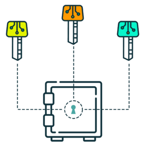

# Gnosis

Estamos orgullosos de anunciar que **Somos el primer proyecto en implementar Gnosis** como sistema Multi-firma en la BSC.

Una wallet de firma múltiple es una billetera de criptomonedas que controla el acceso y los cambios de uno o varios contratos inteligentes \(Smart Contracts\). La mayoría de los proyectos controlados por la comunidad de la red Ethereum requieren un sistema Multisig, es decir, múltiples firmas, para aprobar una transacción antes de ser ejecutada. 

[ballena.io](https://ballena.io/) es el primer proyecto de la red Binance Smart Chain en implementar Gnosis Safe para controlar nuestra DAO. Hemos implementado una estructura de 3 wallets Gnosis dependiento del grado de importancia de las acciones a realizar y por lo tanto vvariando el nivel de seguridad para cada una de las áreas.

#### 1. Protocolo de Gobernanza

Esta wallet es la más crítica. Se encarga de las acciones diarias de la plataforma y tiene acceso a todas las operaciones que tengan que ver con los Smart Contracts y [ballena.io](https://ballena.io/) en general. Cambiar la dirección de contrato de la tesorería, cambiar las wallets de Gnosis y operaciones de tesorería son ejemplos de las acciones que esta lleva a cabo.

Se rige por el modelo 6/9, es decir, hacen falta 6 firmas de 9 wallets firmantes para poder llevar a cabo una operación.

#### 2. Protocolo de Operaciones

Lleva a cabo acciones menos críticas pero que aun así requieren de un mínimo de firmas para no comprometer el proyecto. Este se encuentra en el nivel de seguridad media. Cambiar el multiplicador de los rewards en BALLE tokens, desactivar los BALLE rewards de las vaults, reanudar las vaults o agregar una nueva vault son funciones que puede ejecutar esta wallet.

Se rige por el modelo 3/9, es decir, hacen falta 3 firmas de 9 wallets firmantes para poder llevar a cabo una operación.

#### 3. Protocolo de emergencia de seguridad

Este protocolo se reserva para actuaciones de emergencia y solo será necesaria una firma para poder ejecutar las acciones dentro de sus límites. Esta wallet no puede ejecutar acciones transcendentales que afecten al proyecto pero sirve para poder tomar medidas inmediatamente por un firmante en caso de un ataque o situación de peligro. Pausar las vaults o pausar las distribuciones de BALLE, por ejemplo, son funciones que puede llevar a cabo.

En el siguiente archivo podrás ver todas las funciones y su respectiva descripción, así como las wallets que tienen asignadas dichas funciones.



Para más información acerca del sistema Mulit-firma Gnosis haz clic en el siguiente link:



