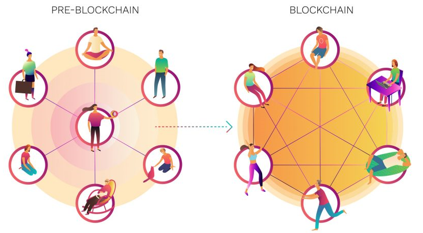

# Introducción DAO

## **FINANZAS DESCENTRALIZADAS PARA TODO EL MUNDO** 

\*\*\*\*[**ballena.io** ](https://ballena.io/)**está 100% gestionada por la comunidad que la compone y todos los miembros de la misma tienen voz y voto para dirigirla.**   
  

Tanto si formas parte del equipo de gobernanza de [**ballena.io** ](https://ballena.io/), como si quieres formar parte de él, estás a tiempo y en el lugar adecuado. **El proyecto** [**ballena.io** ](https://ballena.io/)**es de la comunidad**, es de todos nosotros, se aleja de la tradicional estructura y objetivos de una empresa tal y como la conocemos y rompe con la jerarquía centralizada para dar **el poder y los beneficios a todos los miembros** de la misma por igual.  

Con el auge de la tecnología en un amplio abanico de sectores era hora de que llegara a la **gestión de los fondos de inversión**. Las entidades bancarias se han acomodado en el mercado actual y cada vez son más difíciles las variaciones en el sistema implantado. La tecnología blockchain en cambio es una de las vías prometedoras para este cambio en busca de la **descentralización**. 

* ¿Nunca has pensado en una sociedad u organización en la cual todas las tasas y comisiones van directamente al uso y disfrute de los que las aportan? 
* ¿Nunca has soñado con una organización regida por votación rigurosa de los miembros de la misma? 

En eso exactamente consiste nuestra DAO. 

**Esta DAO se gestiona de manera autónoma en base a los contratos inteligentes** que se han desarrollado y que tras su lanzamiento son inmutables. Esto quiere decir que los usuarios, ya sean del equipo de desarrollo como poseedores del token BALLE, no podrán alterar el curso de la plataforma por ellos mismos. Solo la propuesta y votación de nuevas ideas vinculadas a estos contratos inteligentes tienen el poder de modificar las características del proyecto, y en esto, tu tienes mucho que ver.

Cuanto más extensa sea nuestra comunidad, más fuerza tendremos, más rentable será nuestra plataforma, aparecerán más ideas de desarrollo y la seguridad cada vez será mayor. Tu podrás elegir dónde colocar tu dinero para obtener rendimientos pero además **tendrás voz y voto para decidir el futuro de esta organización** para garantizar su seguridad, y quizás, explorar nuevas vías de inversión. 

A través de la plataforma de votación, **podrás proponer nuevas ideas** que serán escuchadas y estudiadas por todos los miembros interesados como tú en implantar este sistema justo.  

Las **operaciones relacionadas con la tesorería** están vinculadas a un [**sistema multi-firma**](../tecnico/gobernanza.md#seguridad-de-la-wallet) llamado Gnosis. Esto quiere decir que todas las nuevas ideas serán propuestas en comunidad, serán votadas por todos los miembros y que además antes de hacer **cualquier movimiento, este tendrá que ser aprobado previamente por un mínimo de usuarios** de la misma garantizando la democratización de su trayectoria.  

Llegados a este punto, recomendamos a los usuarios ver los siguientes apartados de la documentación relacionada con esta organización descentralizada. Aquí podrás aprender cómo proponer ideas, cómo votar otras existentes, las normas de la organización y muchas cosas más. Como ya habrás podido comprobar, además de esta plataforma de votación mencionada, [ballena.io](https://ballena.io/) cuenta con una amplia comunidad donde si no lo has hecho ya, [**puedes formar parte cuando quieras**](../#comunidad).

  

