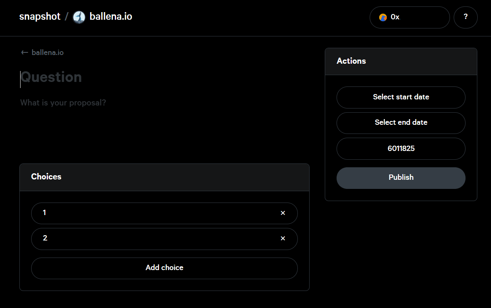
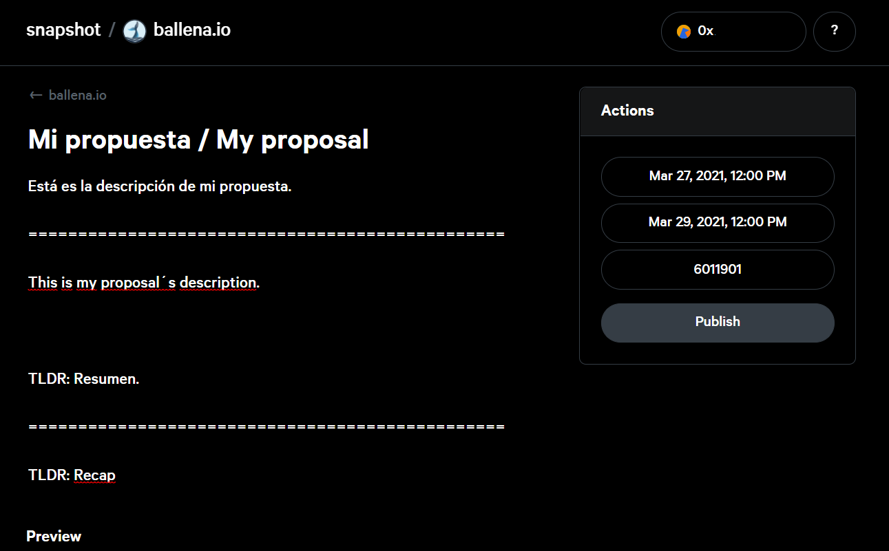
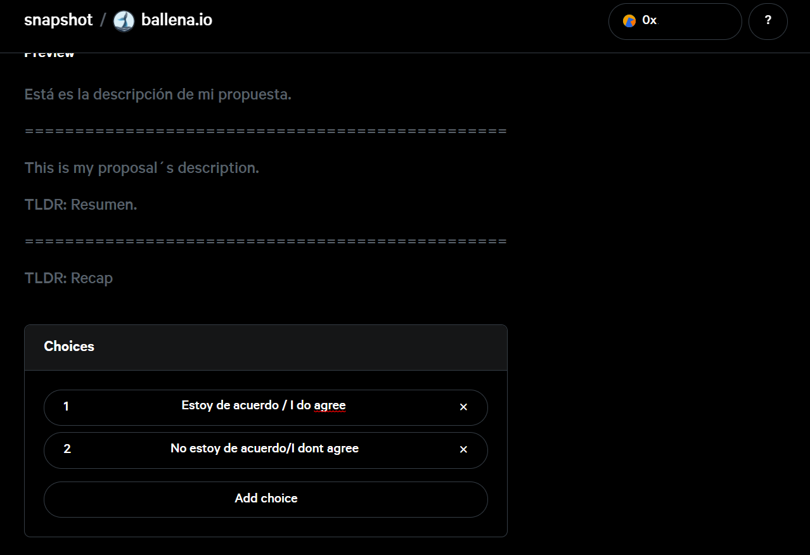
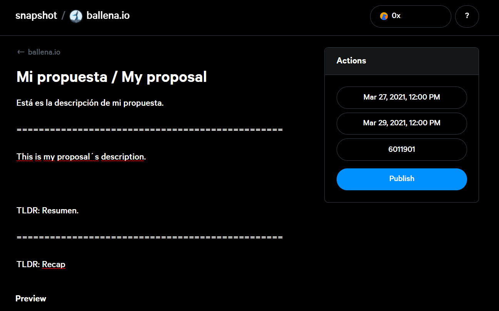
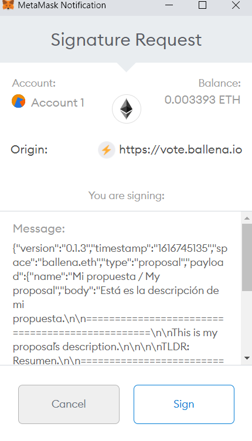

# Crear propuestas

## Estandarización

La creación de propuesta seguirá estas bases de estandarización para seguir un patrón conjunto:

* Las propuestas se publicarán en **ambos idiomas**, inglés y español neutro. Separar estás versiones para cada uno de los apartados con un "/" o "======" según corresponda. Puede ver un ejemplo haciendo clic [aquí](crear-propuestas.md#4-completa-los-campos-de-tu-propuesta).
* Siempre irá el español en primer lugar. 
* En caso de que alguno de los campos no admita caracteres suficientes para ambos idiomas, se intentará adaptar para ello, y sino, se dará prioridad al español.
* Se incluirá un "**TLDR**" al final de la descripción a modo de síntesis. Esta servirá como pregunta directa para la elección de las opciones.
* La propuesta, el **TLDR** y las opciones serán totalmente claras y concisas.
* Las duración de las propuestas será la siguiente:
  * **Propuestas transcendentales: mínimo 72 horas.**
  * **Propuestas no transcendentales: mínimo 24 horas.**
* **Todas las propuestas deberán incluir una opción de voto que vaya en contra de la propia cuestión** propuesta, una opción de voto de negación. Siempre existirá la opción de negarse a acatar el cambio propuesto, sean cual sean el resto de las opciones.
* Una vez se haya publicado la propuesta, el usuario debe notificar la publicación en el canal **\#votaciones** de Discord.

## Cómo crear una propuesta

### 1. Navega a la [plataforma de votación](https://vote.ballena.io/).

* Link: [https://vote.ballena.io/](https://vote.ballena.io/)

### 2. Conectar tu wallet.

Sigue los pasos del tutorial [Conectar Wallet para votar y crear propuestas](conectar-wallet-para-votarpara-votar-y-crear-propuestas.md).

### 3. Pulsa el botón "New proposal".

### 4. Completa los campos de tu propuesta.

* Añade un título en "Question".
* Expone tu propuesta en "What is your proposal". 
* Selecciona el rango de fechas en "Actions".
* El número que aparece a continuación es el número de bloque de la blockchain. No te preocupes por el mismo, para más información navega a [Número de bloque](crear-propuestas.md#numero-de-bloque).
* Añade las opciones a elegir entre los usuarios en "Choices".

En la siguiente imagen vemos un ejemplo de la propuesta "Mi propuesta".

Recuerda las [bases ](crear-propuestas.md#estandarizacion)para crear una propuesta.

### 5. Haz clic en "Publish".

### 6. Firma la propuesta en tu wallet.

Te aparecerá un desplegable para firmar la propuesta, haz clic en "Sign".

## Número de bloque

El **número de bloque** es muy importante. Este servirá de filtro para los usuarios que acceden a la votación. En caso de pertenecer a la gobernanza antes de la propuesta, el usuario podrá votar, y en caso contrario, no. 

El **número de bloque** es un registro del momento de lanzamiento de la propuesta y bloquea a los usuarios que no corresponden.

Este viene definido a la hora de crear cada propuesta y el usuario no necesita realizar ninguna acción respecto al mismo.

