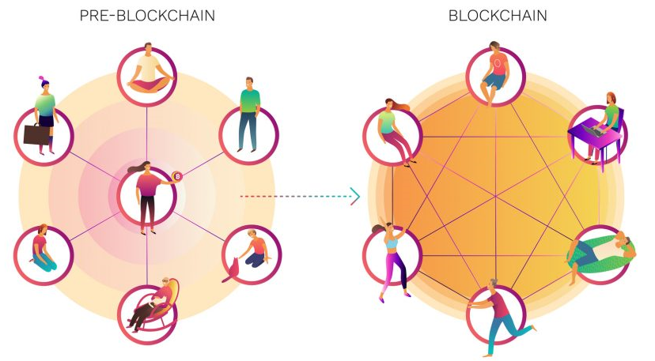
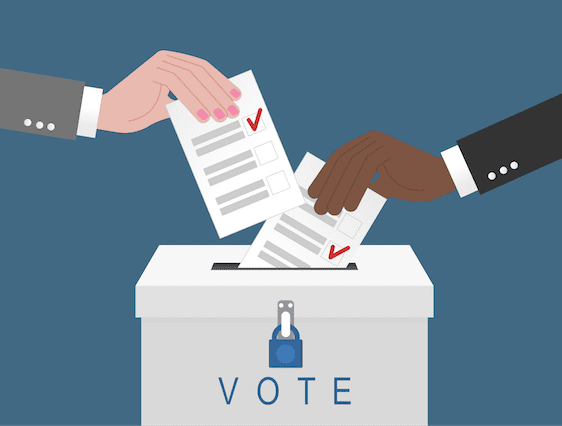

# DAO Introduction

## **DECENTRALIZED FINANCE FOR EVERYBODY**

\*\*\*\*

[**ballena.io**](https://ballena.io/) **project is managed at its 100% by the community and all users are eligible to vote and take part in the decision-making process.**  

Whether you are part of the Governance team, or whether you are willing to, you are in the right place. **The project** [**ballena.io**](https://ballena.io/) **belongs to its community**, it´s ours, it flies away from the traditional company structure and brakes with the commonly established centralised hierarchy for giving **the power and the benefits to its community members**.

  

The blockchain tech is changing **the investment funds management**. Traditional banking institutions are partially losing control of the market they were comfortably well established in. The Blockchain is a game changing technology seeking the **decentralization** that we have all lost.

* Have you ever thought in a society where the fees go directly to all users and not to some few wallets?
* Have you ever dreamt of a community led company?

That is exactly what our DAO is, this is what is all about.

**Our DAO is autonomously managed by the deployed Smart Contracts**. They are clearly published in BSCScan \(See Tokenomics\) and immutable, meaning no user will be able to modify them, not even ballena.io´s dev. team. Only through the proposal and voting of new ideas the platform will suffer new modifications or implementations, and this decision-making process is completely led by the user. **You, as a member of our community, will be heard and you will be able to decide the direction this DAO takes.**

\*\*\*\*

You will be able to **propose new ideas** which will be studied and voted among all members in the community seeking the success of the project.

The tr**easury related operations rely on a** [**Multi-signature system called Gnosis**](../technical/governance.md#wallet-safety). This means the new ideas will be proposed in our community, voted by all members and before **any transaction or change** becomes effective, it **will need** **the approval of a minimum number of users**.

  

We strongly recommend users read the documentation related to this decentralized organization. You will learn how to create and vote on new proposals, rules and much more. If you have any questions, reach us out on any of our channels. You will probably know our community, but if you don´t, come [become one of us!  
](../#community)

