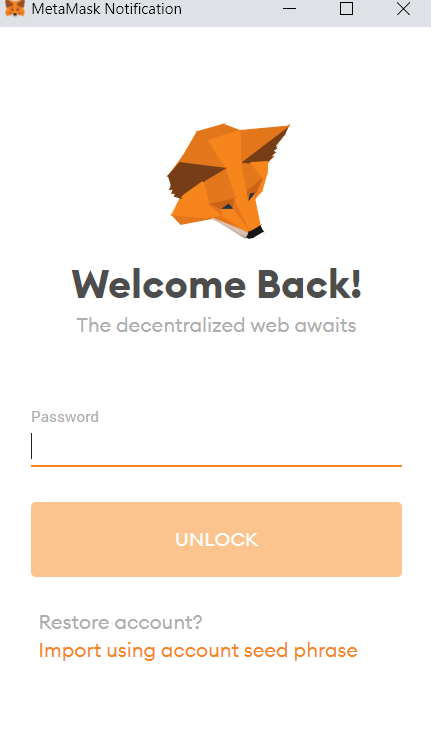

# Connect your Wallet for propolsals creation and voting

We need to connect our wallet first in order to create or vote on any proposal. Follow the next steps to connect your wallet.

### 1. Navigate to the [voting platform](https://vote.ballena.io/).

* **Link:**[ https://vote.ballena.io/](https://vote.ballena.io/)

### 2. Click on "Connect Wallet".

### 3. Select your wallet. If you followed our tutorials, click on "MetaMask".

### 4. Insert your password and click on "Unlock".

### 5. Done! Your wallet is connected. 

You can see your wallet´s address at the top right corner of your screen.

### 

### 

