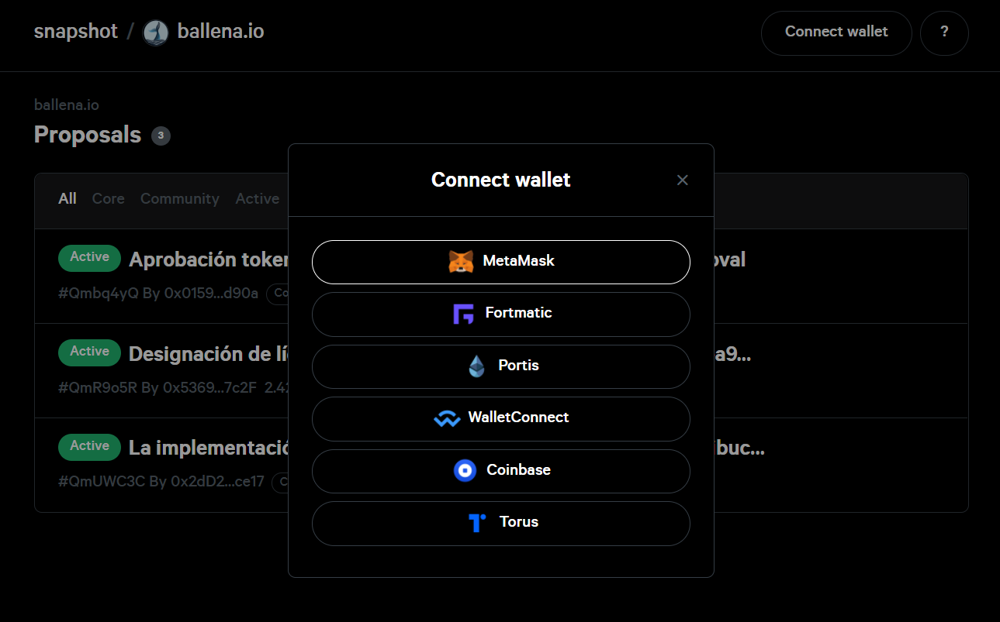

# Connect Wallet for propolsals creation and voting

We need to connect our wallet first in order to create or vote on any proposal. Follow the next steps to correct your wallet.

### 

### 1. Navega a la [plataforma de votación](https://vote.ballena.io/).

* Link: [https://vote.ballena.io/](https://vote.ballena.io/)

### 2. Haz click en "Connect Wallet".

### 3. Si has seguido nuestros tutoriales elige "MetaMask/TrustWallet", en caso contrario, elige la wallet con la que trabajes.

### 4. Conecta tu wallet haciendo click en "Unlock" al introducir tu clave.

### 5. Completado! Verás que tu wallet está ahora conectada. 

Esta aparece en la parte derecha del menú superior.

### 

### 

