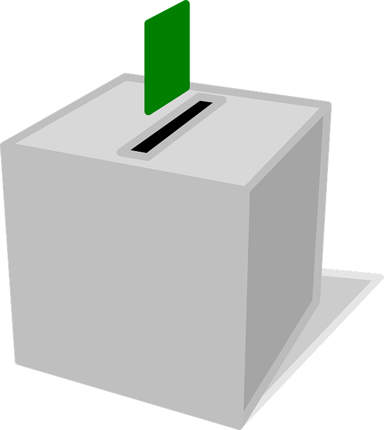

# Vote

Users in this community are eligible to create and vote on proposals in our [voting platform](https://vote.ballena.io/).

The creation of proposals and voting are free of charge but remember that users will always need to hold BALLE tokens for it.

### 1. **Access the ballena.io´s** [**voting platform**](https://vote.ballena.io/#/ballena)**.**

* **Link:** [**https://vote.ballena.io/**](https://vote.ballena.io/#/ballena)

### 2. **Connect your wallet containing BALLE tokens.**.

Follow the simple steps found in the [Connect your wallet](connect-your-wallet-for-propolsals-creation-and-voting.md) tutorial.

### 3. **Click on the desired proposal.**

\*\*\*\*

\*\*\*\*

### \*\*\*\*

### **4. Select your choice and click on "Vote".**

\*\*\*\*

### \*\*\*\*

### **5. Sign it with your wallet.**

\*\*\*\*

### **5. Done!**

\*\*\*\*

