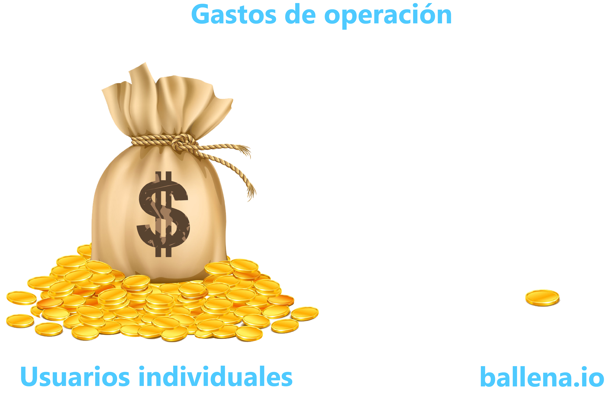

# Primeros Pasos

## ¿Qué son las DeFi y por qué están tan de moda?

Finanzas descentralizadas. Es decir, no hay una institución que gobierne la aplicación. Esto evita manipulación, malversación y altas comisiones de operación que tan acostumbrados estamos de ver.

Aquí podemos encontrar una gran cantidad de proyectos que proponen nuevas ideas o utilidades en la web. Cada día surgen nuevos proyectos, ya sea para solucionar problemas existentes, proyectos de inversión, etc. Por ejemplo, [ballena.io](https://ballena.io/) es un proyecto que **se encarga principalmente de reinvertir tus ganancias obtenidas en fondos de inversión** de tal manera que no tengas que preocuparte de hacerlo manualmente. Además, de esta manera, tus beneficios son **exponenciales**. Es decir, se aplica el **interés compuesto**.

Esto quizás te suene un poco abstracto pero en resumidas cuentas funciona de la siguiente manera: Aportas una cantidad de dinero a una plataforma y por el hecho de mantener ahí tu capital está te compensará con ciertos beneficios diarios, por ejemplo del 1%. 

Esto sería como cuando antiguamente el banco ofrecía ciertos intereses por depositar y confiar tu dinero en su institución. Una de las grandes diferencias es que este tipo de proyectos son descentralizados y todos los beneficios se reparten entre los usuarios de la plataforma y no van al bolsillo de unos pocos.

La aplicación de [ballena.io](https://ballena.io/) funciona como enlace a este tipo de fondos de liquidez. Por lo general, en este tipo de plataformas puedes cosechar manualmente los beneficios obtenidos para sacarlos de la plataforma o volverlos a reinvertir pagando unas tasas.

[ballena.io](https://ballena.io/) tiene como uno de sus objetivos principales **reinvertir continuamente tus beneficios generando así ganancias exponenciales**, ****esto se llama **interés compuesto.** Para entender esto veamos el siguiente gráfico. La línea azul denota la inversión de interés simple, es decir, no tiene en cuenta la reinversión. En cambio la línea naranja muestra la progresión de tus fondos como **inversión compuesta**.  
  

Supongamos que has invertido 100€. Si recibes el 1% diario de este importe, a final de año tendrás 365\*1€ = 365€ de beneficio. En cambio si cada día **reinviertes** ese 1€ de beneficio, el 1% de los próximos días actuará sobre una cantidad mayor a 100€, con lo cual tus beneficios serán mayores. Estos crecerán de manera exponencial hasta el valor de 3847.27€ a final de año exactamente.

Esto es lo que hace esencialmente[ ballena.io.](https://ballena.io/) Además, el equipo de desarrollo **busca los mejores fondos de liquidez**, las mejores oportunidades e implementa las estrategias más adecuadas para cada una de ellas. 

## ¿Por qué [ballena.io](https://ballena.io/)?

Si estás pensando en **invertir** en un proyecto de DeFi tienes que estar seguro de dónde estás metiendo tu dinero. Tendrás que aprender:

* Quién está detrás del proyecto.
* Cuál es su objetivo.
* Quién y cómo se toman las decisiones.
* Con qué fondos de liquidez trabaja.
* Qué rendimientos tiene.
* Su comunidad y accesibilidad.

El proyecto [ballena.io](https://ballena.io/) es completamente transparente y puedes ver todos estos datos en su documentación junto a los tutoriales. Podrás ver los [tokenomics](../tecnico/tokenomics.md), es decir, cómo se gestiona la economía del proyecto y más detalles de este tipo. A continuación se muestran las características principales en respuesta a preguntas frecuentes y estos puntos citados anteriormente.

### ¿Quién está detrás del proyecto?

Detrás del proyecto se encuentra la comunidad que nació en [Telegram](https://t.me/stgcrypto) con afán de crear un grupo de trabajo en el mundo de las crypto. Con más de 7.000 usuarios en el grupo, ahora esta comunidad tiene la forma de [DAO](), Organización Autónoma Descentralizada, donde la organización se coordina de manera autónoma por los contratos inteligentes. Es decir, **las decisiones se toman en comunidad** y el poder no recae sobre unos pocos.  

### 

### ¿Cuál es su objetivo?

De interés social y lucrativo para toda la comunidad de libre acceso y con objetivo de ofrecer también un producto útil de alto rendimiento para el público general. Además se centra en dar respuesta a los problemas originados por el lenguaje, ya que todas las plataformas DeFi se encuentran en inglés, [**ballena.io**](https://ballena.io/) **apuesta por el español** como lengua principal y el inglés como secundaria. Otro de los objetivos más perseguidos es la accesibilidad para los usuarios de todos los niveles, como podrás comprobar, [ballena.io](https://ballena.io/) hace fácil lo complicado.

### ¿Quién y cómo se toman las decisiones?

Las decisiones se toman en comunidad entre todos los usuarios que poseen el token de la plataforma BALLE. Es decir, si tu como usuario tienes algún token BALLE tendrás derecho a votar las decisiones. 

[ballena.io](https://ballena.io/) cuenta con una [plataforma de votación](https://vote.ballena.io) en la que se proponen nuevos cambios y son votados por todos los usuarios para su puesta en marcha. 

### ¿Quién se encarga de gestionar los fondos de tesorería del proyecto?

El proyecto cuenta con una tesorería que se lleva un mínimo porcentaje de los beneficios de la plataforma que se destina a :

* La gestión de la misma.
* Pagar las tasas de transacciones.
* Costes de promoción

Los fondos de tesorería se gestionan mediante un [sistema multi-firma llamado Gnosis](https://gnosis-safe.binance.org/#/safes/0x0b56828DfA6fe4144B8619c0f66b9FD594766c29/transactions). Se detalla con profundidad en la plataforma pero resumidamente **requiere un mínimo número de firmas de la comunidad** para llevar a cabo cualquier movimiento evitando así la malversación de fondos.

### Rendimientos

Los rendimientos de los fondos de nuestra plataforma son muy altos como podrás ver en el valor [APY](https://academy.binance.com/es/articles/what-is-yield-farming-in-decentralized-finance-defi#:~:text=Algunas%20m%C3%A9tricas%20habitualmente%20utilizadas%20son,espa%C3%B1ol%20Porcentaje%20de%20Rendimiento%20Anual%29.) de cada uno de nuestros productos. Los retornos son muchísimo más altos que cualquier fondo de inversión tradicional. Además, los usuarios de la plataforma son recompensados con pagos del token BALLE. Este token, debido a la utilidad del proyecto, se revalorizará de manera gradual y bastante rápida generando así un extra de beneficios.

En resumidas cuentas, **obtendrás un beneficio por aportar fondos y además una recompensa extra de tokens BALLE.** Como ventaja adicional, el sistema permite reinvertir los token BALLE y estos tokens también empezarán a generar más rendimiento. Los tokens BALLE no solo tienen valor en el mercado si no que además te permitirán participar en la toma de decisiones.

Aparte de esto, tendrás que **tener en cuenta la fluctuación de la criptodivisa** para el cálculo de tus beneficios. Es decir, el hecho de que el precio de la criptomoneda que has decidido aportar suba o baje causará un **impacto en el valor de tu inversión**. Es decir, el número de tokens aportados siempre irá creciendo en base a un ratio exponencial. Ahora bien, si el valor de la tokens aumenta, habrás ganado muchos más beneficios y si decrece, estarás en perdidas siempre y cuando su valor caiga tanto como para contrarrestar los tokens de más obtenidos. 

Por ejemplo, supongamos que hemos aportado 10 tokens BNB a un fondo de liquidez de [ballena.io](https://ballena.io/) y al cabo de un tiempo estos se convierten en 11 tokens debido a los beneficios obtenidos del interés compuesto que ofrece la plataforma. En principio nuestro capital ha aumentado pero habrá que observar el valor del token BNB para saber en que medida ha aumentado o incluso si estamos en perdidas. Si el BNB valía 100€ cuando lo compramos, invertimos 1000€. 

* En el caso de que ahora siga con el mismo valor, tendremos 11 tokens equivalentes a 1100€ y habremos ganado 100€. 
* En el caso de que el token BNB ahora valga 200€, entonces tendremos 11 tokens equivalentes a 2200€. Habremos ganado 1200€, 1000€ por su revalorización  y 200€ por el token extra que hemos ganado como intereses. 
* Y por último, si el BNB cae a 80€ por ejemplo, tendremos 11 tokens que equivalen a 880€, hemos perdido 120€. Así como la caída del valor de BNB nos habría hecho perder 200€, la ganancia del token extra por el interés compuesto nos reduce la perdida a 120€.

Es por esta razón por la que será **muy importante elegir en que proyectos de la red queremos invertir**, ya que [ballena.io](https://ballena.io/) nos ayudará a aumentar su número de tokens pero no tendrá nada que ver en las fluctuaciones del precio del mismo.

Los tokens aportados serán siempre los mismos y los tokens generados por el rendimiento irá creciendo exponencialmente, pero esto es independiente del valor de estos tokens. Por lo tanto, además de contar con este crecimiento del número de tokens aportados tendrás que estar atento a la tendencia que tiene el valor de tus criptomonedas aportadas.

Otro de los puntos más importantes a favor de [ballena.io](https://ballena.io/) es la **inmensa reducción en costes** para cada individuo en concepto de comisiones de transacción. El usuario promedio se sorprendería al ver los gastos anuales destinados únicamente a las **comisión de transacción**. En  [ballena.io](https://ballena.io/) las operaciones de reinversión de los usuarios se hace de manera conjunta por el mismo valor, con lo que el **impacto sobre el individuo es mínimo e inapreciable**. 

Una vez entendido el potencial del interés compuesto de nuestras inversiones en este tipo de plataformas, podemos deducir el impacto que puede tener el hecho de pagar las comisiones de operación individualmente respecto a pagarlas entre miles de usuarios. 

### ¿Con qué fondos de liquidez trabaja [ballena.io](https://ballena.io/) ?

[ballena.io](https://ballena.io/) trabaja con dos grupos de fondos de liquidez. 

* Por un lado, el fondo BALLE de nuestra comunidad, llamado **BALLE Staking Pool**. Podrás ver el código de los contratos en nuestra documentación.
* Por otro lado, [ballena.io](https://ballena.io/) trabaja sobre los fondos de [PancakeSwap](https://pancakeswap.finance/). Una de las mejores plataformas DeFi hasta el momento. Puedes ver todo su código y [auditorias de seguridad](https://certik-public-assets.s3.amazonaws.com/REP-PancakeSwap-16_10_2020.pdf) en la documentación de su plataforma.

### 

### ¿Es complicado operar en [ballena.io](https://ballena.io/) o cualquier DeFi de este tipo?

Sí, es bastante complejo a primera vista. Es necesario que alguien te ayude en todos los pasos ya que además de ser muchos, son un poco complicados. El equipo de [ballena.io](https://ballena.io/) es consciente de ello y por eso ha enfocado muchos de sus recursos en el apartado de tutoriales y en su comunidad. 

El proyecto nace por un bien común de la comunidad, buscar los máximos rendimientos para todos nosotros de una forma segura. Nos podernos lucrar todos los involucrados **a través de una plataforma que genera flujo de capital y tasas que son repartidas entre todos los usuarios y no se destinan a la propia institución**, ya que en este nuevo concepto de organización, esta recae sobre todos los usuarios. 

El hecho de actuar todos de manera conjunta en busca de estas oportunidades hace que los gastos de operación se paguen de manera conjunta y reduzcan al mínimo el impacto sobre el individuo.

### ¿Puedo retirar el dinero cuando quiera?

¡Por supuesto! Una vez aportado el capital, [ballena.io](https://ballena.io/) se encarga de maximizar tus rendimientos automáticamente pero puedes retirarlos en cualquier momento de manera instantánea. Simplemente haciendo click en "**RETIRAR"**, recibirás en tu billetera tanto los tokens que invertiste cómo los beneficios generados.

### 

### Me gusta como suena esto, ¿por dónde empiezo?

Navega a la página de [Tutoriales](https://docs.ballena.io/v/es/tutoriales) y asegúrate de completar todos ellos. Aquí aprenderás a invertir en [ballena.io](https://ballena.io/) sin haber tenido nunca contacto con el mundo de las DeFi.

También es recomendable que te unas a nuestra comunidad. En caso de tener cualquier pregunta, contacta con nuestro equipo a través de cualquiera de nuestros canales. Nuestra comunidad[ ballena.io](https://ballena.io/) está siempre en disposición de ayudarte, y aunque no necesites ayuda, ¡pásate a saludar!

Twitter:[ https://twitter.com/ballenaio](https://twitter.com/ballenaio)

Discord:[ https://discord.gg/ydRbEAaqqc](https://discord.gg/ydRbEAaqqc)

Medium:[ https://medium.com/@ballena](https://medium.com/@ballena)

‌Website:[ https://ballena.io](https://ballena.io/)

