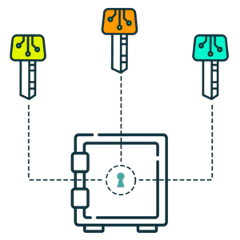

# Security and Risks

## Risks

In the space of crypto, especially in the Decentralised Finance \(DeFi\) space, users have to understand the risks of projects and smart contracts before venturing into DeFi. We call this DYOR \(do your own research\).

### General DeFi Risks

DeFi risks encapsulates a wide range of risks such as [impermanent loss](https://www.bsc.news/post/cryptonomics-what-is-impermanent-loss) to risks of falling for scams such as wallet draining, private key being stolen, et cetera. Hence, DeFi users have to be careful themselves and learn to educate themselves constantly in this space. You can find a guide to keeping your funds SAFU [here](https://letmeape.medium.com/how-to-keep-your-funds-safe-metamask-guide-816773968310).

### 3rd Party Risks

[ballena.io](https://ballena.io/) serves as a yield aggregator by providing vaults which auto-compounds rewards. We've verified the security of each of the vaults before publishing. However, vaults does not indicate any partnership or support by [ballena.io](https://ballena.io/).

## Wallet Safety

We are glad to announce **we are the first project working with Gnosis** Multisig system in the Binance Smart Chain. 

A multiple signature wallet is a cryptocurrency wallet that controls access and changes to one or more Smart Contracts. Most of the community governed projects in the Ethereum network often require multiple signers to approve a transaction before it will be executed. 

We are the first project in the BSC implementing Gnosis Safe to run our DAO. 

For more information regarding Gnosis Multi signature system check this link:



You can also find information about this system at the following link:



## Smart Contracts

### Audits



### Deployed

All deployed contracts have verified and published source codes on [tokenomics](tokenomics.md) and BscScan.

**BALLE**



_BalleMigration_



\[20:17\]BalleMaster: [https://bscscan.com/address/0x26fbb0ff7589a43c7d4b2ff9a68a0519c474156c](https://bscscan.com/address/0x26fbb0ff7589a43c7d4b2ff9a68a0519c474156c)\[20:18\]StratPancakeLpV1 vault 0 \(bALBT/BNB\): [https://bscscan.com/address/0xdaada85e22df14b12fe3eda2739b82541f206b2d](https://bscscan.com/address/0xdaada85e22df14b12fe3eda2739b82541f206b2d)\[20:18\]StratPancakeLpV1 vault 1 \(INJ/BNB\): [https://bscscan.com/address/0x8044182086ae7feeb00cc40d45877188a5587025](https://bscscan.com/address/0x8044182086ae7feeb00cc40d45877188a5587025)\[20:19\]StratPancakeLpV1 vault 2 \(DOT/BNB\): [https://bscscan.com/address/0x4da397f5c51bae9a37bc4ff6634b34b8e9111819](https://bscscan.com/address/0x4da397f5c51bae9a37bc4ff6634b34b8e9111819)\[20:19\]BalleTreasury: [https://bscscan.com/address/0xe81e27be6b4171601e1c055959db2940655c544d](https://bscscan.com/address/0xe81e27be6b4171601e1c055959db2940655c544d)\[20:19\]BalleRewardFund: [https://bscscan.com/address/0x11e4ecf13e3b4ccb246ae538d28ecceb28e28833](https://bscscan.com/address/0x11e4ecf13e3b4ccb246ae538d28ecceb28e28833)\[20:20\]Todos los datos de contratos se guardan en la hoja de registro: [https://docs.google.com/spreadsheets/d/1QF5Yd1hThGcGRwr\_xZq4mct1lMDN8V3pX2RkTauSCko/edit\#gid=1230263815](https://docs.google.com/spreadsheets/d/1QF5Yd1hThGcGRwr_xZq4mct1lMDN8V3pX2RkTauSCko/edit#gid=1230263815)\[20:22\]Ahí están todos los datos de los contratos: nombre, ruta en el repositorio, direcciones de testnet y mainnet, transacciones de creación, fecha y hora de creación, coste de la transacción\[20:22\]Algunos datos de los de hoy tengo que ponerlos al día  

