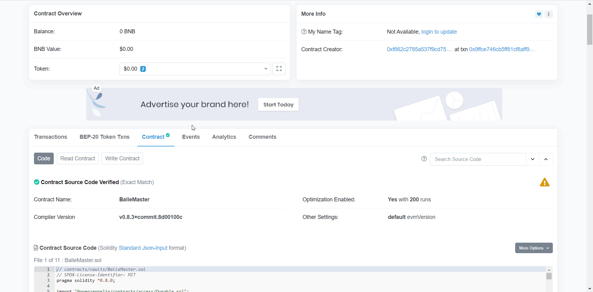

# Emergency Withdrawal

### What do you need?

#### **Balle MasterChef Contract Address.**

0x1105bd1d8c952c24e73f6866177fad7bfb35e13d 

#### **pID of the Balle-Vault where your LPs are.**

| pID  | VAULT  |
| :--- | :--- |
| 0 | bALBT-BNB |
| 1 | INJ-BNB |
| 2 | DOT-BNB |
| 3 | VRT-BNB |
| 4 | BTCST-BNB |
| 5 | WATCH-BNB |
| 6 | CAKE-BNB |
| 7 | TWT-BNB |
| 8 | ADA-BNB |
| 9 | TUSD-BUSD |
| 10 | TRX-BNB |
| 11 | UNI-BNB |
| 12 | LINK-BNB |
| 13 | XVS-BNB |
| 14 | UST-BUSD |
| 15 | WELL-BUSD |
| 16 | CAKE  |
| 17 | BUSD-BNB |
| 18 | BALLE-BNB |

## Step by Step

### 1. Access the BalleMaster link.



### 

### 2. Click on "Contract".

### 

### 3. Click on "Write Contract" and then click on "Connect to Web3".

### 4. Once connected, scroll down to "6. emergencyWithdraw".

### 5. Type-in the pID of the vault where your LPs are and click on "Write".

### 6. Your funds have been successfully withdrawn.

