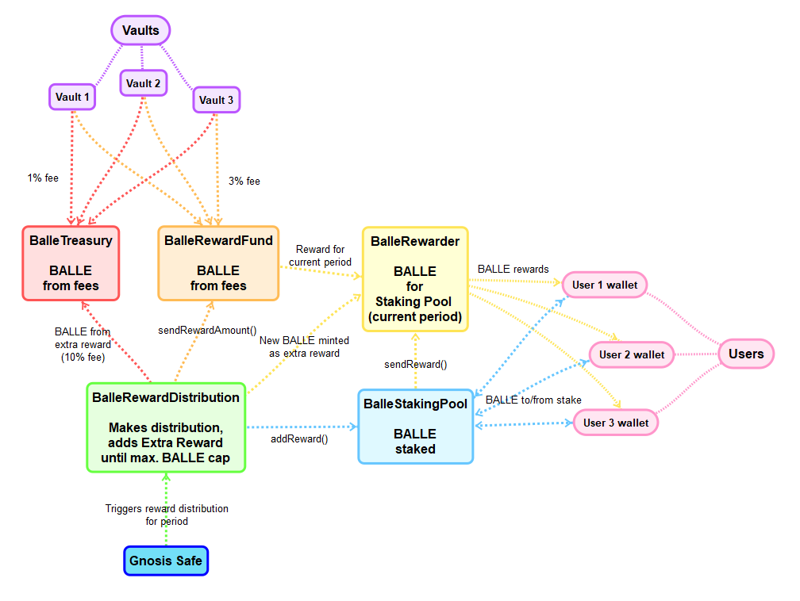

# BALLE Staking Pool

El token BALLE es el token nativo de gobernanza. Por el hecho de participar en el staking del token BALLE, recibirás una porción de los beneficios totales de la plataforma. Además de contribuir a su revalorización y al potenciar la plataforma, podrás participar así en el proceso de gobernanza de nuestra DAO, es decir, podrás proponer y votar propuestas en nuestra plataforma.


Participar en el Staking de BALLE te aportará beneficios de la plataforma de por vida.


Los usuarios de este producto reciben el 3% de los beneficios obtenidos por los usuarios de toda la plataforma en forma de tokens BALLE. 

Además, se reparte una recompensa extra de 12000 tokens para estos usuarios. La distribución de los mismos se lleva a cabo como un multiplicador que actúa sobre esta tasa del 3%. El usuario, por lo tanto, recibirá la porción de los beneficios correspondiente, multiplicada por este factor, en tokens BALLE.


El token BALLE es el token de gobernanza de [ballena.io](https://ballena.io/). Su valor radica en el beneficio a largo plazo de la posesión del mismo, derivado de las ganancias de la plataforma distribuidas entre los usuarios que lo poseen a medida que aumenta el TVL y los productos ofertados en la misma. Un equipo de desarrollo y una comunidad sólida centrada en la sostenibilidad del proyecto a largo plazo, así como un suministro limitado de los tokens, hacen del token BALLE un bien muy preciado. 

Así como el valor del token sufrirá altibajos como cualquier activo del mercado, este no está diseñado para lucrar al poseedor mediante la compra-venta en relación a las subidas de valor que este sufra, sino a través de su posesión, que permite al holder recibir de manera constante e indefinida un porcentaje del total de las ganancias de la plataforma.


### 

### Información técnica

[ballena.io](https://ballena.io/) recibe el 3% de las ganancias totales obtenidas en la plataforma cada semana, que se destina a los usuarios que participan en la BALLE Staking Pool. Estas ganancias acumuladas se reparten entre estos usuarios a lo largo de la siguiente semana, donde cada uno recibirá la parte proporcional que le corresponde en base a la cantidad de tokens depositados respecto al total de los mismos que haya en la pool.

Mientras se reparte esta recaudación durante la semana posterior, la plataforma se encarga de volver a  recaudar esa porción de las ganancias de la plataforma para repartirlas la próxima semana, y así sucesivamente. 

Además, la recompensa extra de 12.000 tokens BALLE se reparte también a estos usuarios que participan en el Staking, reparto que se regula por el multiplicador que se observa en la pool. Este multiplicador marcará el número de tokens que se distribuyen junto con las ganancias de la plataforma. Dado que el objetivo de este producto es distribuir parte de las ganancias de la plataforma y sustentarse por las mismas, se variará el multiplicador para satisfacer las necesidades del proyecto. 

Tras el lanzamiento de la plataforma, el multiplicador será mayor, ya que al contar con un TVL menor, los beneficios de la plataforma no serán lo suficientemente altos como para ofrecer APYs atractivos. De esta manera, los extra tokens BALLE situarán el APY en rangos muy rentables.

Una vez la plataforma cuente con más TVL, incrementarán las ganancias de la misma y por lo tanto los usuarios que participen en la BALLE Staking Pool se beneficiarán de un APY muy atractivo sin la necesidad del reparto extra excesivo de tokens BALLE, disminuyendo paulatinamente su distribución hasta llegar a un punto de total sostenibilidad de la pool puramente con las ganancias de la plataforma.

La siguiente ilustración muestra el funcionamiento de la recaudación que reciben los usuarios de la BALLE Staking Pool a modo de esquema:

 

