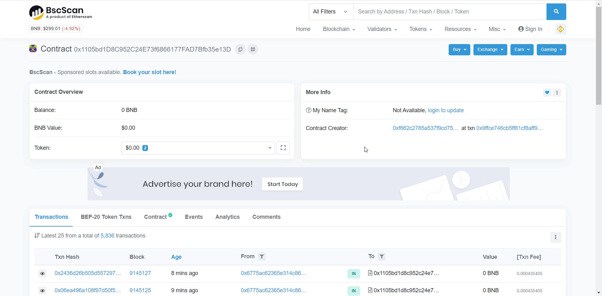
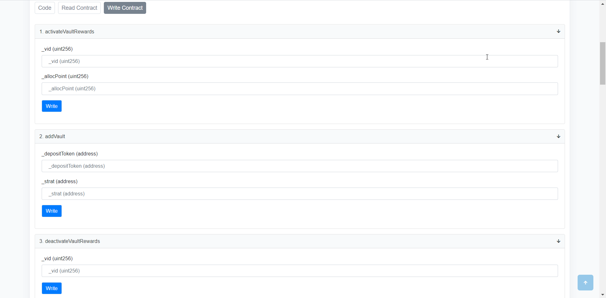

# Retiro de Emergencia

### ¿Qué necesitas?

#### **Contrato MasterChef de Balle:** 

0x1105bd1d8c952c24e73f6866177fad7bfb35e13d 

#### **pID de la Balle-Vault donde tienes tus LP**

| pID  | VAULT  |
| :--- | :--- |
| 0 | bALBT-BNB |
| 1 | INJ-BNB |
| 2 | DOT-BNB |
| 3 | VRT-BNB |
| 4 | BTCST-BNB |
| 5 | WATCH-BNB |
| 6 | CAKE-BNB |
| 7 | TWT-BNB |
| 8 | ADA-BNB |
| 9 | TUSD-BUSD |
| 10 | TRX-BNB |
| 11 | UNI-BNB |
| 12 | LINK-BNB |
| 13 | XVS-BNB |
| 14 | UST-BUSD |
| 15 | WELL-BUSD |
| 16 | CAKE  |
| 17 | BUSD-BNB |
| 18 | BALLE-BNB |

## Paso a Paso

### 1. Accede a la página web del BalleMaster.



### 

### 2. Haz click en "Contract".

### 

### 3. Haz click en "Write Contract" y después en "Connect to Web3".

### 4. Una vez conectada, baja hasta la sección "6. emergencyWithdraw".

### 5. Ingresa el pID de la vault donde tengas tus LPs que deseas retirar y haz click en "Write".

### 6. Tus fondos han sido retirados y se encuentran ya en tu wallet.

