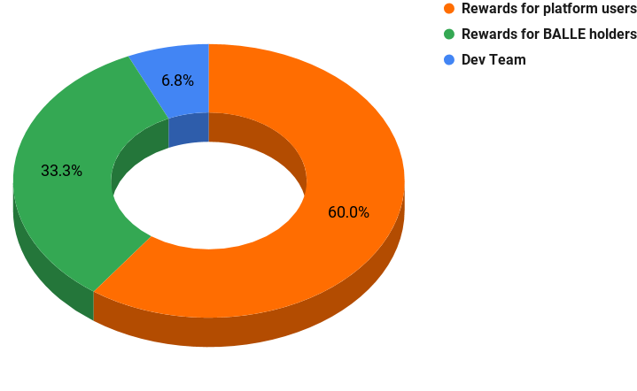

# Tokenomics

## Suministro máximo: 40000 BALLE

[Ballena.io](https://ballena.io/) cuenta con un suministro máximo de 40000 tokens BALLE. La plataforma no ha llevado a cabo un programa de preventa y el suministro comenzará con el arranque de la plataforma. Se distribuirán gratuitamente al completo entre nuestra comunidad de usuarios y poseedores del token BALLE. Además, una pequeña parte está destinada a nuestro equipo de desarrolladores y a los gastos de fomento y publicidad.

\*\*\*\*

**Distribución**

La distribución del total fijo e inmutable se compone de:

* **60% - 24000 BALLE tokens:** Distribuido entre todos los usuarios de la plataforma [ballena.io](https://ballena.io/).
* **33.3% - 13300 BALLE tokens:** Distribuido entre los holders del token BALLE como recompensa.
* **6.8% - 2700 BALLE tokens:** Fondos para el Equipo de Desarrollo, están dedicados al equipo de desarrollo promoviendo la innovación rápida, sostenible y segura de la plataforma, así como para acciones con objeto de promoción.

## Detalles:

**Límite de suministro Tokenomics :** La  totalidad de los tokens han sido producidos y se distribuyen gratuitamente entre los usuarios de la plataforma. La producción queda cerrada desde el momento del desarrollo y no hay producción posterior posible. El máximo de 40000 tokens es fijo e inalterable.

**Utilidad:** Las tasas del ecosistema van dirigidas a los usuarios que poseen el token BALLE. El 3% de los beneficios generados de la Yield Optimizer App se destinan a la compra de tokens BALLE para su posterior distribución entre los participantes de la App de Gobernanza o la Pool de Staking de BALLE.

## Cómo se distribuyen los tokens BALLE

Los mecanismos de distribución están incluidos en los Smart Contracts de nuestra plataforma. El Equipo de Desarrollo solo puede modificar un multiplicador para ajustar la razón de recompensa de ciertas pools. Toda la información estará disponible en la UI (Interfaz de Usuario).

Un total de 37300 tokens BALLE se distribuyen entre los usuarios de la Yield Optimizer App y la App de Gobernanza.

### Distribución entre los usuarios de la plataforma \(Yield Optimizer App\).

La distribución consiste en 24000 tokens BALLE y se llevará a cabo durante el primer año de funcionamiento de la plataforma entre los usuarios que participan activamente en nuestros productos. Al utilizar una de las BalleVaults, la bóveda CAKE-BNB por ejemplo, resultará en una recompensa de tokens BALLE, aparte claro del aumento de los tokens LP correspondientes.

Cada 3 segundos se distribuye un bloque de la BSC. De este modo, cada bloque dispone de un valor fijo de tokens BALLE que son distribuidos, los cuales se dividen entre el número de bóvedas activas y se entregan a los usuarios de acuerdo a la proporción compartida de la misma, multiplicada por el multiplicador que aparece en cada una de ellas. Este multiplicador es una herramienta ajustable del Equipo de Desarrollo que sirve para asegurar el correcto funcionamiento de la plataforma ligada al suministro de los tokens BALLE. Esto resultará en que algunas de las pools recompensarán en mayor grado al usuario.

### Distribución entre los usuarios que poseen el token BALLE \(Governance App\).

Los usuarios que poseen tokens BALLE y que participan activamente en la App de Gobernanza (BALLEReward Pool o BALLE Staking Pool), recibirán el 3% de los beneficios obtenidos por los usuarios en la Yield Optimizer App. Además de este reparto, estos usuarios serán recompensados con una distribución gradual de 13300 tokens BALLE.

Esta recompensa extra será distribuida como un multiplicador sobre el retorno generado de la tasa de la Yield Optimizer App. Este multiplicador aparecerá como un x10, x100 o x200 en la pool de gobernanza, o staking pool. De esta manera, el usuario recibirá la parte proporcional de la tasa multiplicada por este factor dependiendo del porcentaje aportado a la pool.

## Smart contracts

El suministro total ha sido producido y depositado en los siguientes contratos inteligentes para su distribución:

* Recompensa usuarios de la plataforma. 24000 BALLE en Smart Contracts: 0x2305423942390582058092
* Recompensa usuarios poseedores de BALLE. 13300 BALLE en Smart Contracts: 0x2305423942390582058092
* Fondos Equipo de Desarrollo. 2700 BALLE en Smart Contracts:

  * 0x2305423942390582058092
  * 0x2305423942390582058092
  * 0x2305423942390582058092
  * 0x2305423942390582058092
  * 0x2305423942390582058092
  * 0x2305423942390582058092
  * 0x2305423942390582058092
  

El suministro se encuentra cerrado y no es posible ampliarlo. La cuenta de producción se suprimió de los contratos inteligentes y no es posible configurar una nueva.

Transacciones: 0x2305423942390582058092 and 0x2305423942390582058092

