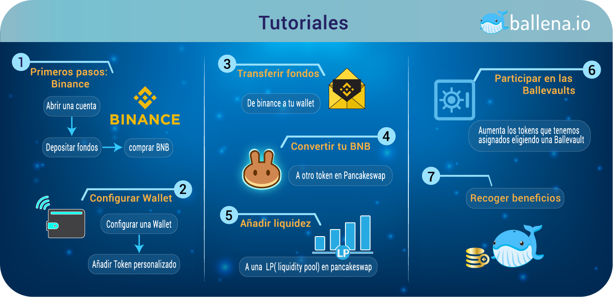

# Tutoriales

¿Estás empezando desde cero? No te preocupes, [ballena.io](https://ballena.io/)🐋 está aquí para ayudarte.

Empecemos con el siguiente esquema. Aquí se encuentran los pasos para llegar a invertir en la plataforma [ballena.io](https://ballena.io/) y generar ingresos pasivos. Haz clic en la imagen para agrandarla.

Una vez entendido el esquema a grandes rasgos, empezamos con los tutoriales uno a uno para completar todos los pasos de la mano de [ballena.io](https://ballena.io/). Para ello decide si vas a configurar un dispositivo móvil o el PC . Haz clic en los links de la parte inferior y empecemos uno a uno con esos pasos.





