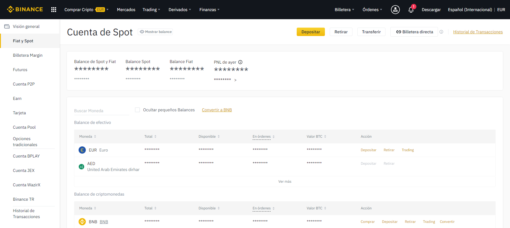
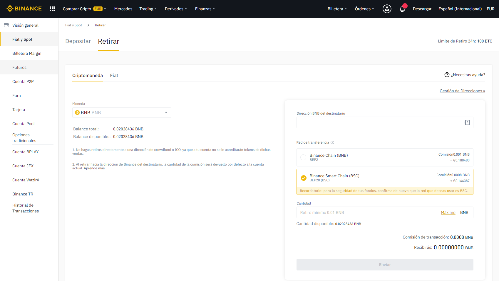

# Cómo enviar fondos de Binance a Metamask

## Cómo enviar fondos de Binance a Metamask

[ballena.io](https://ballena.io/)🐋 te ayuda a transferir tus fondos desde Binance a Metamask en 5 sencillos pasos. ¡Vamos allá!

### 1. Abre nuestra página de [Binance](https://www.binance.com/es) e ingresa con nuestra cuenta. Una vez ahí, entramos en Billetera-Spot.

### 

### ​2. Selecciona “Retirar” en la línea del Token BNB.

### 

### 3. El siguiente paso será rellenar los campos del cuadro de la parte derecha del panel. Lo primero que tendremos que hacer aquí es seleccionar "Binance Smart Chain \(BSC\)".

​​

​

### 4. Ahora copiamos nuestra dirección de la red BSC en Metamask.

Hacemos clic en la extensión de Metamask en nuestro navegador asegurándonos de tener la BSC seleccionada como red \(ver parte superior de la siguiente imagen\). Luego hacemos clic en la cuenta que aparece, copiando así su dirección.

​

### 

### 5. Por último, pegamos nuestra dirección en el campo "Dirección BNB del destinatario", la cantidad deseada de BNB en la parte inferior y le damos clic a enviar. 

No tengas prisa! En unos pocos minutos, tus BNB aparecerán en tu Wallet de Metamask.

​​

