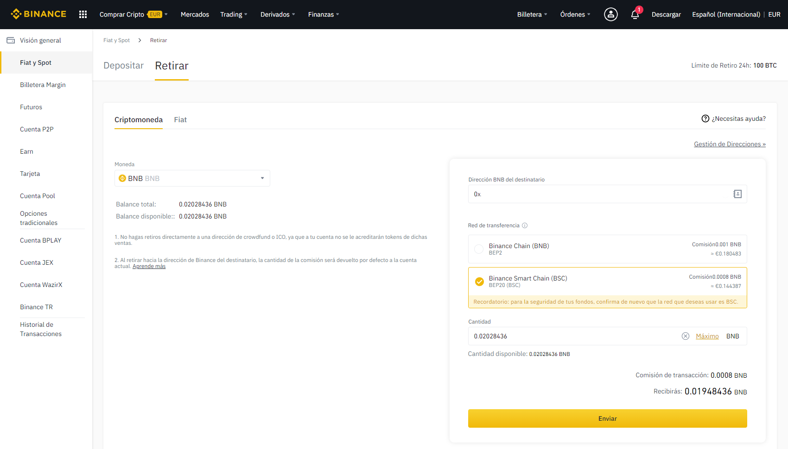

# Cómo enviar fondos de Binance a Metamask

Con este tutorial, transferiremos fondos \(en este caso BNB\) desde Binance a Metamask en 5 sencillos pasos. ¡Vamos allá!

### 1. Abrimos [Binance](https://www.binance.com/es) e ingresamos con nuestra cuenta. Una vez dentro, vamos a _Billetera **→**Spot_.

### 

### ​2. Seleccionamos “Retirar” en la parte derecha de la línea de la moneda BNB.

### 

### 3. Tendremos que rellenar los campos del cuadro de la parte derecha del panel. Lo primero que tendremos que hacer aquí es averiguar nuestra dirección de envío.

​​

​

### 4. Vamos a MetaMask y copiamos nuestra dirección BSC .

Hacemos clic en la extensión de MetaMask en nuestro navegador **asegurándonos de tener la BSC seleccionada** como red \(ver siguiente imagen\). Luego hacemos clic en la cuenta que aparece, copiando así la dirección.

​

### 

### 5. Por último, pegamos nuestra dirección en el campo "Dirección BNB del destinatario" y es muy importante que en "Red de transferencia" nos aseguremos de seleccionar _Binance Smart Chain \(BSC_\).

Más abajo, elegimos la cantidad deseada de BNB y le damos a enviar. Tendremos que confirmar la transferencia.

No hay prisa! En unos pocos minutos, los BNB aparecerán en nuestra wallet de MetaMask.  

​​

Ya tenemos fondos para operar en la BSC y participar en ballena.io:



