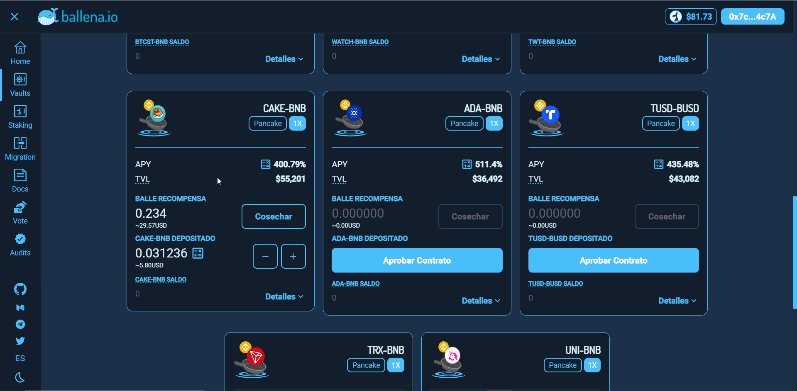

# Cosechar BALLE de una BalleVault

En este pequeño tutorial veremos como cosechar los BALLE tokens generados en una de tus vaults como recompensa.

No es necesario retirar tus tokens LP para cosechar las recompensas de BALLE tokens.

1- Accede a la Dapp de ballena.io y conecta tu wallet Metamask.

Navega al apartado "Vaults".

Elige la vault donde depostaste tus fondos, haz click en "Cosechar" y confirma la transacción en Metamask.

Los tokens BALLE han sido añadidos a tu wallet Metamask.


Recuerda agregar el token BALLE correctamente a tu Metamask, de lo contrario, no podrás verlos.


