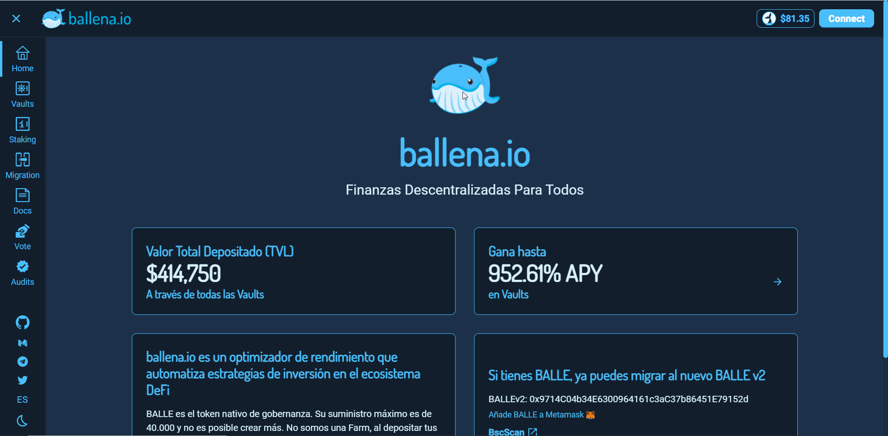
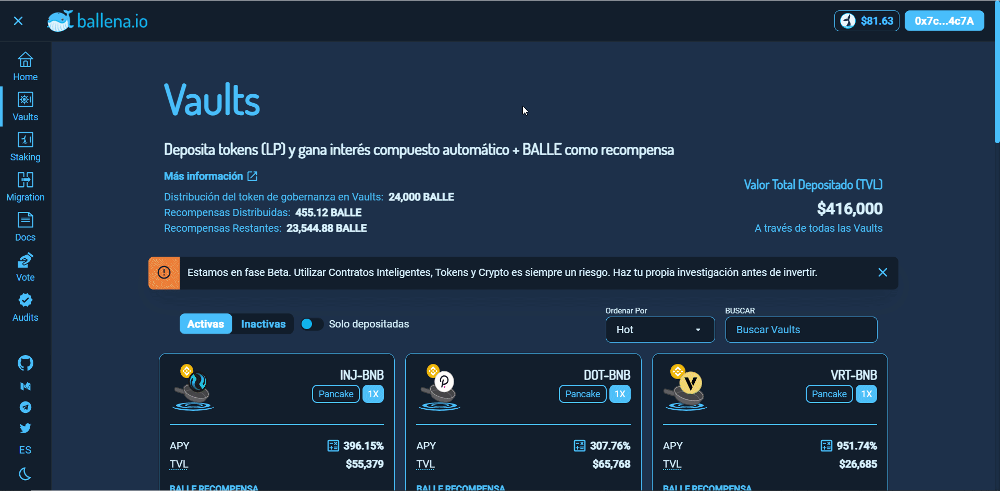

# Retirar los LP de una BalleVault

Para retirar tanto los tokens LP como las ganancias generadas en la misma, seguiremos este pequeño tutorial. Al retirar tu inversión recibirás:

* Los LP tokens aportados.
* Los LP ganados debido al interés compuesto.
* BALLE tokens a modo de recompensa.

Sigue los pasos a continuación para ello:

### 1. Accede a la Dapp de [ballena.io](https://app.ballena.io/) y conecta tu wallet Metamask.

### 

### 2. Navega al apartado "Vaults".

### 

### 3. Elige la vault donde depositaste tus fondos, haz click en "-", el símbolo de retirar, y confirma la transacción en Metamask.

### 4. Ya has retirado tus fondos. Comprueba que en tu cartera cuentas con los LP correspondientes y los tokens BALLE. 


Asegúrate de tener esos tokens agregados en tu Metamask o no podrás verlos. Para ello dirígete a este [tutorial](../metamask/como-anadir-un-token-personalizado-a-metamask.md). 


Además, podrás ver tus LP tokens tanto en Metamask como en el apartado "Liquidity" de [PancakeSwap](https://pancakeswap.finance/).

