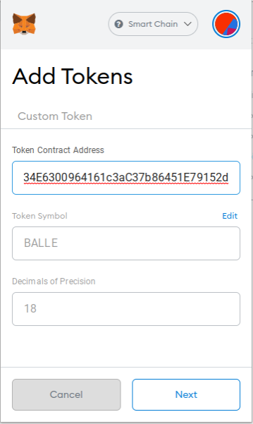

# Cómo añadir un token personalizado a MetaMask

Durante el proceso de [ballena.io](https://ballena.io/)🐋 trabajaremos con varios tokens, pero MetaMask no cuenta con la información de todos ellos. Esto NO significa que no vayan a ser compatibles con nuestra billetera. Significa que aunque seamos poseedores del token, este no se verá reflejado en nuestra billetera. **Necesitaremos añadir la información \(el contrato\) del token** a MetaMask **para** que este aparezca en la lista de tokens y **poder ver la cantidad de la que disponemos**.

**Pondremos como ejemplo el token BALLEv2 \(BALLE\)** ya que es el protagonista de esta odisea y porque es el único token que sabemos con toda certeza que manejaremos.

Recomendamos **siempre añadir los tokens** a MetaMask **antes de enviar fondos** a la wallet para evitar sustos.

### 1. Abrimos MetaMask, icono en la parte superior derecha de nuestro navegador.

### 

### 2. Hacemos clic en "Add Token" en la parte inferior del menú.

Nos aseguramos de estar en la red correcta \(BSC\).

### 

### 3. Copia y pega la dirección del contrato del token BALLEv2 en el campo "Address" y comprobamos que el resto de campos se rellenen automáticamente. Hacemos clic en "Next".


Siempre copiar la dirección de BALLEv2 de un sitio oficial de ballena.io.


**Esta es la dirección del contrato de BALLEv2:** 0x9714C04b34E6300964161c3aC37b86451E79152d


Saber que el nombre real del token es "BALLEv2" pero su símbolo sigue siendo "BALLE" \(no confundir con la versión antigua\).


### 4. Hacemos clic en 'Add Tokens' y...

#### 

### 5. BALLE 🐋! El token BALLE ya está disponible entre nuestros tokens. La wallet muestra ahora su balance en el menú principal de MestaMask.

Hora de enviar los BNB que compramos en Binance a MetaMask:



