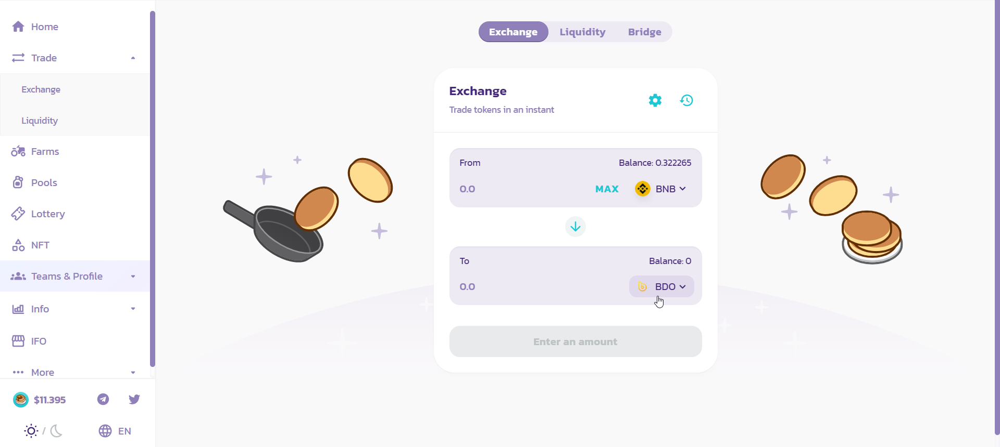

# Cómo añadir un token personalizado a Metaask

Durante el proceso de [ballena.io](https://ballena.io/)🐋 trabajaremos con varios tokens, pero MetaMask no cuenta con la información de todos ellos. Esto NO significa que no vayan a ser compatibles con nuestra billetera. Significa que aunque seamos poseedores del token, este no se verá reflejado en nuestra billetera. **Necesitaremos añadir la información \(el contrato\) del token** a MetaMask **para** que este aparezca en la lista de tokens y **poder ver la cantidad de la que disponemos**.

**Pondremos como ejemplo el token BALLE** ya que es el protagonista de esta odisea y porque es el único token que sabemos con toda certeza que manejaremos.

Recomendamos **siempre añadir los tokens** a MetaMask **antes de enviar fondos** a la wallet para evitar sustos.

### 1. Abrimos MetaMask, icono en la parte superior derecha de nuestro navegador.

### 2. Hacemos clic en "Add Token" en la parte inferior del menú.

### 

### 3. Hacemos clic en "Custom Token".

#### 

### 4. Copia y pega la dirección del contrato del token BALLE en el campo "Address" y comprobamos que el resto de campos se rellenen automáticamente. Hacemos clic en "Next".


Siempre copiar la dirección de BALLE de un sitio oficial de ballena.io.



Tener cuidado si se va a copiar la dirección desde bscscan.com ya que existen 2 tokens con este mismo nombre al buscar "ballena.io". Asegurarse de seleccionar ✅ ballena.io \(BALLE\) ✅ y no ❌ Ballena.io \(Balle\) ❌ 


**Esta es la dirección del contrato de BALLE** \(siempre comprobar\)**:** \ ADD NEW ADDRESS / 

### 

### 5. Hacemos clic en 'Add Tokens' y...

#### 

### 6. BALLE 🐋! El token BALLE ya está disponible entre nuestros tokens. La wallet muestra ahora su balance en el menú principal de MestaMask.

Hora de enviar los BNB que compramos en Binance a MetaMask:



