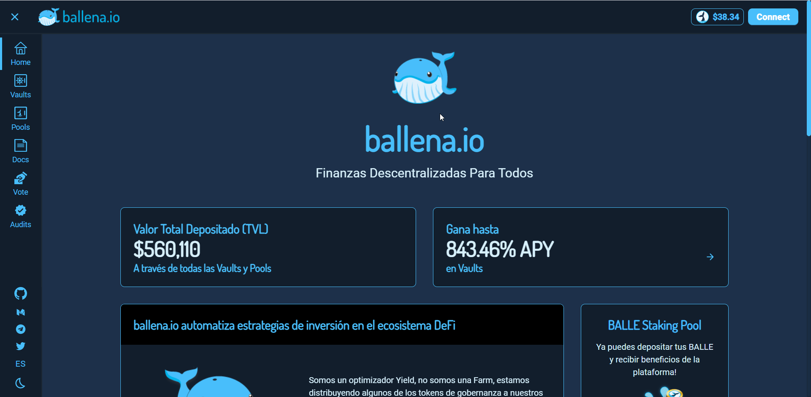
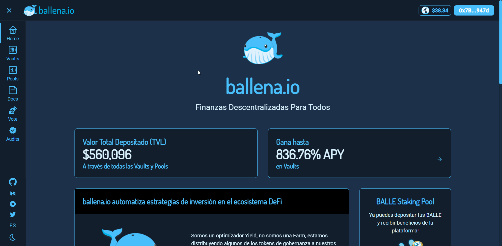
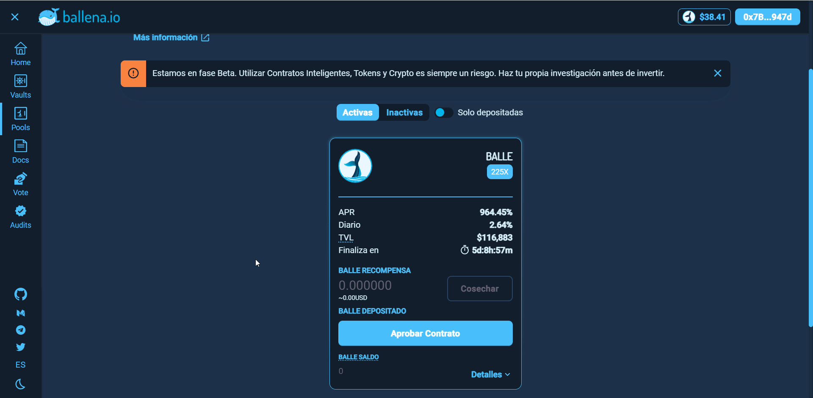
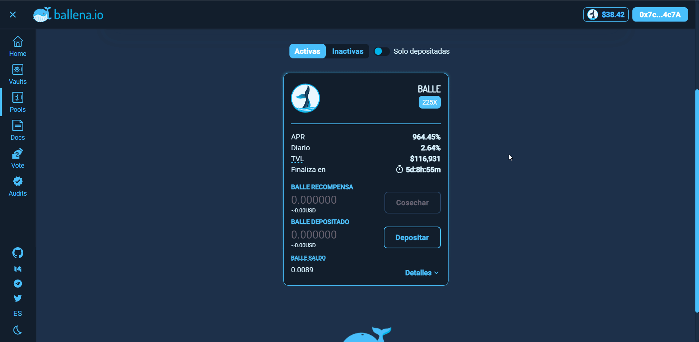

# Agregar los tokens BALLE a la Staking Pool

En este pequeño tutorial aprenderás a participar en la BALLE Staking Pool. Aquí, añadirás tus tokens BALLE para obtener los beneficios del staking.

* Recibirás el 3% de los beneficios de la plataforma.
* Podrás crear y votar propuestas en la plataforma de votación.

### 1. Accede a la Dapp de [ballena.io](https://app.ballena.io/) y conecta tu wallet Metamask.

### 

### 

### 2. Navega al apartado "Pools".

### 3. Aprueba el contrato.

### 4. Deposita la cantidad de BALLE deseada con el botón "+" y confirma la transacción.

### 5. Tus tokens BALLE han sido depositados en la BALLE Staking Pool y están listos para generar retornos.

