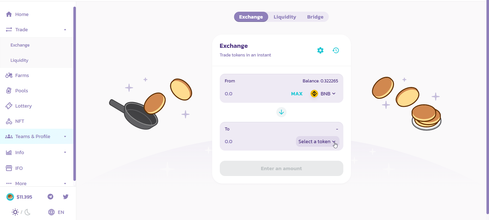

# Cómo comprar el token BALLE

En este tutorial veremos como **convertir tus BNB** **por el token BALLE** y además para poder así participar en la Gobernanza agregándolos a la BALLE Staking Pool para obtener más beneficios y participar en el proceso de toma de decisiones de la comunidad.

### 1. Navega a [PancakeSwap](https://pancakeswap.finance/).

* **Link**: [https://pancakeswap.finance/](https://pancakeswap.finance/)

### 

### 2. Conecta tu wallet Metamask haciendo click en "connect"

### 3. Haz click en "Trade" y después en "Exchange" en el menú de la parte izquierda.

### 4. Haz click en "Select a token" para seleccionar el token requerido.

### 5. Introducir la dirección BSC del token BALLE en el buscador.

**Dirección**: 0x9f0D5f45CE8573f43E0BA17876329784be0fd700

### 

### 6. Haz click en "\(Add\)" y después en la palabra "BALLE" para seleccionarlo.

### 

### 6. Introducimos la cantidad BNB deseada y hacemos click en "Swap".

Recuerda dejar algunos BNB tokens para hacer frente al pago de las fees que surgirán en estas plataformas.

### 7. Haz click en "Confirm swap" y confirma la transacción en Metamask.

### 

### 8. Completado!

Tus tokens deberían aparecer en tu Metamask. En caso de no verlos, asegúrate de haber agregado el token a tu metamask, si no sabes como hacerlo ve a [este tutorial](../../configurar-wallet-metamask-pc/como-anadir-un-token-personalizado-a-metamask.md).

