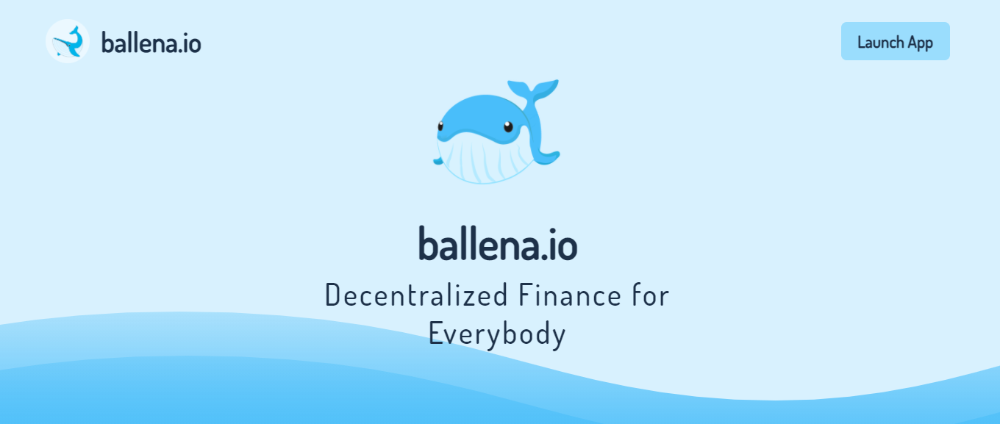
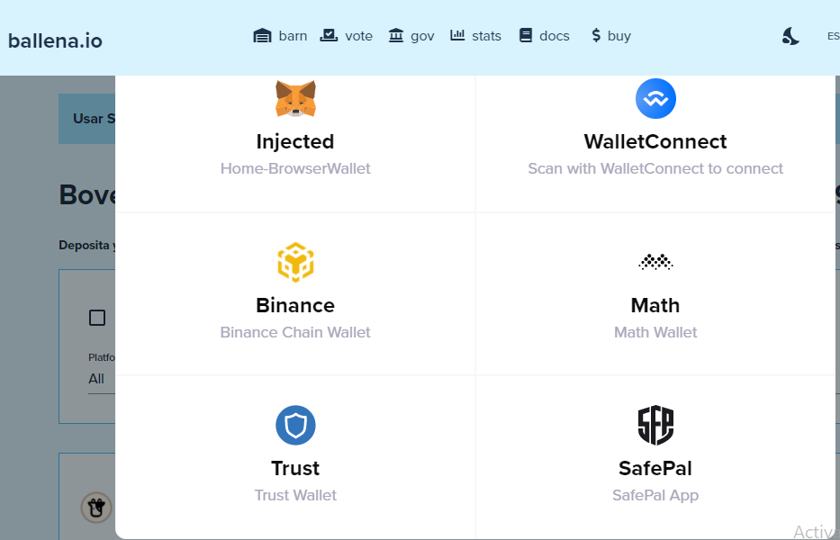

# Agregar los tokens de LP a BalleVault - PC

## Agregar los LP tokens a la BalleVault correspondiente en [ballena.io](https://ballena.io/)

En este pequeño tutorial [ballena.io](https://ballena.io/) os muestra cómo agregar los LP tokens a las BalleVaults.

Cuando queramos sacar rendimiento de nuestros tokens LP de las distintas plataformas las pondremos en la Bóveda que deseemos y a continuación ya nos irá generando rendimiento. Recuerda que para participar en las bóvedas LP antes es necesario que hayas agregado liquidez al de los pares indicados y en el Exchange al que hace referencia cada Bóveda.

### 1. Navegar a la página web [ballena.io](https://ballena.io/).

### 

### 2. Presiona el botón "Launch App" en la parte superior derecha.

En caso de aparecer "Error de conexión" asegúrate de haber configurado y seleccionado correctamente la red BSC en Metamask. Puedes verlo en el tutorial [correspondiente](../../configurar-wallet-metamask-pc/).

### 3. Selecciona "CARTERA" en la parte superior derecha.

### 4. Selecciona la cartera Metamask \(O la que hayas configurado\) haciendo click en "Injected".

### 5. Selecciona la bóveda requerida para proveer los LP tokens.

### 6. Haz click en "DEPOSITAR" en la bóveda seleccionada. 

### 7. Una vez abierto el menú hacer click en "DEPOSITAR" o "DEPOSITAR TODO".

### 8. Tus tokens LP ya se encuentran en la bóveda.

Podrás ver estos tokens a continuación de "Depositado" en el menú de la bóveda a la que has aportado LP. Verás cómo este valor aumenta poco a poco.

