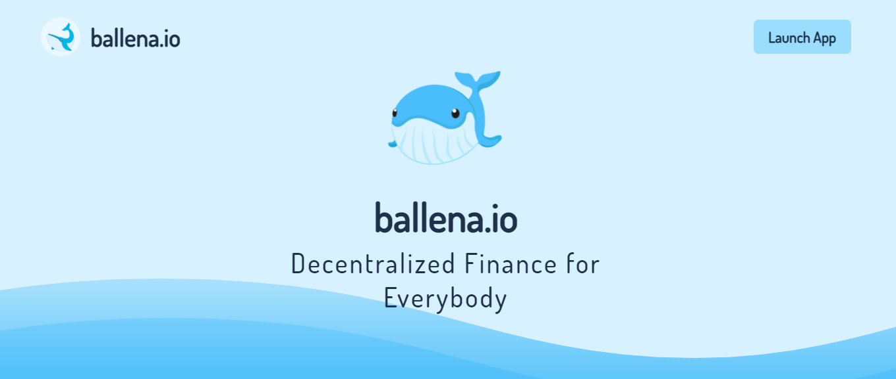
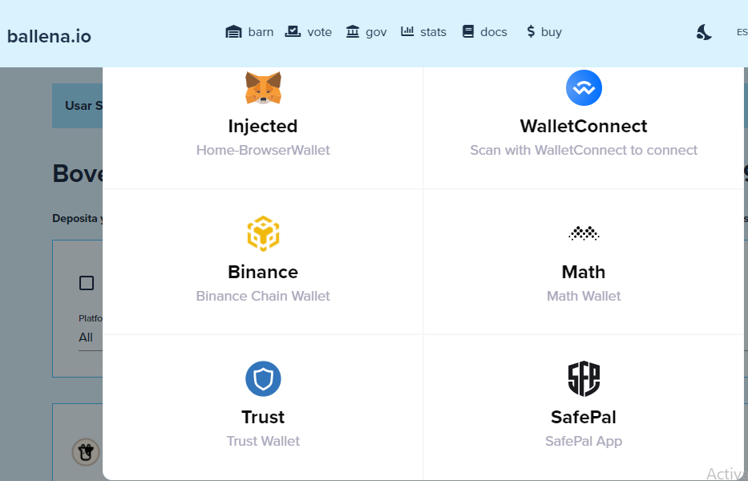

# Agregar los tokens de LP a BalleVault correspondiente en ballena.io

Basta con seguir los pasos de este pequeño tutorial que [ballena.io](https://ballena.io/) nos muestra para agregar los LP tokens a las BalleVaults y empezar a generar ingresos pasivos.

### 1. Navegar a la página web [ballena.io](https://ballena.io/).

### 

### 2. Presionamos el botón _Launch App_ en la parte superior derecha.

Nos aseguramos de estar en la red adecuada. De no ser así, cambiamos la red en MetaMask a la Smart Chain de Binance.

### 3. Arriba a la derecha, pulsamos "Connect".

### 4. Seleccionamos la cartera MetaMask.

### 5. Encontramos la bóveda requerida para proveer los LP tokens.

En el caso de que sigamos el ejemplo de los tutoriales anteriores, buscamos la bóveda "bALBT-BNB".

### 6. Hacemos clic en _DEPOSITAR_ en la bóveda seleccionada. 

Es necesario aprobar la bóveda antes.

### 7. Una vez desplegado el menú, hacer clic en _DEPOSITAR_ o _DEPOSITAR TODO_.

O bien deslizamos la ballena hasta donde queramos.

Aprobamos la transacción con MetaMask y pagamos las comisiones.

### 8. Nuestros tokens LP ya se encuentran trabajando en la bóveda.

Podrás ver estos tokens a continuación de "Depositado" en el menú de la bóveda a la que has aportado LP. Verás cómo este valor aumenta poco a poco.

