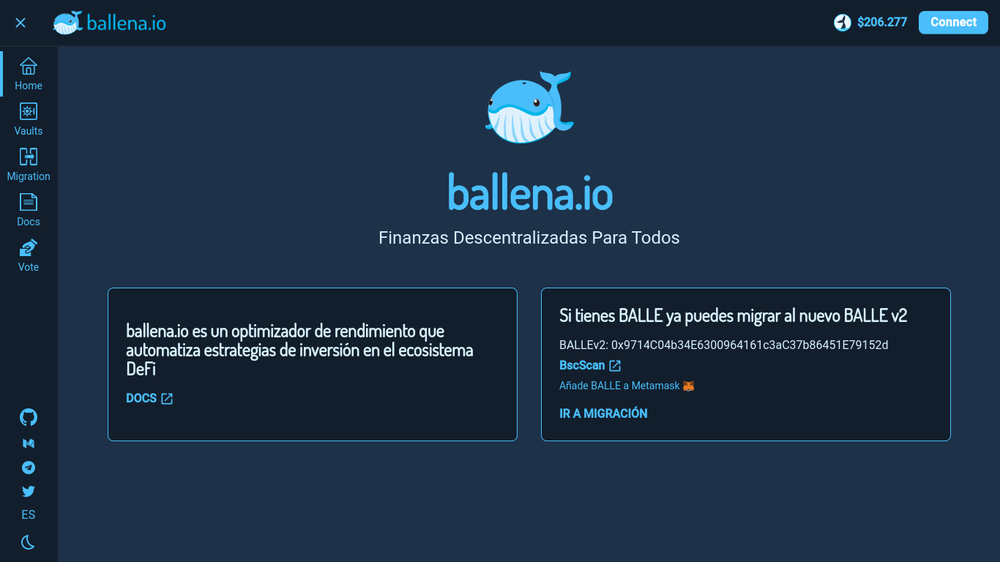

# Agregar los tokens LP a una BalleVault \(bóveda\) en ballena.io

Basta con seguir los pasos de este pequeño tutorial que [ballena.io](https://ballena.io/) nos muestra para agregar los LP tokens a las BalleVaults y empezar a generar ingresos pasivos.

### 1. Navegar a la página web [ballena.io](https://ballena.io/).

Nos dirigirá a la interfaz principal.

Nos aseguramos de estar en la red adecuada. De no ser así, cambiamos la red en MetaMask a la Smart Chain de Binance.

### 2. Arriba a la derecha, pulsamos "Connect".

### 3. Seleccionamos la cartera MetaMask.

### 4. Nos dirigimos a la interfaz _Vaults_ mediante el menú de la izquierda.

Encontramos la bóveda correspondiente a nuestros LP tokens.

En el caso de que sigamos el ejemplo de los tutoriales anteriores, buscamos la bóveda "bALBT-BNB".

### 5. Depositamos en la bóveda seleccionada. 

Es necesario aprobar la bóveda antes.

### 6. Una vez desplegado el menú, seleccionamos la cantidad.

Deslizamos la ballena hasta donde queramos o elegimos un porcentaje.

Aprobamos la transacción con MetaMask y pagamos las comisiones.

### 7. Nuestros tokens LP ya se encuentran trabajando en la bóveda.

Podremos ver como los tokens pasan a estar en "DEPOSITADO". Podremos apreciar también como la cantidad de los LPs y la cantidad de BALLE generado va aumentando progresivamente.

En cuanto hayamos **generado bastantes BALLE**, los **cosecharemos** y los **stakearemos en la Pool de Gobernanza**. De este modo, con los BALLE que hemos ganado, **podremos producir más BALLE** para nuestro propio **beneficio**.



