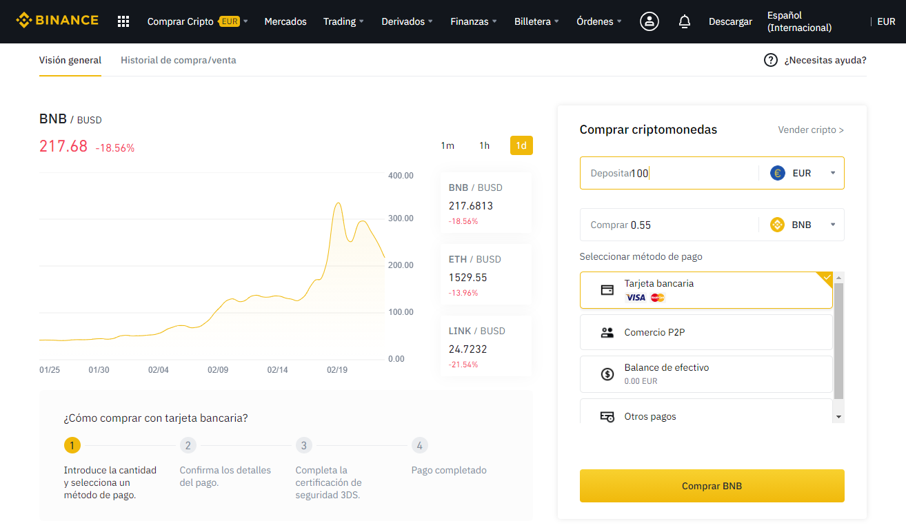
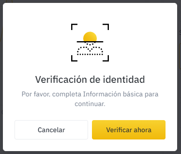
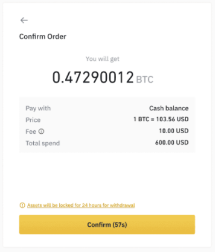
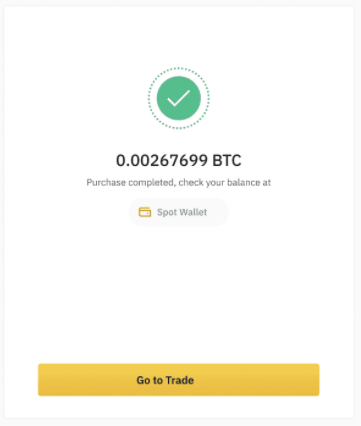

# Comprar BNB en Binance \(Tarjeta de crédito\)

## Cómo comprar Cripto en Binance \(Tarjeta de Crédito\)

En vez de depositar fondos a través de una transferencia bancaria para su posterior conversión a BNB, también podremos comprar BNB directamente con nuestra tarjeta de crédito. Esta transacción suele requerir el pago de una tasa algo más alta, aunque el proceso es mucho más rápido y sencillo. Para comprar cripto con tarjeta de crédito en Binance lo haremos de la siguiente manera.

### 1. Pulsa el botón “Comprar Cripto” del menú de la Barra superior en Binance.

### 2. Selecciona la opción “Tarjeta de crédito/débito”.

### 3. Selecciona la moneda correspondiente, introduce la cuantía y haz clic en continuar.

### 4. Selecciona BNB.

Recuerda que, en la mayoría de proyectos de la Red Binance Smart Chain utilizan como toquen básico BNB y además se utiliza BNB para pagar las comisiones. Por lo tanto, necesitarás tener BNB en tu billetera para trabajar en Binance Smart Chain. Puedes seleccionar BNB en el combo de selección de criptomoneda.

### 5. Asegúrate que has verificado tu identidad en Binance.

Si no has completado el proceso de verificación no se permitirá realizar esta acción y aparecerá esta pantalla.

### 6. Confirma la transacción.

En cuanto tengas la identidad verificada podrás continuar con el siguiente paso y confirmar la transacción.

Una vez validada la operación te aparecerá una pantalla de confirmación. Hay que tener en cuenta que el pago puede necesitar de acciones propias de tu banco.

### 7. Completada.

* Puedes obtener información más detallada y respuestas a preguntas frecuentes en la propia web de Binance [Cómo hacer depósitos de monedas fíat por transferencia bancaria \(SEPA\)](https://www.binance.com/es/support/faq/e117b4c063534e5f93b735b980575000) o [Comprar cripto](https://www.binance.com/es/support/faq/c-66?navId=75).

