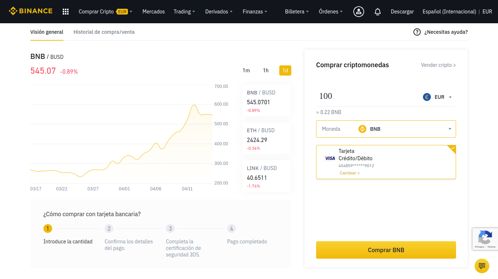
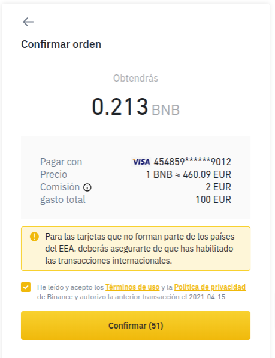

# Comprar BNB en Binance \(Tarjeta de Crédito\)

Podemos comprar BNB directamente con nuestra Tarjeta de Crédito. Esta opción ofrece una **compra directa de BNB,** **sin** necesidad de **esperas** de deposito **ni** tampoco **conversiones**. Debemos saber que la **comisión** aplicada a este proceso es del **1.8%**.

### 1. Sobre “Comprar Cripto” del menú de la barra superior en Binance.

### 2. Seleccionamos la opción “Tarjeta de crédito/débito”.

Necesitaremos introducir los datos de nuestra tarjeta.

### 3. Seleccionamos la moneda correspondiente en "Depositar".

### 4. Elegimos comprar BNB.

Como ya sabemos, es imprescindible comprar BNB para cumplir este objetivo.

### 5. Estipulamos el importe en Euro que queremos invertir y pulsamos "Comprar BNB".

### 5. Asegurarse de haber completado la Verificación de identidad de Binance.

Si no hemos completado el proceso de verificación, no se nos permitirá realizar la acción y aparecerá esta pantalla.

### 6. Confirmamos la transacción.

Hay que tener en cuenta que el pago puede necesitar de acciones propias de nuestro banco.

### 7. Ingreso finalizado.

Una vez validada la operación nos aparecerá una pantalla de confirmación ✅ . 


**Comprobamos si se ha realizado el cargo en nuestra cuenta bancaria y si nuestro saldo de Binance ha aumentado.**


En caso de que las dos anteriores sean negativas, volvemos a realizar el proceso.

* Podemos obtener información más detallada y respuestas a preguntas frecuentes en la propia web de Binance de [Comprar cripto](https://www.binance.com/es/support/faq/c-66?navId=75).

Completado este proceso, dispondremos de una pequeña cantidad de BNB en nuestra _Billetera Spot_ y estaremos listos para el siguiente paso:



