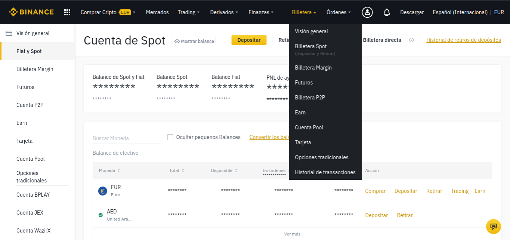
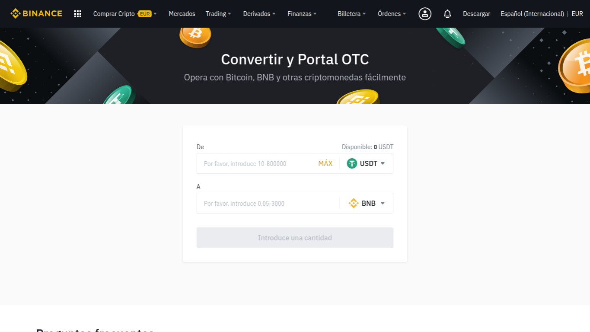

# Convertir fondos a BNB en Binance

Ya tenemos nuestro dinero en Binance. Podremos comprobarlo en el saldo de _Billetera Spot._

\_\_

## Cómo convertir fondos a BNB en Binance

### 1. Accedemos a la página web de [Binance](https://www.binance.com/es).

### 

### 2. Ingresamos en nuestra cuenta creada en los pasos anteriores.

### 3. En la barra superior, en "Trading", elegimos "Convertir".

### 4. Seleccionamos EUR y USDT como en la siguiente imagen.

De este modo convertiremos nuestros EUR en USDT.

### 5.Introducimos la cantidad de EUR.

Le damos a "Previsualizar conversión" y convertimos.

### 6. Ahora habrá que hacer lo mismo de USDT a BNB.

Colocamos las monedas como en la siguiente captura y convertimos el _MAX_ de USDT.

### 7. **¡**Completado! 

Dispondremos de una pequeña cantidad de BNB en nuestra _Billetera Spot_ y estaremos listos para el siguiente paso:



