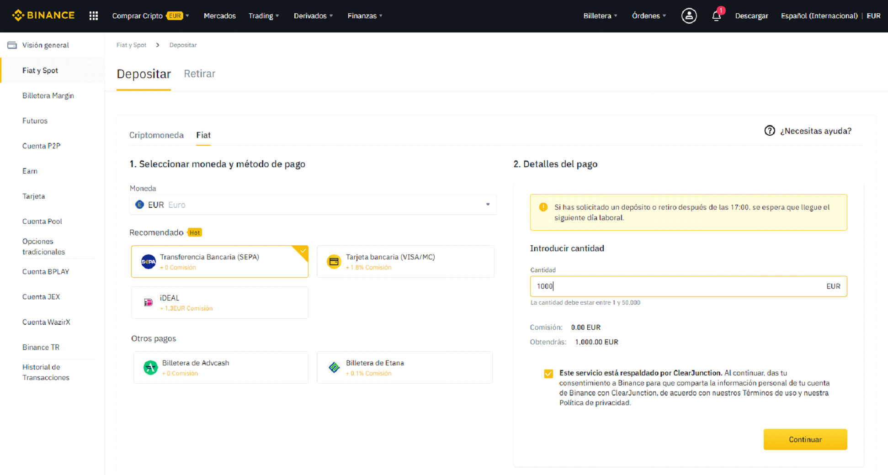
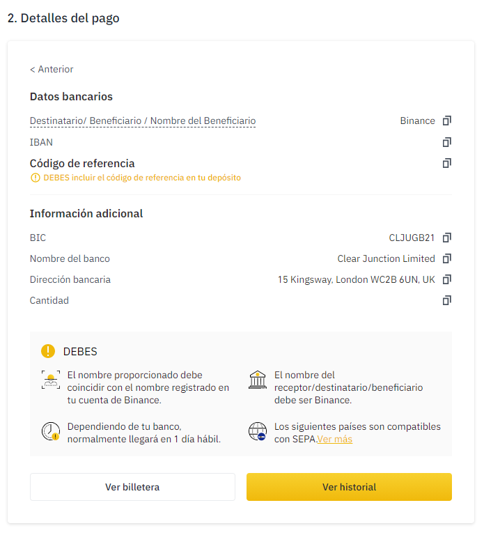

# Cómo depositar fondos en Binance \(Transferencia Bancaria SEPA\)

### 1. Pulsar el botón “Comprar Cripto” del menú de la barra superior en Binance.

### 

### 2. Seleccionar la opción “Depósito bancario”.

### 3. Seleccionar la moneda correspondiente, introducimos la cantidad y continuamos.

### 

### 4. Recibimos los Detalles del pago.

### 

### 5. Accedemos a nuestro banco vía Web o vía App y realizamos una transferencia internacional con los datos que se nos han facilitado.


 Añadir el Código de referencia de 4 dígitos en el concepto de la transferencia y comprobar todos los datos.


Podemos obtener información más detallada y respuestas a preguntas frecuentes en la propia web de Binance [Cómo hacer depósitos de monedas fíat por transferencia bancaria \(SEPA\)](https://www.binance.com/es/support/faq/e117b4c063534e5f93b735b980575000).

### 6. Esperamos hasta que nuestro dinero llegue a Binance al día siguiente.

Mientras tanto, podemos seguir leyendo el resto de la documentación. ¡Aprende más sobre [ballena.io](https://ballena.io/)!

