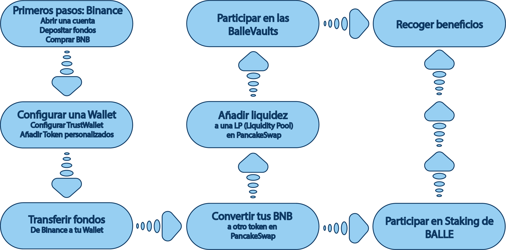

# Smartphone/Tablet

Los dispositivos móviles tienen la ventaja de que nos permiten tener acceso en prácticamente cualquier lugar y a cualquier hora. Los pasos a seguir en Smartphone son los mismos que en PC, pero tanto las herramientas que usaremos como su funcionamiento serán diferentes. Por eso, en[ ballena.io](https://ballena.io/) hemos querido separarlos para contar con la ayuda más personalizada en cada uno de los dispositivos.

En el caso de los dispositivos móviles se utilizarán las siguientes herramientas:

* Aplicación **Binance**.
* Wallet - En este caso utilizaremos **Trust Wallet**.

La aplicación de Binance será el puente entre nuestro banco y el mundo de las criptomonedas. Después la usaremos para conectar con Trust Wallet.

Y Trust Wallet, a parte de ser una billetera segura donde almacenar nuestras criptomonedas, será nuestra puerta de acceso a la blockchain Binance Smart Chain \(BSC\), plataforma descentralizada en la que operan Dapps \(aplicaciones descentralizadas\) como PancakeSwap y la misma [app.ballena.io](https://app.ballena.io/)🐋.

Cada paso de este esquema es necesario para hacer que nuestro dinero pase de estar inmovil en el banco a que esté generando altos rendimientios en[ ballena.io](https://ballena.io/)🐋, y ninguno se podrá realizar sin haber completado el anterior. 

Puede resultar algo confuso a primera vista, pero cada paso se detalla de modo que lo podamos entender a medida que lo vayamos haciendo. ¡Comencemos!  

Para comenzar  nos dirigimos al siguiente enlace:



