# Configurar Wallet: Metamask y la red BSC

MetaMask es una billetera, o wallet, compatible con ERC20. En este tutorial explicaremos cómo configurar una wallet en MetaMask desde el comienzo. Además veremos cómo configurar la red BSC para la misma.

**​**

## **Cómo instalar MetaMask en tu Smartphone o Tablet.**

MetaMask está disponible para sistemas iOS y Android**.**

\*\*\*\*

### **1. Abre el AppStore en tu móvil y descarga la aplicación.** 

**​** Una vez en el AppStore, busca la aplicación de MetaMask y toca en descargar.

**​**

**​**

### **2. Una vez descargada la app, la abrimos . Ahora haz Clic en "Empezar".** 

**​**

**​**

### **3. Crea una cuenta. Haz clic en el botón "Crear billetera" de Metamask.** 

**​ ​**

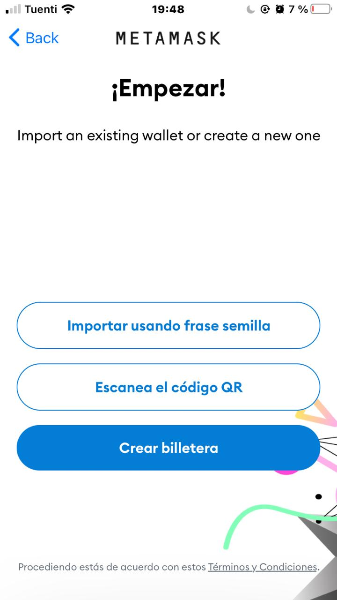

**​**

### **4. Crea una contraseña y acepta los términos.**

**​​**

\*\*\*\*

### **​5. Asegura tu billetera con la frase de semilla.** 


**Esta es la parte más importante** de la configuración de una billetera, las Palabras de Recuperación son las claves de nuestra billetera criptográfica. **Nos aseguramos de guardarlas** en un lugar seguro, preferentemente offline. Anotarlas **exactamente en el mismo orden que aparecen en nuestra pantalla**, ya que de lo contrario no sería válida y **su pérdida ocasionaría la pérdida total de los fondos.**


Escríbela en el recuadro y confirma.​

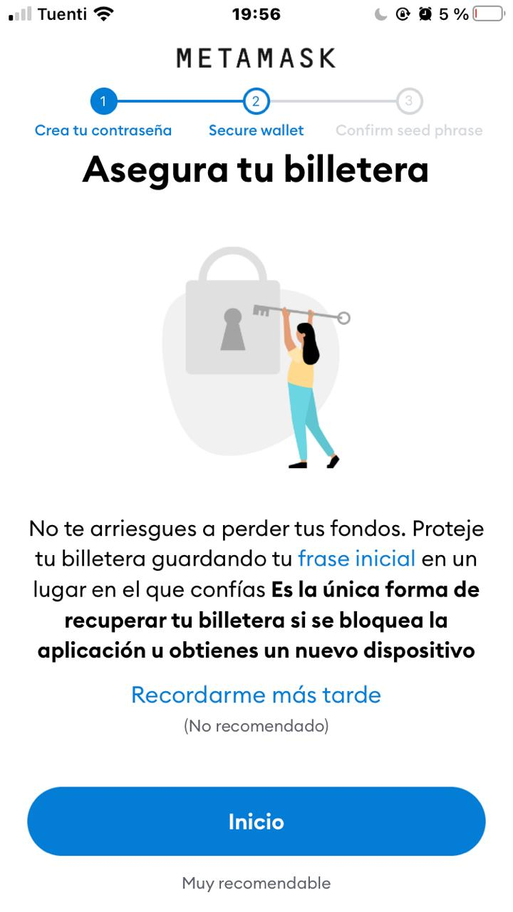

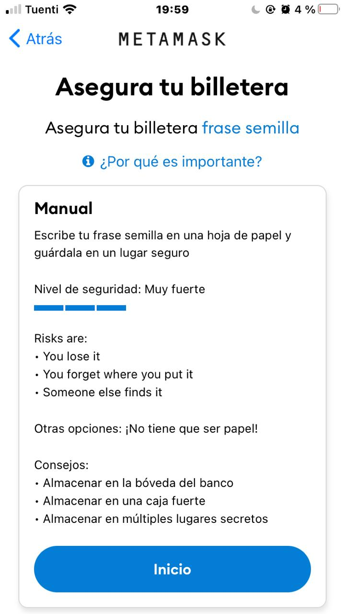

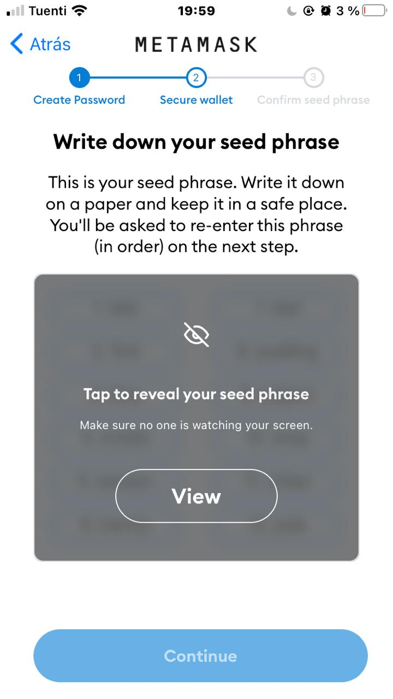

**​**

### **6. ¡Hecho! ¡Has creado tu cuenta de MetaMask!. Ahora toca “Done” para acceder a la billetera.**

\*\*\*\*

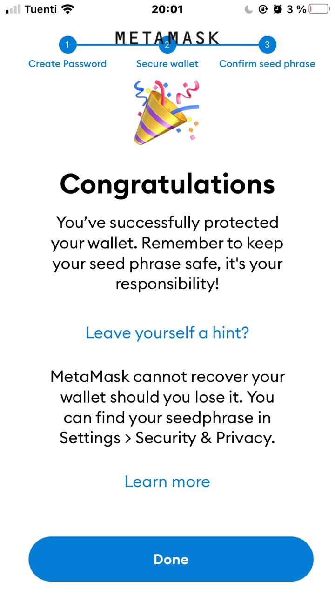

**​**

## **Cómo configurar la red BSC en tu Wallet de MetaMask**

**​**

### **1. Ahora vamos a configurar la red BSC en tu Wallet. Primero haz clic arriba a la izquierda en el botón para ingresar al menú y haz clic en "ajustes".**

**​​**

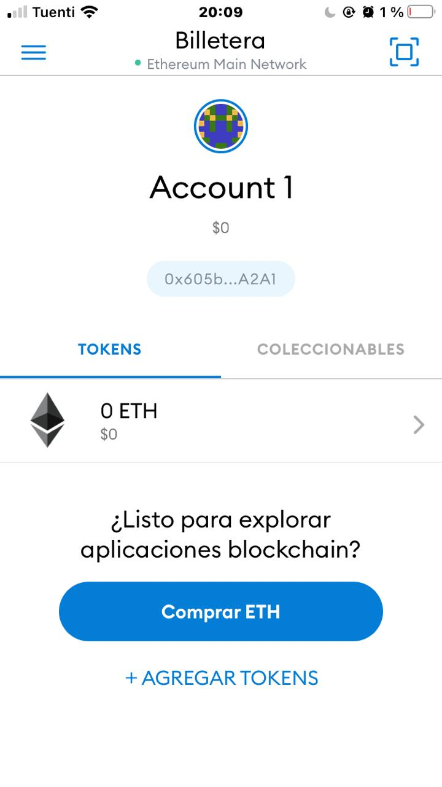

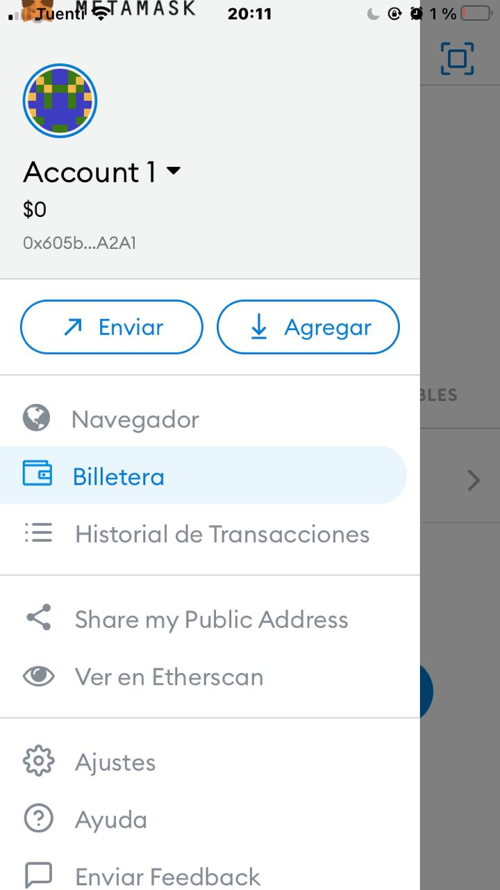

### **​2. Ahora hacemos clic en “Redes” y luego “Agregar Red”.**

\*\*\*\*

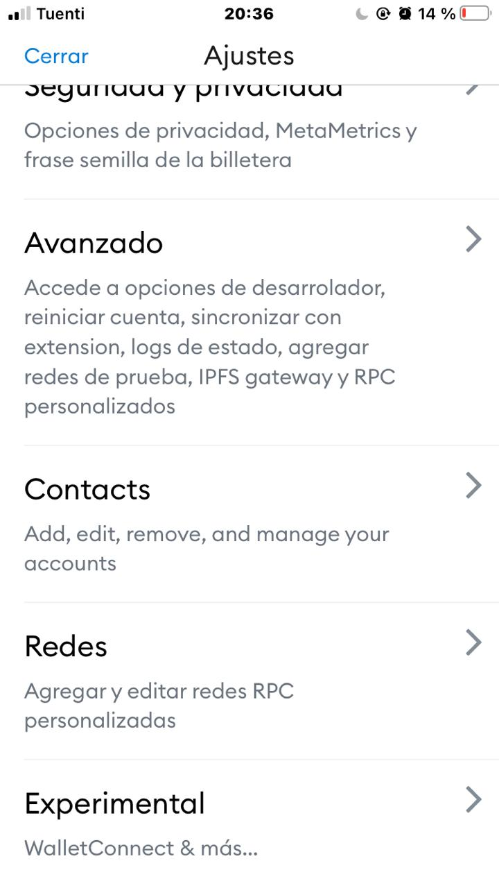

\*\*\*\*

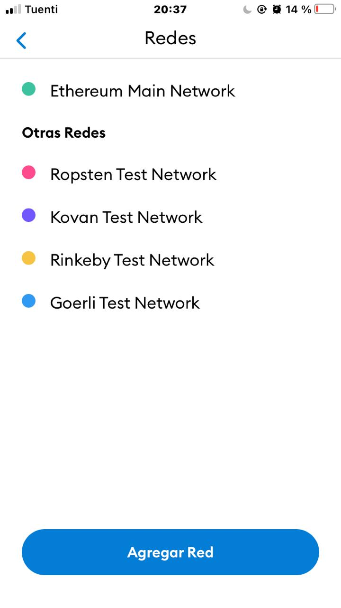

### **3. Añade los datos de la BSC que mostramos a continuación y haz clic en "Agregar".**

**​​**En el campo "Chain ID" puedes escribir 0x38 o 56, ya que son equivalentes. No debería preocuparos si al hacer clic en "Save" los valores se intercambian entre estos dos citados.

**​**

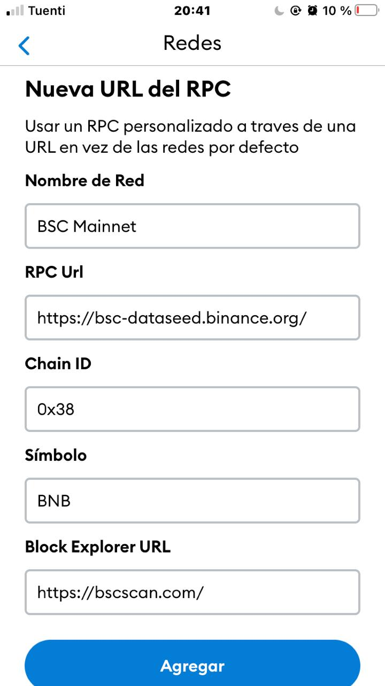

### \*\*\*\*

### **4. Ahora tu Wallet está lista para operar en la red Binance Smart Chain, ¡enhorabuena!**

**​**

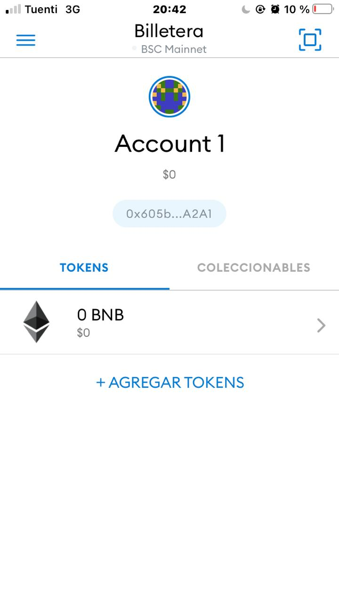

**​**

Sigue con [ballena.io](https://ballena.io/) en los siguientes pasos!

  

