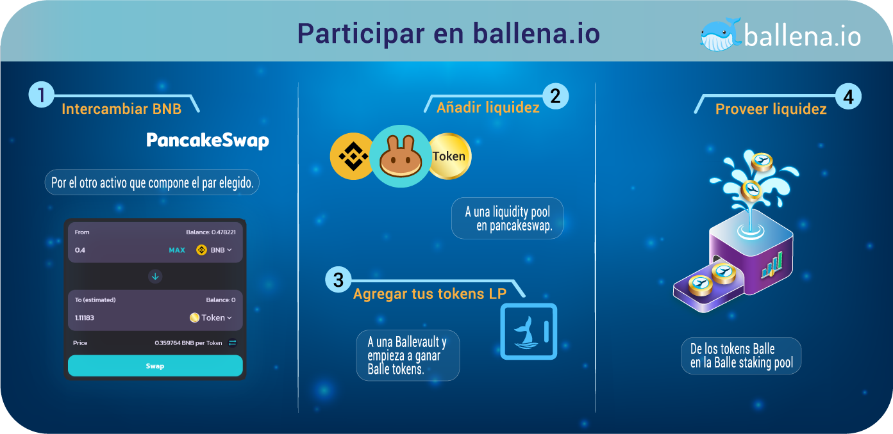

# Participar en ballena.io

### 1. **Participar en una BalleVault y generar tokens BALLEv2**

Mediante los pasos explicados en este apartado, invertiremos nuestro dinero en una BalleVault en ****[**ballena.io**](https://app.ballena.io/)**🐋**. Como ya sabemos, la plataforma nos dará altos retornos sobre los activos invertidos y, además, **nos recompensará con tokens BALLEv2.**

En [este link](../../../../../primeros-pasos/primeros-pasos.md) se detalla el método que [ballena.io](https://app.ballena.io/) utiliza para multiplicar la inversión.

### 

Aprendamos sobre el primer paso en la siguiente página:



En caso de que ya seamos poseedores de BALLEv2 y queramos maximizar su rendimiento, en el siguiente enlace se detalla cómo añadirlos a la Staking Pool:



