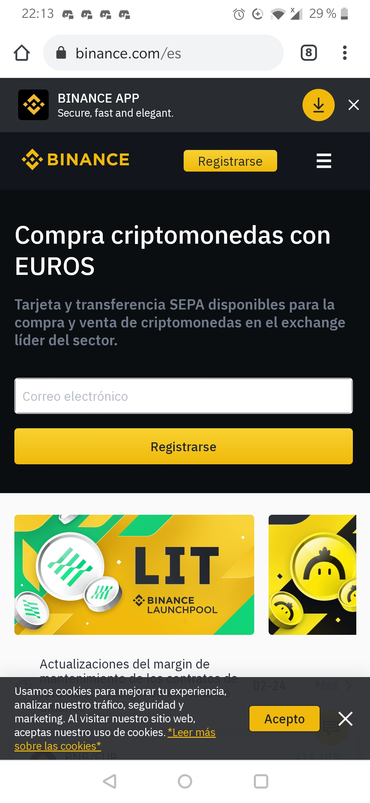
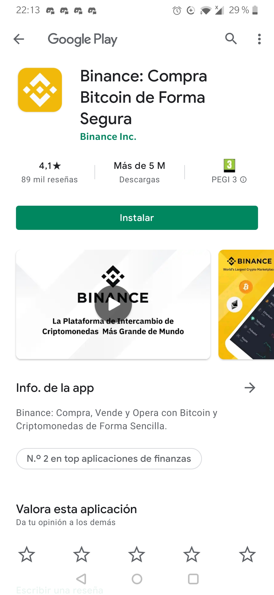
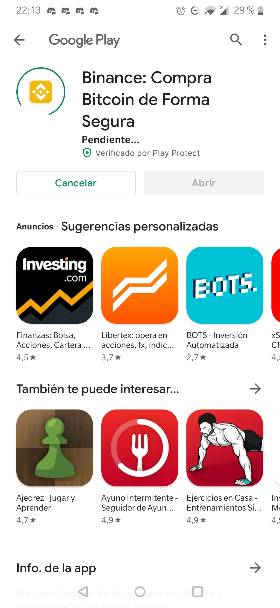
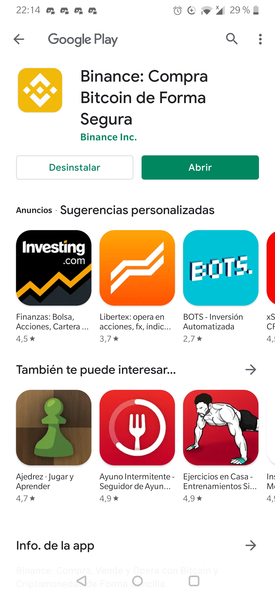
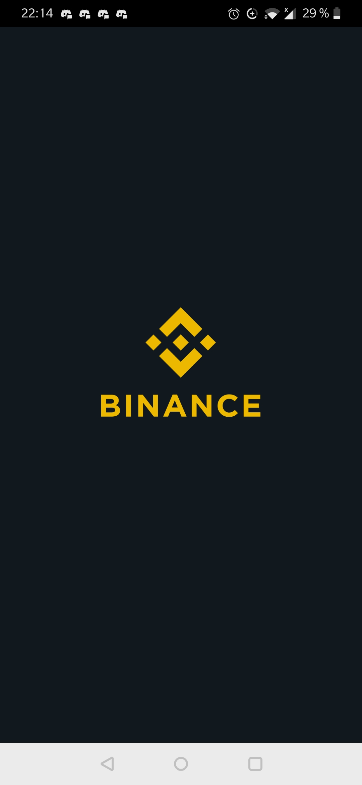

# Abrir y configurar una cuenta en Binance - Smartphone/Tablet

## Abrir y configurar una cuenta en Binance - Smartphone/Tablet

Para poder empezar a trabajar en el mundo de las criptomonedas, es recomendable darse de alta en un Exchange. Puedes utilizar cualquier Exchange a tu elección, este tutorial se centra en [Binance](https://www.binance.com/es%20).

### 1. Abre [Binance ](https://www.binance.com/es%20)en tu navegador.

Para darte de alta en Binance lo primero que tienes que hacer es ir a la dirección de su página web. Recomendamos escribir la dirección directamente y una vez dentro verificar que estás trabajando con la página correcta.

### 2. Haz click en el botón de descarga.

Te aparecerá un botón en la parte superior para descargar la app de binance. Haz clic en el banner para ir a la Play Store para poder descargar la aplicación.

### 3. Pulsa "Instalar".

### 4. Espera a que termine la descarga y haz click en "Abrir".

### 5. Crear la cuenta- Completar campos.

Rellenamos los campos utilizando nuestro número de teléfono móvil o nuestro correo electrónico y una contraseña segura. Ten en cuenta que para los siguientes pasos tendrás que tener acceso al correo electrónico que has utilizado para darte de alta.

### 6. Haz click en "Crear cuenta" y completa la verificación de seguridad.

A continuación, pulsamos el botón “Crear cuenta” y completamos la verificación de seguridad deslizando la pieza del puzzle al lugar correcto haciendo clic y deslizando en la pieza o en la flecha amarilla.

### 7. Verificación de la cuenta.

Una vez hecho se nos pedirá que introduzcamos un código de verificación que se nos ha enviado vía sms o al correo electrónico que hemos utilizado para dar el alta.

### 8. Comprobar bandeja de entrada del correo.

Nos habrá llegado un correo electrónico de este estilo

### 9. Completa la verificación.

Utiliza el código de seis dígitos enviado a tu correo para completar la verificación.

### 10. Ya estas dado de alta en Binance.

Para las opciones de depósito Fiat o compra con tarjeta de crédito deberás pasar un proceso de identificación “KYC” \(Know your customer\). Sigue los pasos marcados en la plataforma. Este proceso es un proceso de seguridad para vincular la cuenta con una empresa o persona física, para completarlo necesitarás un DNI, Carnet de Conducir o Pasaporte y poder hacer la verificación con el móvil. Una vez identificado en la plataforma podrás recargar saldo o comprar cripto para pasar a Binance Smart Chain. Estos pasos los podrás ver en el correspondiente tutorial.

