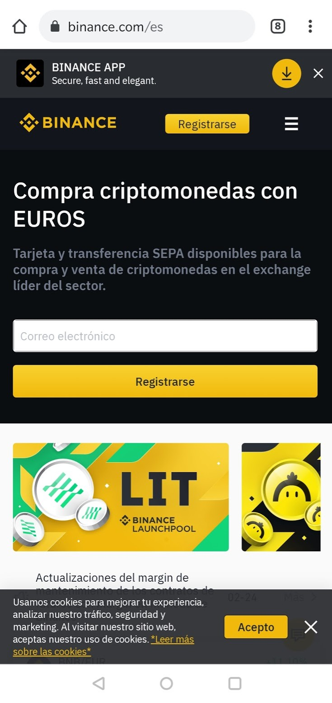
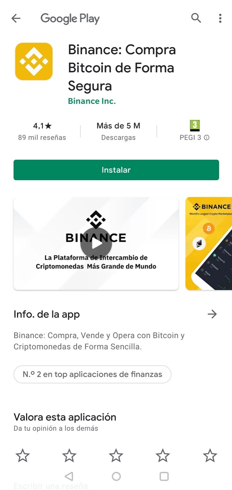
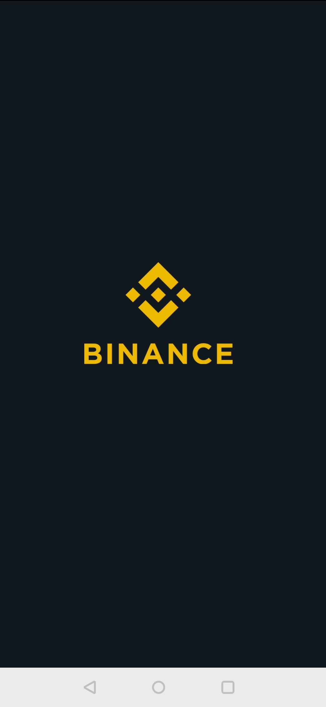
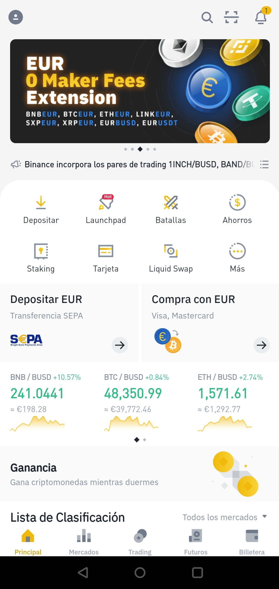

# Abrir y configurar una cuenta en Binance - Smartphone/Tablet

Para poder empezar a trabajar en el mundo de las criptomonedas, es indispensable darse de alta en un exchange. Podemos utilizar cualquier exchange que disponga de la moneda BNB. Este tutorial se centra en[ Binance](https://www.binance.com/es), por lo tanto, lo mejor será seguirlo al pie de la letra.  

### 1. **Abrimos**[ **Binance**](https://www.binance.com/es) **en el navegador.**

Para darnos de alta en Binance, lo primero que tenemos que hacer es ir a su dirección web. Se recomienda escribir la dirección directamente y una vez dentro verificar que estamos trabajando con la página correcta: **binance.com/es**. Añadir la página a marcadores.

### 

### 2. Hacemos clic en el botón de descarga.

Veremos un botón en la parte superior para descargar la Binance App. Hacemos clic en el banner para ir a la Play Store y poder descargar la aplicación.

**​**

### 3. Instalamos y abrimos la aplicación.

### 4. Creamos la cuenta - Completamos los campos.

Rellenamos los campos utilizando nuestro correo electrónico y una contraseña segura. Debemos tener en cuenta que para los siguientes pasos necesitaremos acceso al correo electrónico que hemos utilizado para darnos de alta.

### 5. Hacemos clic en "Crear cuenta" y completamos la verificación de seguridad.

### 6. Verificación de la cuenta.

Una vez hecho se nos pedirá que introduzcamos un código de verificación que se nos ha enviado al correo electrónico.

### 7. Comprobamos la bandeja de entrada de nuestro correo.

Nos habrá llegado un correo electrónico de este estilo:

### 8. Completamos la verificación.

Utilizamos el código de seis dígitos enviado a nuestro correo para completar la verificación.

### 9. Ya estamos dados de alta en Binance.

Para los siguientes pasos debemos pasar un proceso de identificación “KYC” \(Know Your Customer\). Seguiremos los pasos marcados en la plataforma Binance. Este es un proceso de seguridad para vincular la cuenta con una empresa o persona física. Para completarlo necesitaremos un DNI, Carnet de Conducir o Pasaporte y poder hacer la verificación facial con el teléfono. Una vez identificados en la plataforma, se nos permitirá hacer depósitos Fiat y comprar criptomonedas. Habrá dos opciones diferentes para esto último:





