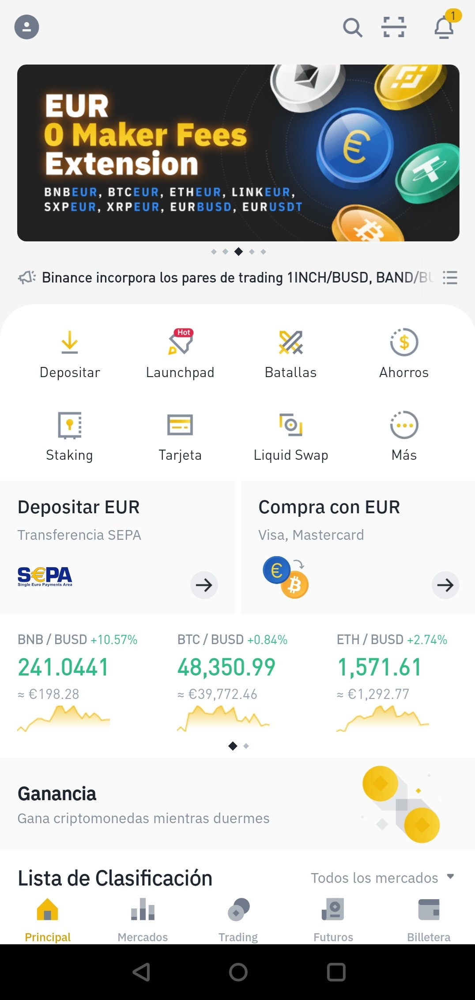
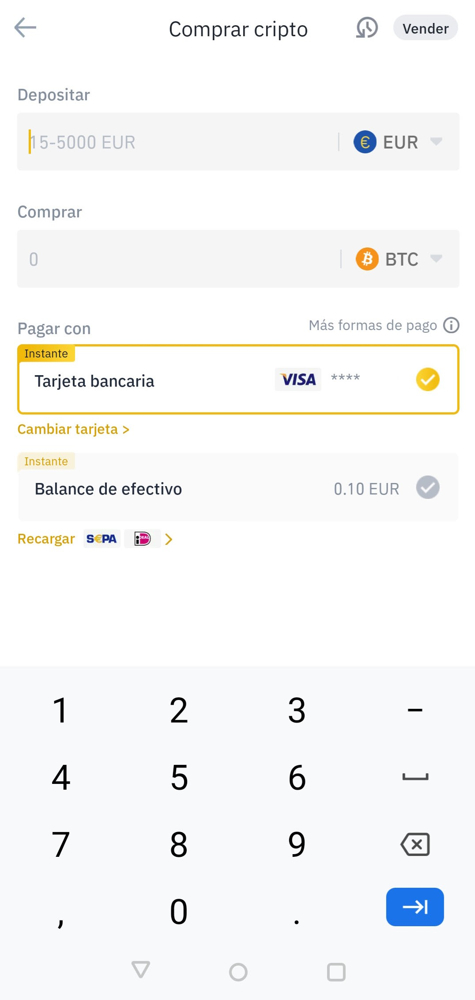
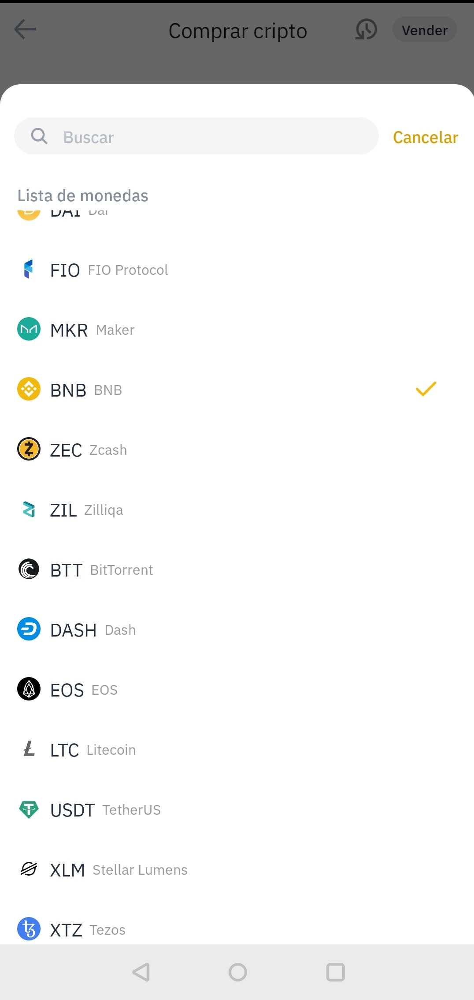
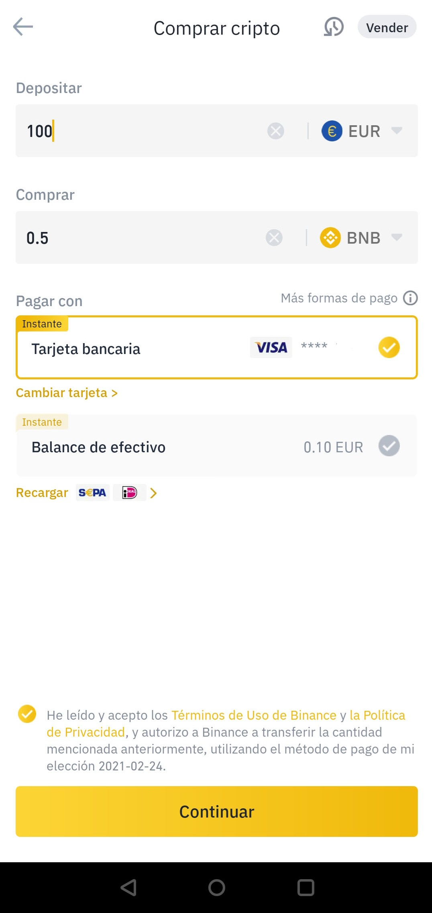
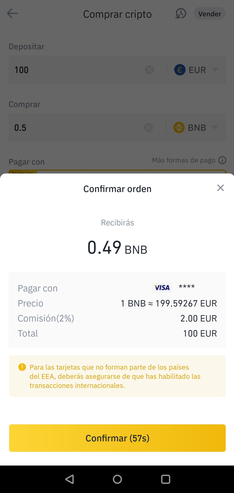

# Cómo comprar BNB en Binance a través de Smartphone/Tablet \(Tarjeta de crédito\)

Esta opción ofrece una compra directa de BNB a traves de la Tarjeta de Crédito, sin necesidad de esperas de deposito ni tampoco conversiones. Debemos saber que la comisión aplicada a este proceso es del 1.8%.

### 1. Pulsamos el botón “Comprar con EUR” de la parte central de la pantalla. 

En lugar de EUR puede aparecer otra divisa si es la divisa por defecto en nuestro país.

### 2. Seleccionamos el importe en Euros.

### 3. Seleccionamos BNB.

### 4. Introducimos el importe en EUR.

Nos aparece la cantidad de BNB que vamos a comprar con el importe en EUR \(Fiat\) seleccionado.

### 5. Pulsamos “Continuar”.

Nos aparece una pantalla con el detalle exacto de la operación.

### 6. Confirmamos.

Revisamos los datos de la transacción y, si estamos conforme, pulsamos “Confirmar”. Hay que tener en cuenta que el pago puede necesitar de acciones propias de nuestro banco.

### 7. Ingreso finalizado.

Una vez validada la operación nos aparecerá una pantalla de confirmación. 


**Comprobamos si se ha realizado el cargo en nuestra cuenta bancaria y si nuestro saldo de Binance ha aumentado.**


En caso de que las dos anteriores sean negativas, volvemos a realizar el proceso.

Completado este proceso, dispondremos de una pequeña cantidad de BNB en nuestra Billetera y estaremos listos para el siguiente paso:



