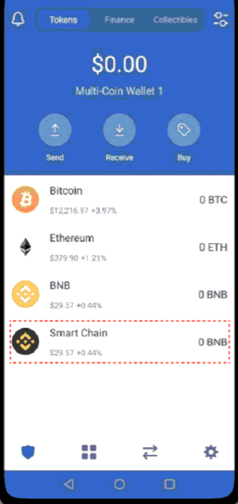
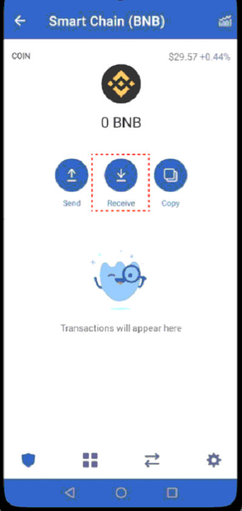
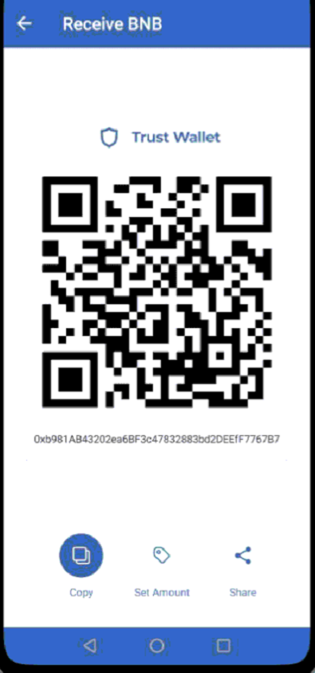
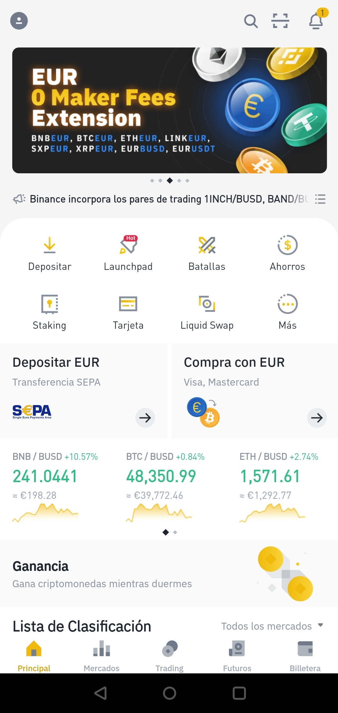
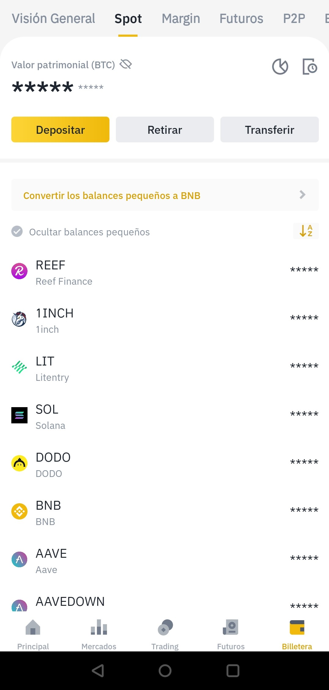
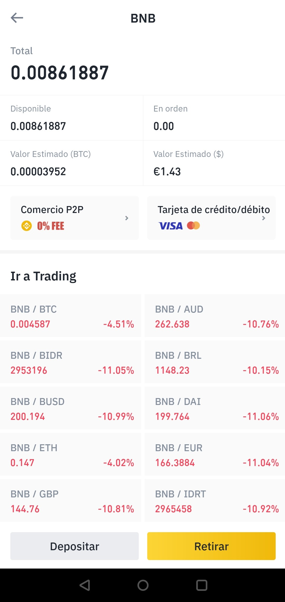
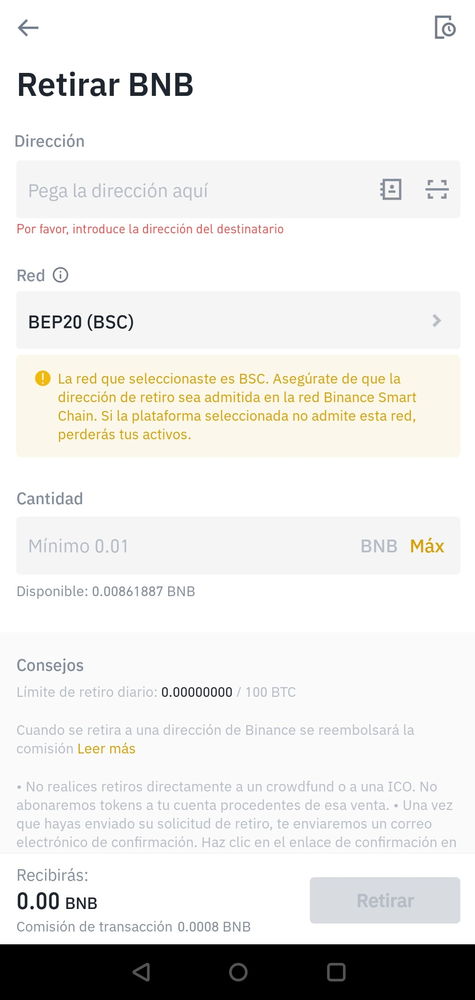
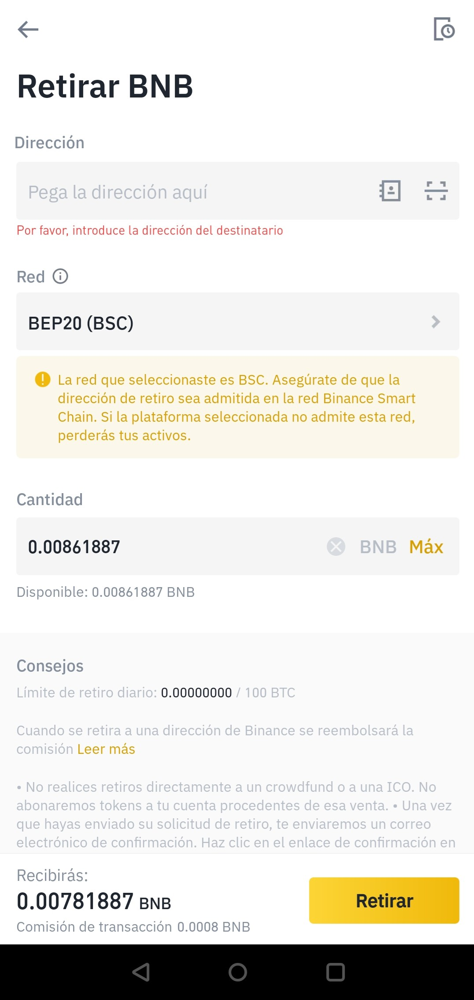

# Cómo enviar fondos de Binance a Trust Wallet

### 1. Averiguamos nuestra dirección de BSC.

Seleccionamos Smart Chain BNB y presionamos "Receive" para encontrar nuestra dirección “Smart Chain" \(BSC\). Copiamos la dirección.

### 

### 2. Depositamos activos desde Binance.

En el caso de que queramos mandar un activo \(no solo BNB\) a Trust Wallet con el propósito de utilizarlo en la BSC, tendremos que enviarlo a través de la dirección Smart Chain que hemos copiado en el paso anterior. Lo que recibiremos en Trust Wallet será un token BEP20 equivalente pero de formato distinto, haciéndolo así válido para operar en las DApps de la BSC. La mejor manera es hacerlo desde Binance, ya sea con la App o desde la página web. En este caso, explicamos cómo enviar los BNB que habremos comprado en tutoriales anteriores.

### 3. Abrimos la aplicación Binance.

### 4. Accedemos a la billetera.

Accedemos a la Billetera pulsando el icono “Billetera” en la parte inferior derecha de la pantalla.

### 5. Seleccionamos Spot.

Aparece la pantalla con el resumen de nuestra Billetera Spot \(al contado\).

### 6. Seleccionamos la moneda “BNB”.

Se mostrarán los detalles BNB.

### 7. Seleccionamos "Retirar".

Seleccionamos “Retirar” pulsando el botón amarillo en la parte inferior.

### 8. Pegamos la dirección copiada de Trust Wallet en la Dirección a la que retirar BNB.

Ver paso 1.

### 9. Seleccionamos la red BEP20 \(BSC\).

### 10. Introducimos la cantidad de BNB a enviar a la billetera y pulsamos “Retirar”.

Tendremos que verificar el envío. Pasado unos minutos, nos llegará un correo de Binance confirmando el retiro. 

A continuación, nos llegará una notificación de Trust Wallet indicando que se han recibido los BNB.

### 11. **¡Buen trabajo!** Fondos enviados a Trust Wallet. 

Ya podemos proceder a usar nuestros Smart Chain BNB en la red BSC mediante el navegador de DApps que nos ofrece Trust Wallet.



