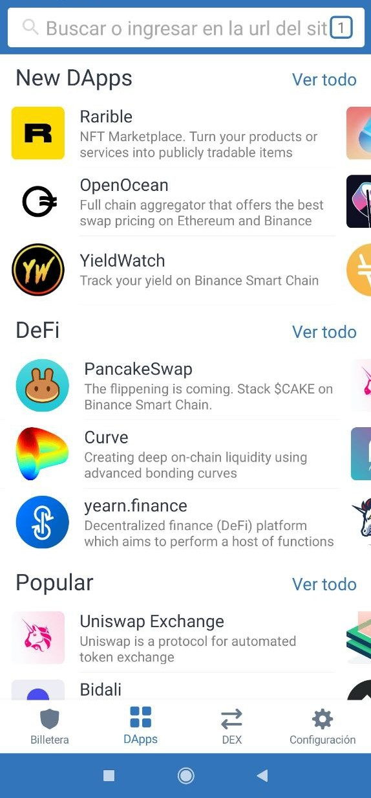
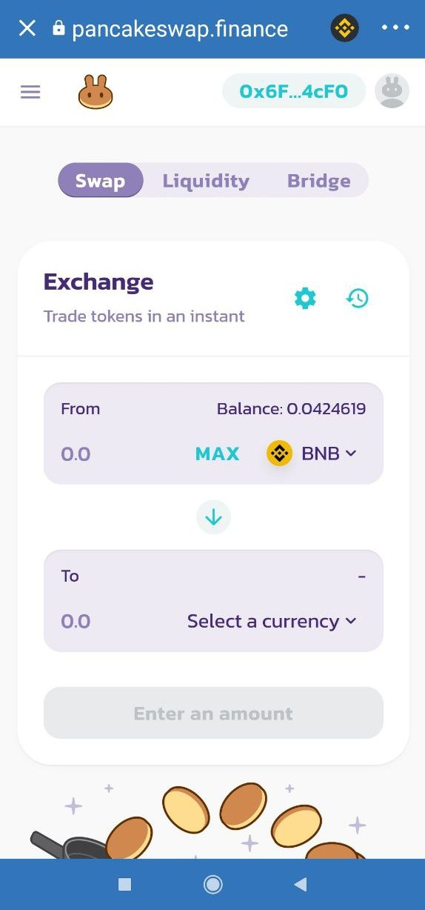
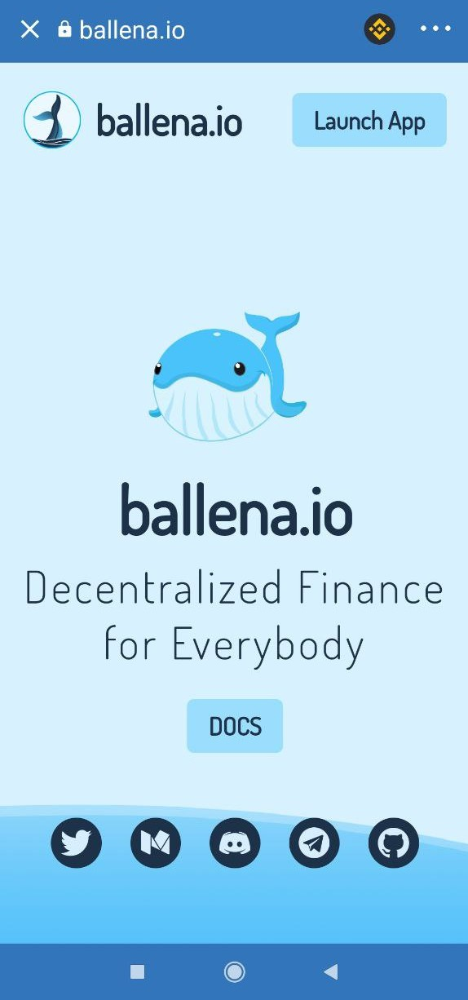

# Cómo usar DApps en Trust Wallet

### 1. Para poder acceder a esta funcionalidad en Trust Wallet, los usuarios de iOS necesitan el navegador DApps.

Este navegador se puede conseguir en la siguiente guía haciendo click [aquí](https://community.trustwallet.com/t/how-to-use-the-dapp-browser-on-ios/69390?ref=JLI1VBLA&utm_source=TrustTwitter&utm_medium=TrustSocial&utm_campaign=TrustSocial). Los usuarios de Android cuentan con el navegador DApps de manera predeterminada.

### 2. Abrimos el navegador DApps.

Una vez que hayamos recargado la billetera, en la aplicación de Trust Wallet, abrimos el navegador DApps presionando los cuatro cuadros en la parte inferior de la pantalla.

### 3. Navegamos hacia una DApp de Binance Smart Chain como PancakeSwap.

Simplemente seleccionamos PancakeSwap entre las opciones que nos ofrece la interfaz. 

### 4. Navegamos a [ballena.io](https://ballena.io/) 🐋 mediante el navegador DApps.

En el buscador de la parte superior introducimos "ballena.io" y nos llevará directamente a la landing que vemos a continuación:

 ****¡Enhorabuena! Ya casi estamos. Solo falta saber cómo participar en [ballena.io](https://ballena.io/) 🐋.



