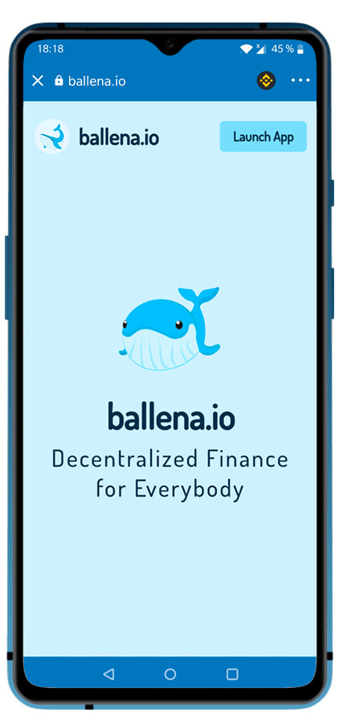

# Cómo usar Dapps en TrustWallet

## Cómo usar las Dapps de Binance Smart Chain

### 1. Para poder acceder a esta funcionalidad en Trust Wallet, los usuarios de iOS necesitan el navegador Dapp.

Este navegador se puede conseguir en la siguiente guía haciendo clic [aquí](https://community.trustwallet.com/t/how-to-use-the-dapp-browser-on-ios/69390?ref=JLI1VBLA&utm_source=TrustTwitter&utm_medium=TrustSocial&utm_campaign=TrustSocial). Los usuarios de Android cuentan con el navegador Dapp de manera predeterminada.

### 2. Abrir el navegador DApps.

Una vez que hayamos recargado la billetera, en la aplicación de Trust Wallet, abrimos el navegador Dapp presionando los cuatro cuadros en la parte inferior de la pantalla.

### 3. Navegar hacia una Dapp de Binance Smart Chain como PancakeSwap.

Simplemente seleccionamos PancakeSwap entre las opciones que nos ofrece la interfaz. 

### 4. Navegar a [ballena.io](https://ballena.io/) 🐋 mediante el navegador DApp.

En el buscador de la parte superior introducimos "ballena.io" y nos llevará directamente a la landing que vemos a continuación:

 ****¡Enhorabuena! Ya casi estamos. Solo falta saber cómo participar en [ballena.io](https://ballena.io/) 🐋.

