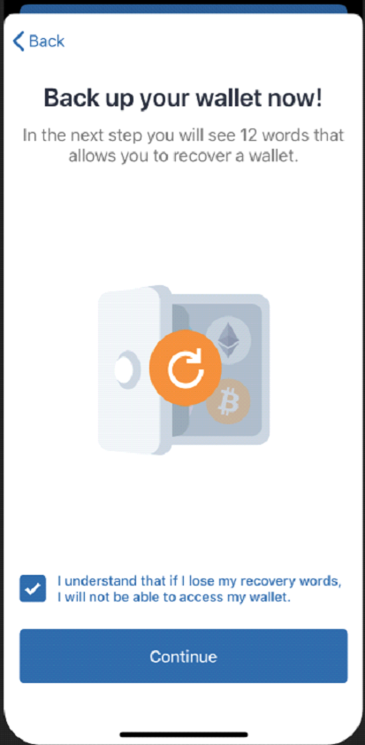
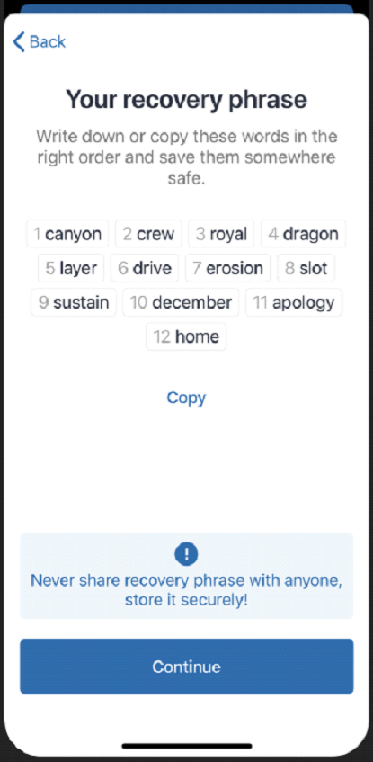
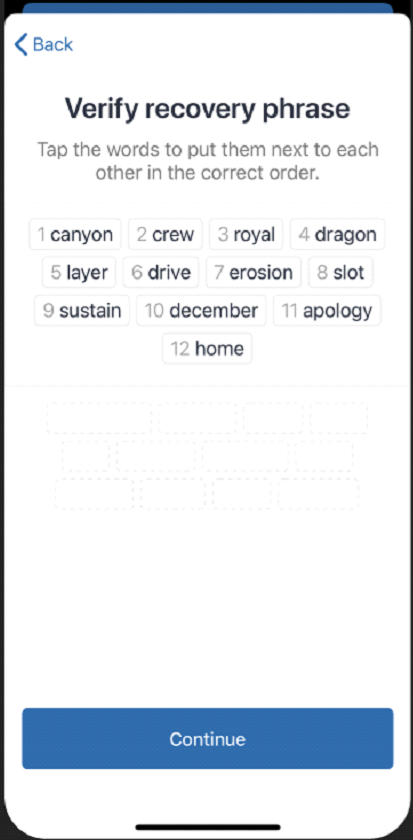
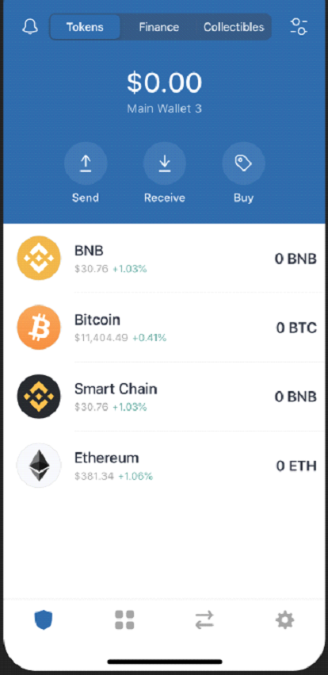

# Configurar Wallet: Trust Wallet

## Configuración de una billetera Trust Wallet para Binance Smart Chain

Se puede descargar la billetera de Trust Wallet desde el siguiente [link](https://share.trustwallet.com/kuBobNL1Mab). Siempre se recomienda actualizar la aplicación a la última versión. 

### 1. Descargar Trust Wallet solo de fuentes oficiales.

* [App Store](https://apps.apple.com/app/trust-ethereum-wallet/id1288339409)
* [Google Play](https://play.google.com/store/apps/details?id=com.wallet.crypto.trustapp)

### 

### 2. Iniciamos Trust Wallet

Tras el primer inicio de la aplicación, se nos presentará la siguiente pantalla donde podemos seleccionar entre “Crear una nueva billetera” o importar una existente. Para esta guía, crearemos una nueva billetera.

### 

### 3. Aceptamos las condiciones de uso.

A partir de aquí, leemos con detenimiento todo lo que sale en pantalla. Hay que tener en cuenta que perder la Frase de Recuperación también significará que perderemos el acceso a nuestra billetera.

### 

### 4. Guardar Palabras Clave de Recuperación.


**Esta es la parte más importante** de la configuración de una billetera, las Palabras de Recuperación son las claves de nuestra billetera criptográfica. **Nos aseguramos de guardarlas** en un lugar seguro, preferentemente offline. Anotarlas **exactamente en el mismo orden que aparecen en nuestra pantalla**, ya que de lo contrario no sería válida y **su pérdida ocasionaría la pérdida total de los fondos.**


Cuando hayamos tomado nota, continuamos.

### 

### 5.    Verificar la frase de recuperación.

Si hemos seguido el paso anterior y hemos realizado una copia de seguridad de las 12 Palabras de Recuperación, solo tendremos que seleccionar las palabras de una en una en el orden correcto.. Pulsamos en “Continue” cuando hayamos terminado.

### 

### 6. Trust Wallet está listo.

Después de pasar por el proceso de respaldo y verificación, se nos redirigirá a la pantalla principal de la billetera. ¡Buen trabajo hasta ahora!

 

Veremos una lista inicial de monedas de las cuales nos centraremos en **Smart Chain BNB**. Vamos a ver cómo recibir esta moneda desde Binance:



