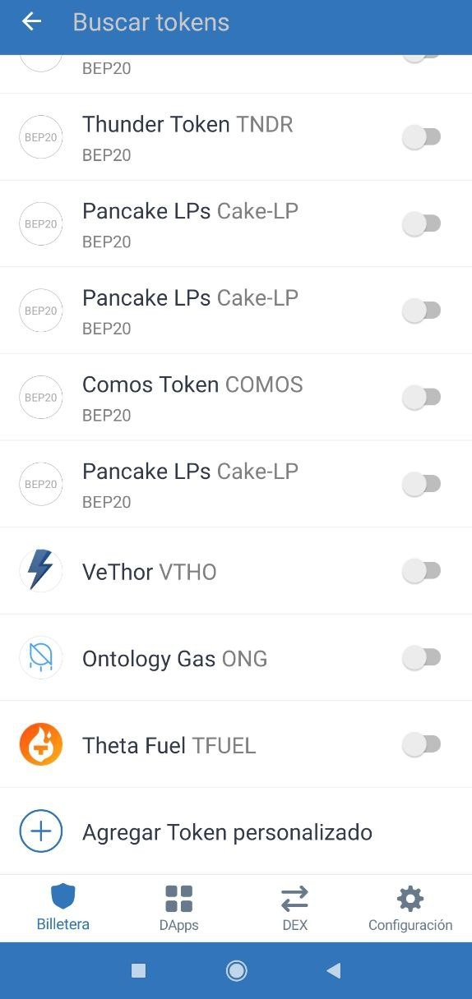

# Cómo agregar token personalizado: BALLE

Los BALLE solo **entraran** en nuestra billetera **al cosechar las ganancias** de una BalleVault. En cambio, es posible que **no se reflejen** en la lista de tokens de **Trust Wallet.**

Para poder ver de cuántos BALLE disponemos, **tendremos que agregar el token** a Trust Wallet mediante unos sencillos pasos.

### 1. Lo primero será averiguar la direccion del contrato del token BALLE


Siempre copiar la dirección de BALLE de un sitio oficial de ballena.io.



Tener cuidado si se va a copiar la dirección desde bscscan.com ya que existen 2 tokens con este mismo nombre al buscar "ballena.io". Asegurarse de seleccionar ✅ ballena.io \(BALLE\) ✅ y no ❌ Ballena.io \(Balle\) ❌ 


**Dirección del contrato del token BALLE** como referencia \(siempre comprobar\): ADD ADDRESSSS

### 2. Acceder a Trust Wallet

En la pantalla principal de nuestra billetera, pulsamos el botón de la esquina superior derecha.

### 3. Nos encontramos en un buscador de tokens.

Abajo del todo de la lista seleccionamos "Agregar Token personalizado"

### 4. Cambiamos la red a "Smart Chain" y pegamos la direccion del contrato.

El resto de casillas se rellenarán automáticamente.

### 5. Pulsamos en "HECHO" arriba a la derecha.

El token se añadirá a la pantalla principal de nuestra billetera.

En el siguiente paso se explica cómo dar un uso práctico a los BALLE recaudados participando en la Staking Pool:



