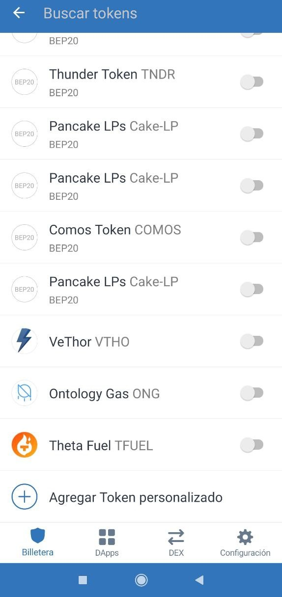
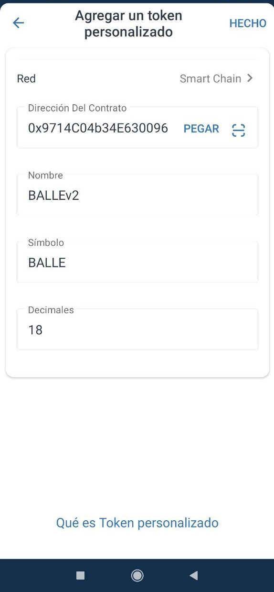
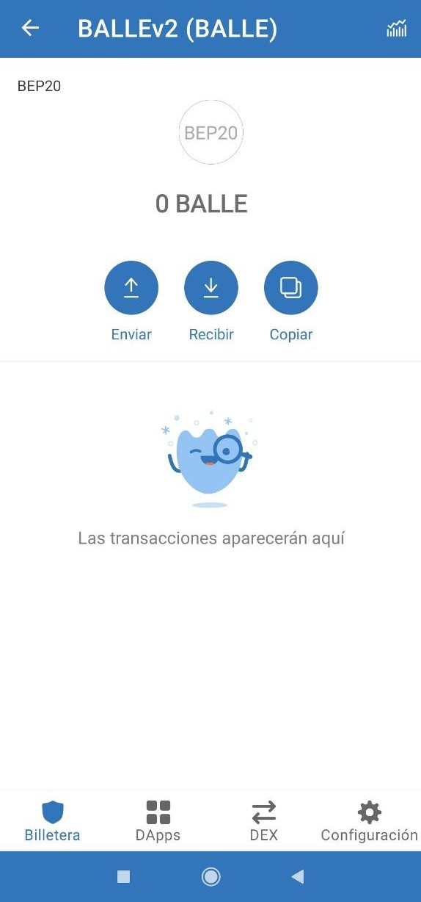

# Cómo agregar token personalizado: BALLEv2 \(BALLE\)

Este tutorial vale para cualquier token.

Los BALLE **entraran en nuestra billetera cuando** los **compremos** o bien **al cosechar las ganancias** de una BalleVault. En cambio, es posible que **NO se reflejen** en la lista de tokens de **Trust Wallet.**

Para poder ver de cuántos BALLE disponemos, **tendremos que agregar el token** a Trust Wallet mediante unos sencillos pasos.

### 1. Lo primero será averiguar la direccion del contrato del token BALLEv2


Siempre copiar la dirección de BALLEv2 de un sitio oficial de ballena.io.


**Dirección del contrato del token BALLEv2**: 0x9714C04b34E6300964161c3aC37b86451E79152d

### 2. Acceder a Trust Wallet

En la pantalla principal de nuestra billetera, pulsamos el botón de la esquina superior derecha.

### 3. Nos encontramos en un buscador de tokens.

Abajo del todo de la lista seleccionamos "Agregar Token personalizado"

### 4. Cambiamos la red a "Smart Chain" y pegamos la direccion del contrato.

El resto de casillas se rellenarán automáticamente.

### 5. Pulsamos en "HECHO" arriba a la derecha y... ¡_voil**à**_**!**

El token se añadirá a la pantalla principal de nuestra billetera.

En el siguiente paso se explica cómo dar un uso práctico a los BALLE recaudados participando en la Staking Pool:



