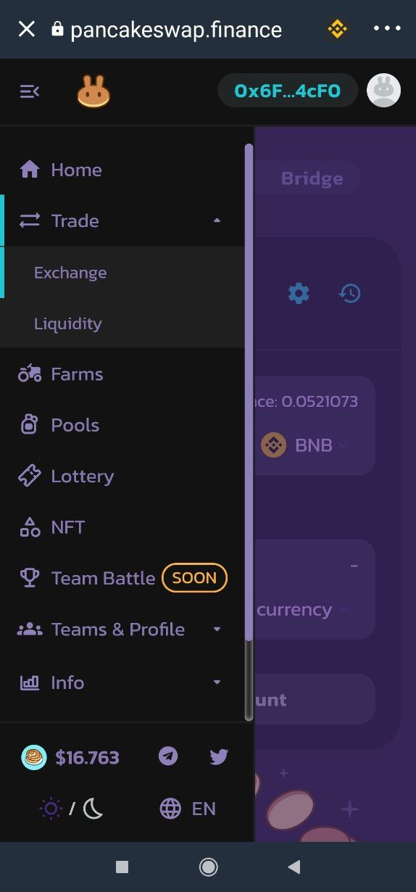
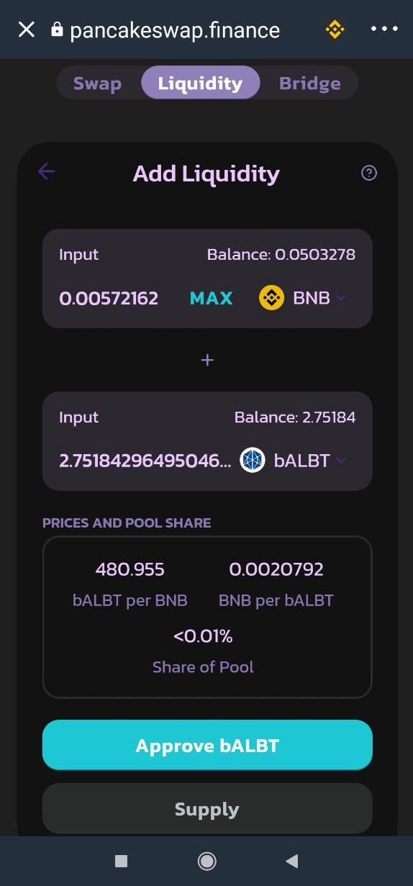
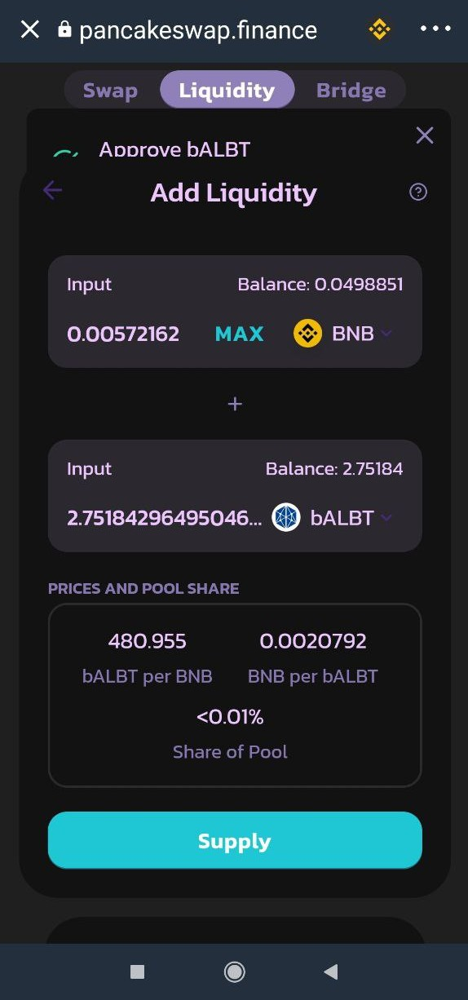

# Cómo añadir liquidez en PancakeSwap a una Liquidity Pool en Trust Wallet

Al **crear un par,** estaremos **aportando liquidez a una Pool** que habilita intercambios entre las dos divisas \(e.g: BNB y bALBT\). Es decir, hacemos posible que otros usuarios de la plataforma \(e.g: PancakeSwap\) puedan comprar bALBT con BNB o puedan vender bALBT por BNB. A cambio de esto, **cobraremos** una pequeña parte de las **comisiones** generadas por esa Pool en forma de las dos monedas. Se puede crear un par a partir de 2 divisas cualesquiera siempre y cuando vayan a partes iguales \(de valor, no de cantidad\). 

En [**ballena.io**](https://app.ballena.io/)**🐋** seguiremos con el ejemplo del par bALBT/BNB.

### 1. Seguimos en PancakeSwap dentro del navegador DApps de Trust Wallet.

### 2. Vamos a la pestaña "Liquidity".

En el apartado _Trade →Liquidity_  pulsamos en "Add Liquidity".

### 

### 3. Añadimos liquidez.

En una casilla seleccionamos BNB y en la otra elegimos bALBT. Le damos a ****_**MAX**_  **en la casilla de bALBT** y, automaticamente, se añadirá la cantidad correspondiente de BNB en su respectiva casilla. Pulsamos abajo en "Approve bALBT" y confirmamos.

### 

### 4. Hacemos clic en “Supply” y luego en “Confirm Supply”. 

A continuación, aprobamos la transacción para añadir finalmente nuestros tokens a la plataforma y crear así el par.

### 5. Comprobamos.

**Obtendremos tokens LP \(Liquidity Provider\)** que **demuestran que somos proveedores de liquidez** en PancakeSwap y que **representan el valor de nuestra aportación**. 

Debemos tener en cuenta que cuando aportamos liquidez, los dos tokens del par aportado ya no se visualizarán en nuestra billetera de Trust Wallet. En cambio, podremos ver que nos aparece _Pancake LPs_. Estos tienen el mismo valor y son intercambiables en cualquier momento.

### 6. La liquidez ha sido aportada con éxito y hemos recibido tokens LP.

Todavía nos falta **agregar esos tokens LP a una BalleVault** en [**ballena.io**](https://app.ballena.io/)**🐋** y optimizar los retornos de forma exponencial. Por un lado, **aplica el interés compuesto a las comisiones generadas** por la Pool, **reinvirtiendo automáticamente** las **ganancias**. Por otro lado, **nos recompensa con tokens BALLE**.

El siguiente es el primero de los dos ultimos pasos:



