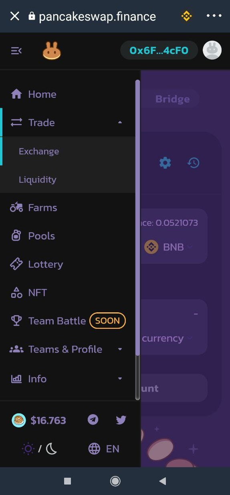
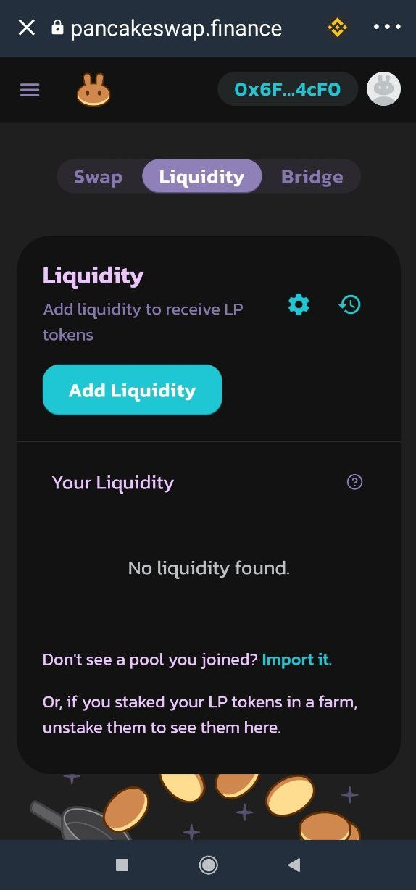
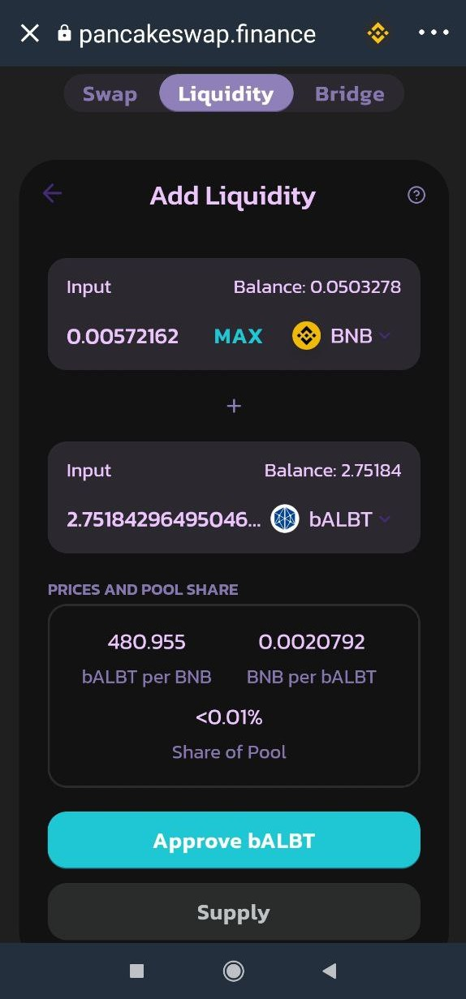
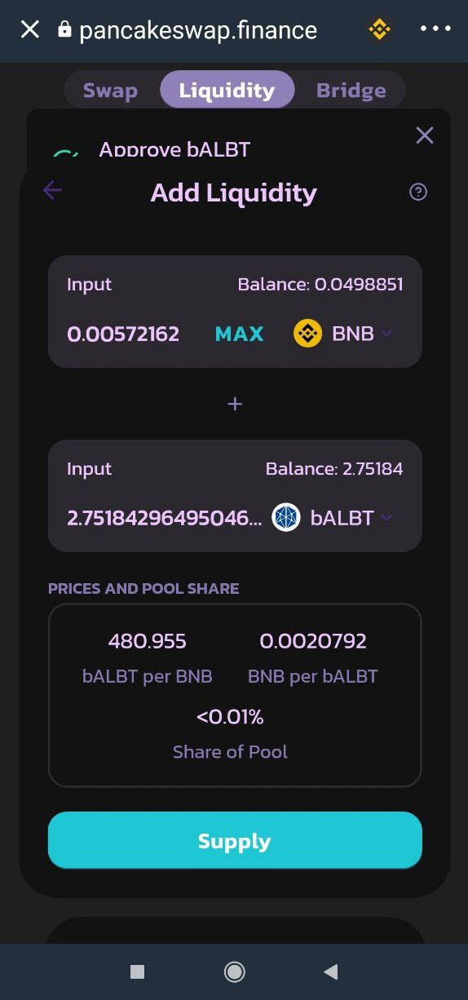
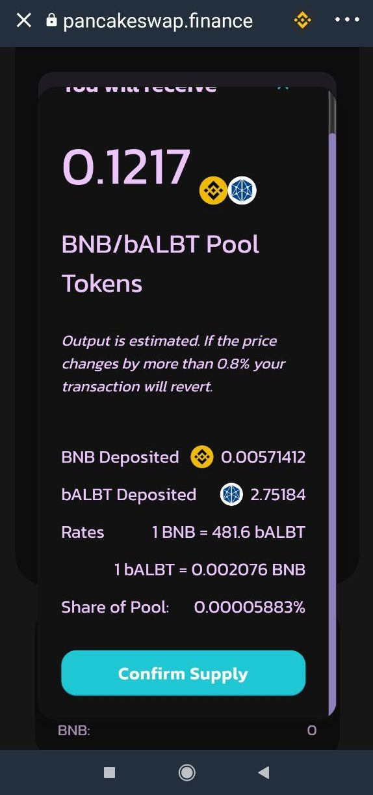

# Añadir liquidez a una Liquidity Pool

## Cómo añadir liquidez en PancakeSwap con Trust Wallet

Se puede añadir liquidez del par que queramos, siempre y cuando las dos monedas del par estén a partes iguales y que la plataforma [**app.ballena.io**](https://app.ballena.io/)**🐋** cuente con el mismo. En este tutorial nos centraremos en añadir liquidez del par bALBT/BNB.

### 1. Seguimos en PancakeSwap dentro del navegador DApps de Trust Wallet.

### 2. Vamos a la pestaña "Liquidity".

En el apartado _Trade →Liquidity_  pulsamos en "Add Liquidity".

### 

### 3. Añadimos liquidez.

En una casilla seleccionamos BNB y en la otra elegimos bALBT. Le damos a ****_**MAX**_  **en la casilla de bALBT** y, automaticamente, se añadirá la cantidad correspondiente de BNB en su respectiva casilla. Pulsamos abajo en "Approve bALBT" y confirmamos.

### 

### 4. Hacemos click en “Supply” y luego en “Confirm Supply”. 

A continuación, aprobamos la transacción para añadir finalmente nuestros tokens a la plataforma y crear así el par.

### 5. Comprobamos.

**Obtendremos tokens LP \(Liquidity Provider\)** que **demuestran que somos proveedores de liquidez** en PancakeSwap y que **representan el valor de nuestra aportación**. A cambio de añadir liquidez, cobraremos una pequeña porción de las comisiones generadas por esa Liquidity Pool.

 Tener en cuenta que cuando aportamos liquidez, los dos tokens del par aportado ya no se visualizarán en nuestra billetera de Trust Wallet. En cambio, podremos ver que nos aparece _Pancake LPs_. Estos tienen el mismo valor y son intercambiables en cualquier momento.

### 6. La liquidez ha sido aportada con éxito y hemos recibido tokens LP.

Todavía nos falta agregar esos tokens LP a una BalleVault en [**app.ballena.io**](https://app.ballena.io/)**🐋** y optimizar ganacias de forma exponencial:

