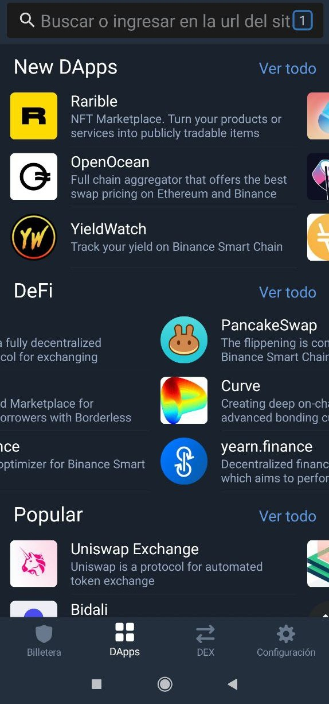
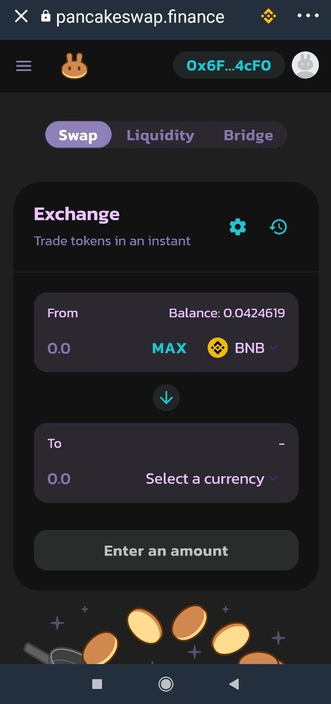
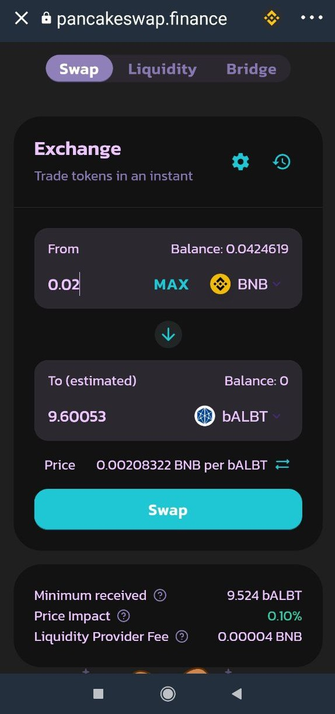

# Convertir BNB por otro Token en PancakeSwap

### 1. Accedemos a PancakeSwap en el navegador DApps de Trust Wallet.


Nunca cambiar todos los BNB para poder pagar las tasas de las transacciones de la red BSC.



Si el buscador DApps no conecta con el sitio, asegurarse que la red en la que estamos sea la "Smart Chain" \(BSC\).


### 

### 2. Puntos a tener en cuenta.

* Nuestra intención es **invertir en una Liquidity Pool** **\(LP\)** para lo que necesitaremos **crear un par.** Como ejemplo usaremos el **par bALBT/BNB**.
* Para explicarlo y entenderlo de forma sencilla, lo plantearemos todo como si nuestro **valor total** fuese de exactamente **2.05 BNB.**
* Antes de seguir, **restamos una pequeña cantidad \(0.05\) de BNB** a nuestro valor total y NO contamos con ella, ya que esta porción irá destinada de forma automática al **pago de las transacciones** a partir de ahora**.** 
* Por tanto, nuestro **valor total disponible** es de **2 BNB**.

### 3. Seleccionamos los tokens.

En el apartado _Trade → Exchange_ de PancakeSwap, partimos con BNB de la casilla "From", y en la casilla "To", en _Select a currency_, buscamos bALBT. Lo mejor es siempre copiar directamente el contrato del token deseado en [bscscan.com](https://bscscan.com/) y pegarlo en la barra de busqueda de tokens. 

### 

### 4. Estipulamos parámetros de conversión.

Para crear el **par bALBT/BNB necesitaremos las dos monedas a partes iguales**. Por tanto, si disponemos de 2 BNB, necesitaremos **cambiar exactamente 1 BNB por bALBT**. Estipulamos la cantidad de BNB y debajo nos aparecerá la cantidad de bALBT que recibiremos . Pulsamos "Swap" y confirmamos la transacción.

### 

### 5. Intercambio completado.

Disponemos ahora de 1 BNB y de su valor correspondiente en bALBT.

Veamos cómo añadir liquidez y crear el par:



