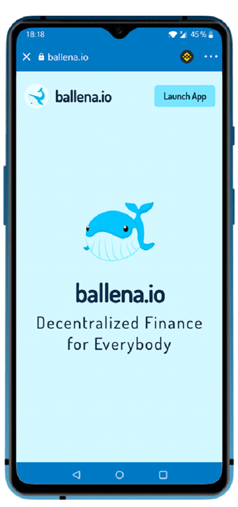
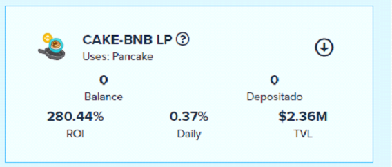
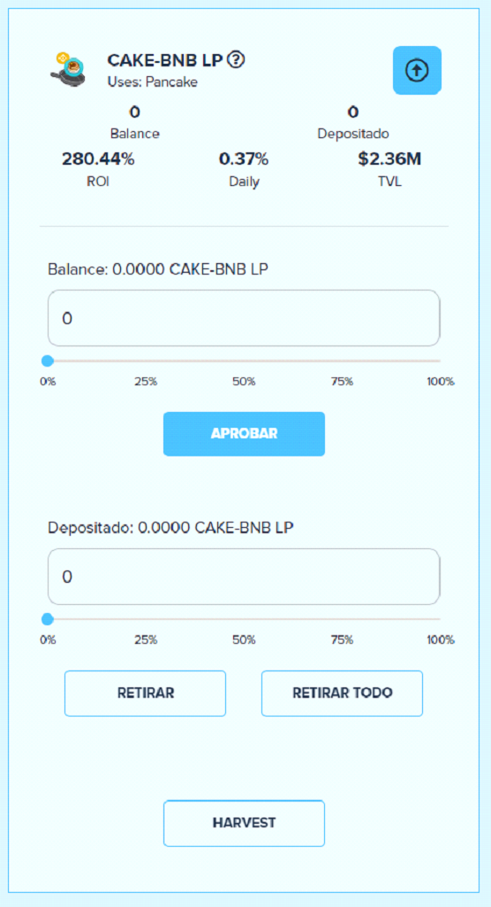
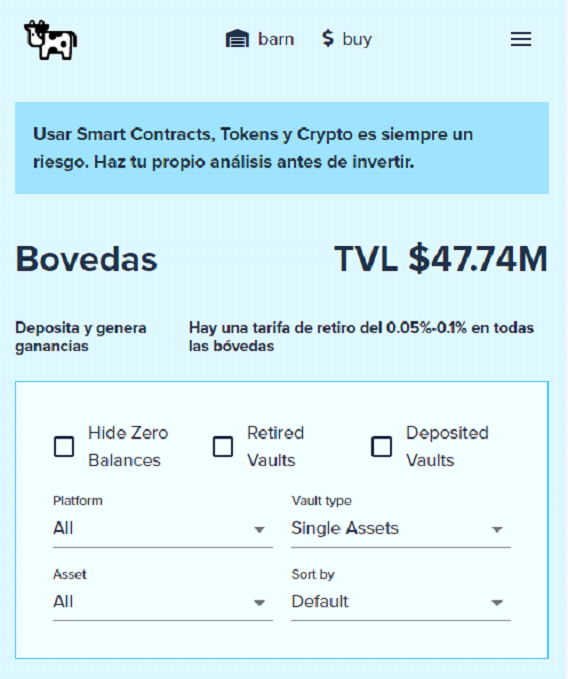
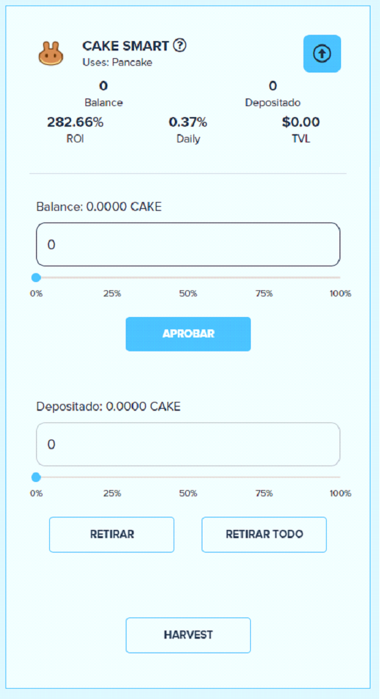
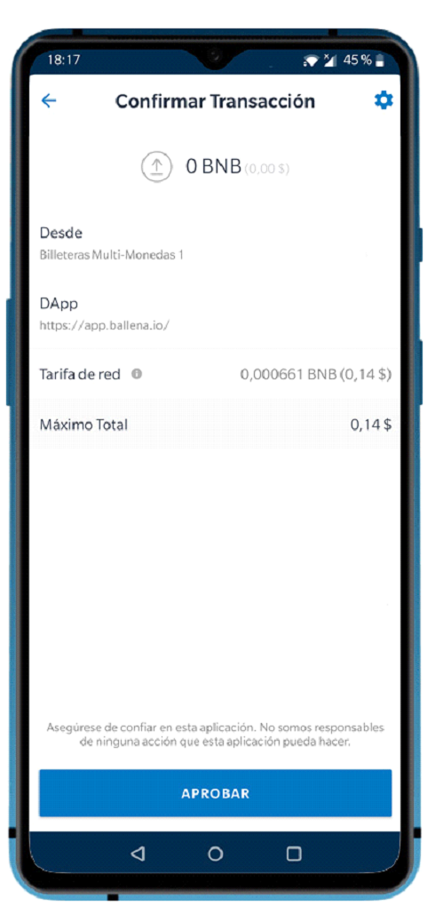
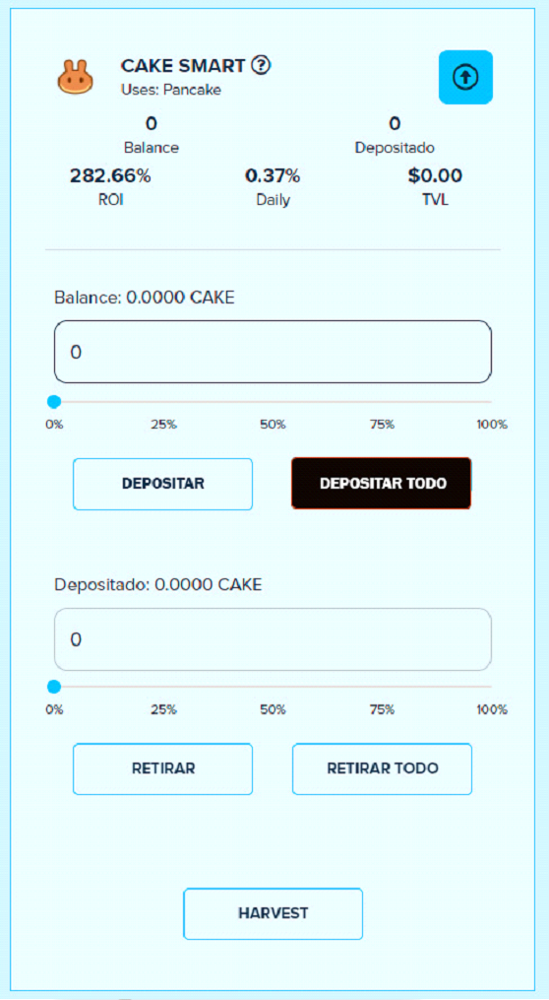
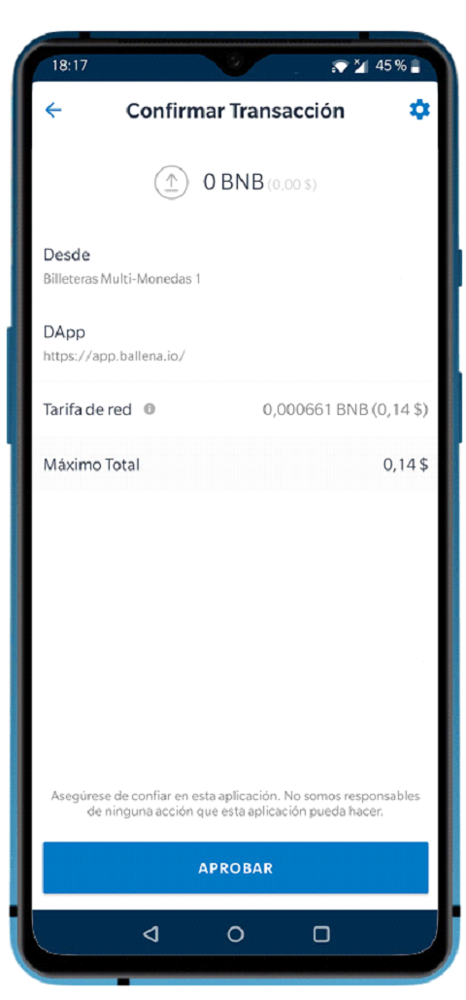

# Agregar los tokens de LP a BalleVault- Móvil/Tablet

## Cómo añadir los tokens LP a una BalleVault \(Bóveda\) en Ballena.io

En este pequeño tutorial Ballena os muestra cómo agregar tanto LP tokens como tokens en forma singular a las BalleVaults.

Cuando queramos sacar rendimiento de nuestros tokens LP de las distintas plataformas las pondremos en la Bóveda que deseemos y a continuación ya nos irá generando rendimiento. Recuerda que para participar en las bóvedas LP antes es necesario que hayas agregado liquidez al de los pares indicados y en el Exchange al que hace referencia cada Bóveda.

### 1. Antes de añadir tokens LP a un Bóveda debes haber añadido liquidez.

Si no lo has hecho puedes seguir los pasos en el apartado [Cómo añadir liquidez en Pancakeswap con Trust Wallet](anadir-liquidez-a-una-lp-movil-tablet.md). Cuando aportas liquidez, los tokens aportados ya no se visualizarán en tu billetera de Trust Wallet, pero podrás ver que te aparecen unos Tokens LP vinculados a la liquidez aportada.

### 2. Navega a la dirección [ballena.io](https://ballena.io) utilizando la parte superior de la pantalla, donde aparece “Buscar o ingresar la url del sitio web”.

### 3. Pulsar la tecla “Launch App”.

### 

### 4. Encuentra la BalleVault deseada.

Cuando entras en [ballena.io](https://ballena.io) accedes directamente al apartado de Bóvedas. Utiliza el buscador para encontrar la Bóveda en la que quieres participar agregando tus token LP. Para encontrar la Bóveda. Utiliza los filtros siguientes:

⦁  Plataforma: Selecciona la plataforma en la que has agregado liquidez. 

⦁ Tipo de Bóveda: Selecciona entre los tipos siguientes: 

⦁ ALL: Se muestran todas las Bóvedas activas en Ballena.io 

⦁ Single Assets: Bóvedas que funcionan directamente con un Token. No es necesario agregar tokens LP. Funcionan directamente con Tokens. 

⦁ Stable LP: Bóvedas que funcionan con Tokens o Tokens LP basados en tokens estables. 

⦁ Stable: Bóvedas que funcionan con Tokens estables o con Tokens LP basados en tokens estable como mínimo en uno de sus pares. A diferencia de “Stable LP” en este caso podemos encontrarnos LP donde hay tokens stables y tokens no estable como el BNB. 

⦁ Asset: Filtra las diferentes Bóvedas por el Token seleccionado. 

⦁ Sort By: Puedes filtrar las Bóvedas según lo siguiente: 

⦁ APY: Rendimiento % 

⦁ TVL: Valor de todas las inversiones depositadas en la bóveda

### 

### 5. Una vez seleccionada la Bóveda en la que queremos participar pulsar el icono de la flecha para desplegar las opciones de la bóveda.

### 

### 6. Una vez desplegado el detalle de la Bóveda, para añadir los tokens LP seleccionaremos “Aprobar”.

### 

### 7. Aprobamos la transacción para poder trabajar con la Bóveda.

Una vez confirmada la transacción nos tenemos que esperar unos segundos para que nos aparezcan las opciones de depósito.

### 

### 8. Seleccionaremos la cantidad de LP a introducir en la Bóveda de las siguientes maneras:

⦁ Introducir directamente el valor en el recuadro. Fíjate que en “Balance” ya te debe aparecer el balance de esos LP que tienes en tu billetera. 

⦁ Arrastrar la pelota de % hasta el porcentaje deseado.

### 

### 9. Una vez seleccionada la cantidad a depositar pulsaremos “Depositar” o “Depositar Todo”.

En el caso de pulsar depositar todo, asegúrate que el valor que aparece en el recuadro no sea superior al balance real disponible en tu billetera. En algunas ocasiones el balance que aparece en el recuadro al seleccionar “Depositar todo” es un balance redondeado y puede ser superior al que realmente tienes y no se realizará la operación. En este caso, por favor introduce manualmente el balance real de tu billetera que aparece en el campo “Balance”.

### 10. Aprobamos la transacción para añadir nuestros tokens LP a la Bóveda.

Tras unos segundos nos aparecerá la confirmación y veremos como los tokens LP que teníamos en el campo Balance, ahora aparecen en Depositado.

### 

### 11. Tu bóveda ya está generando rendimiento. Ahora a disfrutar.

## Como añadir los tokens a una Bóveda en Ballena.io

Cuando queramos sacar rendimiento de nuestros tokens los pondremos en la Bóveda que deseemos y a continuación ya nos irá generando rendimiento. Recuerda que para participar en las bóvedas antes es necesario que tengas disponible el token en la cartera. Si no lo tienes disponible puedes cambiarlo en el Exchange de pancakeswap.

### 1. Antes de añadir tokens LP a un Bóveda debes haber añadido liquidez.

Si no lo has hecho puedes seguir los pasos en el apartado “Cómo añadir liquidez en Pancakeswap con Trust Wallet”.LINK Cuando aportas liquidez, los tokens aportados ya no se visualizarán en tu billetera de Trust Wallet, pero podrás ver que te aparecen unos Tokens LP vinculados a la liquidez aportada.

### 2. Navega a la dirección [ballena.io](https://ballena.io) utilizando la parte superior de la pantalla, donde aparece “Buscar o ingresar la url del sitio web”.

### 3. Pulsar la tecla “Launch App”.

### 

### 4. Encuentra la BalleVault deseada.

Cuando entras en [ballena.io](https://ballena.io) accedes directamente al apartado de Bóvedas. Utiliza el buscador para encontrar la Bóveda en la que quieres participar agregando tus token LP. Encontrar la Bóveda. Utiliza los filtros siguientes:

⦁ Plataforma: Selecciona la plataforma en la que has agregado liquidez. 

⦁ Tipo de Bóveda: Selecciona entre los tipos siguientes: 

⦁ ALL: Se muestran todas las Bóvedas activas en Ballena.io 

⦁ Single Assets: Bóvedas que funcionan directamente con un Token. No es necesario agregar tokens LP. Funcionan directamente con Tokens. 

⦁ Stable LP: Bóvedas que funcionan con Tokens o Tokens LP basados en tokens estables. 

⦁ Stable: Bóvedas que funcionan con Tokens estables o con Tokens LP basados en tokens estable como mínimo en uno de sus pares. A diferencia de “Stable LP” en este caso podemos encontrarnos LP donde hay tokens stables y tokens no estable como el BNB. 

⦁ Asset: Filtra las diferentes Bóvedas por el Token seleccionado. 

⦁ Sort By: Puedes filtrar las Bóvedas según lo siguiente: 

⦁ APY: Rendimiento % 

⦁ TVL: Valor de todas las inversiones depositadas en la bóveda

### 

### 5. Una vez seleccionada la Bóveda en la que queremos participar pulsar el icono de la flecha para desplegar las opciones de la bóveda.

### 

### 6. Una vez desplegado el detalle de la Bóveda, para añadir los tokens LP seleccionaremos “Aprobar”.

### 

### 7. Aprobamos la transacción para poder trabajar con la Bóveda.

Una vez confirmada la transacción nos tenemos que esperar unos segundos para que nos aparezcan las opciones de depósito.

### 

### 8. Seleccionaremos la cantidad de LP a introducir en la BalleVault de las siguientes maneras:

⦁ Introducir directamente el valor en el recuadro. Fíjate que en “Balance” ya te debe aparecer el balance de esos LP que tienes en tu billetera. 

⦁ Arrastrar la pelota de % hasta el porcentaje deseado.

### 

### 9. Una vez seleccionada la cantidad a depositar pulsaremos “Depositar” o “Depositar Todo”.

En el caso de pulsar depositar todo, asegúrate que el valor que aparece en el recuadro no sea superior al balance real disponible en tu billetera. En algunas ocasiones el balance que aparece en el recuadro al seleccionar “Depositar todo” es un balance redondeado y puede ser superior al que realmente tienes y no se realizará la operación. En este caso, por favor introduce manualmente el balance real de tu billetera que aparece en el campo “Balance”.

### 10. Aprobamos la transacción para añadir nuestros tokens LP a la BalleVault.

Tras unos segundos nos aparecerá la confirmación y veremos como los tokens LP que teníamos en el campo Balance, ahora aparecen en Depositado.

### 

### 11. Tu BalleVault ya está generando rendimiento. Ahora a disfrutar.

