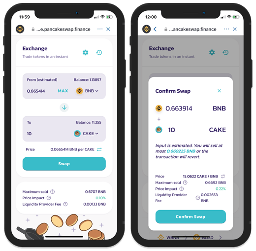

# Convertir BNB por otro Token en PancakeSwap - Móvil/Tablet

## Convertir BNB por otro Token en PancakeSwap - Móvil/Tablet

En muchas ocasiones querrás trabajar con tokens que no tengas directamente en tu billetera, para eso es necesario acceder a un Exchange como “Pancakeswap” donde podremos hacer cambios de multitud de tokens dentro de la Binance Smart Chain. Para llevar a cabo este pequeño tutorial tenemos que tener claro si queremos invertir en una LP \(Liquidity Pool\) o si queremos hacer staking con el token BALLE, ya que cambiará por lo tanto el token al que queremos convertir nuestros BNB. Lo vemos en los siguientes pasos.

### 1. Decide si invertirás en un LP determinado o si buscarás rentabilidad en staking de nuestro token BALLE.

Esta decisión marcará la diferencia en los siguientes pasos del tutorial. Tenemos dos vías de actuación:

#### Proveer liquidez a una LP de un par que nos llame la atención.

Es una forma de inversión en la que se añaden a partes iguales dos assets. El retorno, por lo tanto, será de estos dos assets también a partes iguales. El LP lo que hará será aumentar los tokens que tenemos asignados al par seleccionado. Por ejemplo, podríamos añadir liquidez al par CAKE/BNB. Lo que haremos en este caso será cambiar la mitad de nuestros BNB por CAKE y añadiremos ambos a una LP. 

Para ello tendremos que cambiar BNB por CAKE en PancakeSwap como se detalla en los siguientes pasos.

#### Proveer liquidez al staking del token BALLE.

Es otra forma de inversión en la que añades liquidez exclusivamente del token BALLE. Esto, por lo tanto, genera retorno en token BALLE, contribuyendo además a su revalorización y el potenciamiento de la plataforma. Además de su alta rentabilidad, debido a su incremento de valor, podrás formar parte en la [Gobernanza](../../gobernanza.md). 

Para ello tendremos que cambiar BNB por BALLE en PancakeSwap como se detalla en los siguientes pasos.

### 2. Accede a PancakeSwap en el navegador Dapp.

Una vez que hayas recargado la billetera con BNB, abre el navegador Dapp presionando los cuatro cuadros en la parte inferior de la aplicación. Navega hacia la Dapp de PancakeSwap dentro del apartado “Smart Chain” o introduciendo directamente su url: [https://exchange.pancakeswap.finance/](https://exchange.pancakeswap.finance/). En PancakeSwap se pueden cambiar multitud de tokens. Solo tienes que tener en cuenta que debes tener algunos BNB en tu dirección Smart Chain para las comisiones de red.

* Importante: Nunca cambies todos tus BNB para poder pagar las tasas de las transacciones en esta red BSC\).
* Si el buscador DApp no conecta con el sitio, asegúrate que la red a la que estas conectado es la Binance Smart Chain. 

### 

### 3. Selecciona los parámetros de conversión de tus tokens.

Selecciona el token al que quieres convertir y selecciona la cantidad de tokens que están dispuesto a convertir, o cuantos tokens deseas recibir. Una vez hayas seleccionado lo que deseas pulsa a “Swap” \(Cambiar\). 

#### En el caso de que nuestra intención sea invertir en una de las LP \(Liquidity Pools\) de Ballena.io:

Cambiaremos la mitad de nuestros tokens por el token deseado. De esta manera podremos proveer liquidez al par seleccionado. En este ejemplo se muestra un cambio de BNB a CAKE, para así tener CAKE/BNB a partes iguales para posteriormente agregar liquidez a la correspondiente LP.

* Importante: Nunca cambies todos tus BNB para poder pagar las tasas de las transacciones en esta red BSC\).

#### 

#### En el caso de que nuestra intención sea invertir en staking del token BALLE de Ballena.io:

Cambiaremos nuestros BNB a BALLE de la siguiente manera.

* Seleccionamos BNB en el apartado "FROM" y la cantidad deseada.

  * Importante: Nunca cambies todos tus BNB para poder pagar las tasas de las transacciones en esta red BSC\).

* En el campo "To" accionamos el desplegable y pegamos la dirección de BSC del token BALLE. 

  De esta manera agregamos el token a la plataforma para poder realizar el cambio.

  * Dirección:

* Pulsar Swap y confirmar swap aceptando las tasas que hubiere.

\(imagen cambio BALLE\)

### 3. Confirma la transacción.

Espera a que la red lo procese y cuando este listo se verán reflejados tus tokens en tu billetera.

