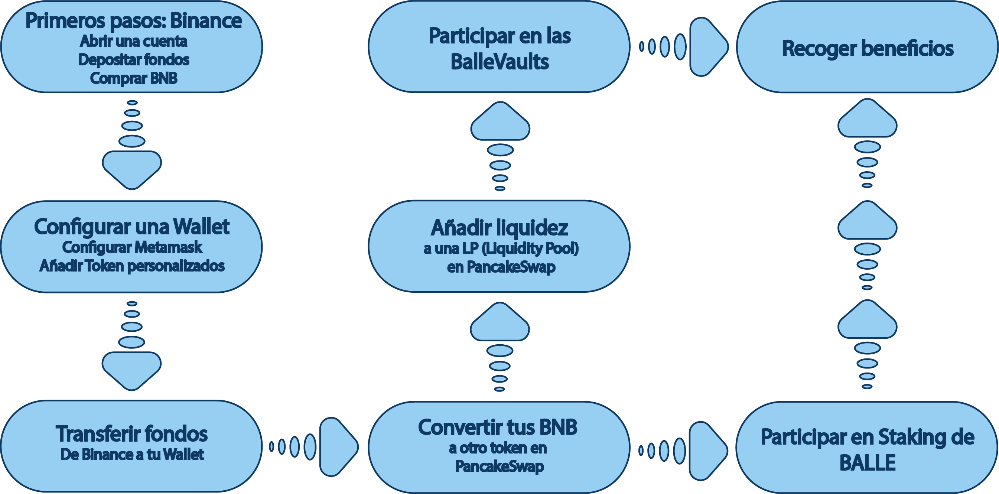

# PC

Te has decido por el PC. Los pasos son muy parecidos para los distintos dispositivos pero en [ballena.io](https://ballena.io/) hemos querido separarlos para que cuentes con la ayuda más personalizada para cada uno de ellos.

En el caso del PC, independientemente del sistema operativo con el que cuentes se utilizarán las siguientes herramientas:

* Navegador web - El tutorial se basa en Google Chrome.
* Wallet - En este caso utilizaremos Metamask.

El navegador web nos servirá para navegar por las webs y Dapps de las que nos nutrimos: [ballena.io](https://ballena.io/), Binance y PancakeSwap, por ejemplo. Y la Wallet, o billetera, la utilizaremos para tanto acceder a las Dapps, como para mover nuestras criptomonedas, acciones como comprar, vender, convertir, aportar liquidez y pagar las tasas.

Recuerda el esquema visto anteriormente y no te perderás. [ballena.io](https://ballena.io/)🐋 te lo vuelve a mostrar.

Para comenzar haz click en el siguiente enlace:



