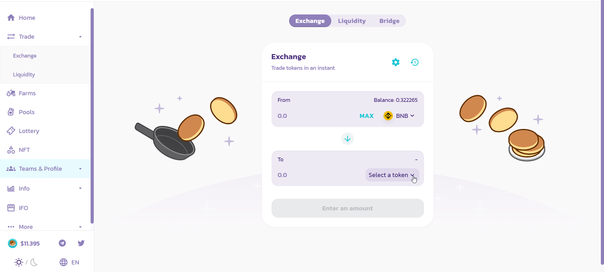
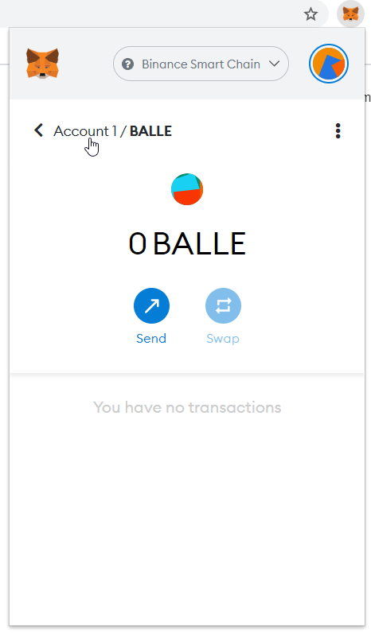

# Convertir BNB por otro Token en PancakeSwap - PC

IN PROGRESS \(BALLE release required\)

En este tutorial veremos como **convertir tus BNB** por otro token para poder, posteriormente, agregar liquidez al par seleccionado y así agregar tokens LP a una BalleVault.

Recuerda que para poder agregar liquidez a una LP necesitaremos el **mismo valor en ambos assets**. En caso de no tenerlo habrá que hacer el cambio correspondiente en el exchange correspondiente.

En este ejemplo convertiremos BNB por BDO.

### 1. Navega a [PancakeSwap](https://pancakeswap.finance/).

* **Link**: [https://pancakeswap.finance/](https://pancakeswap.finance/)

### 

### 2. Conecta tu wallet Metamask haciendo click en "connect"

### 3. Haz click en "Trade" y después en "Exchange" en el menú de la parte izquierda.

### 4. Haz click en "Select a token" para seleccionar el token requerido.

### 5. A modo de ejemplo, seleccionaremos BDO en este ejemplo.

Introducir BDO o el token deseado en el buscador y hacer click en él.

### 6. Introducimos la cantidad BNB deseada y hacemos click en "Swap".

Si queremos aportar liquidez a un par como LP tokens, recuerda que necesitamos la misma cantidad del token que de BNB, por lo tanto cambiaremos menos de la mitad de los BNB disponibles en "Balance". 

No podremos cambiar el valor justo del 50% debido a que tenemos que reservar una pequeña cantidad de BNB para pagar las fees, con lo que cambiaremos algo menos para poder tener cierta cantidad de BNB disponibles.

### 7. Confirma la transacción en Metamask.

### 

### 8. Completado!

Tus tokens deberían aparecer en tu Metamask. En caso de no verlos, asegurate de haber agregado el token a tu metamask, si no sabes como hacerlo ve a [este tutorial](configurar-wallet-metamask-pc/como-anadir-un-token-personalizado-a-metamask.md).

