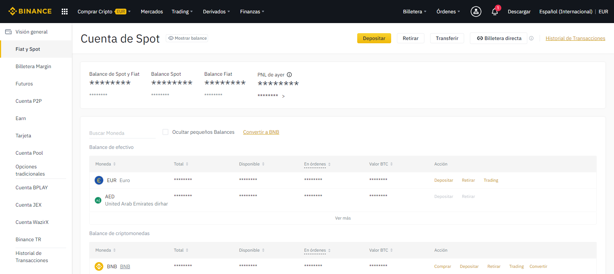
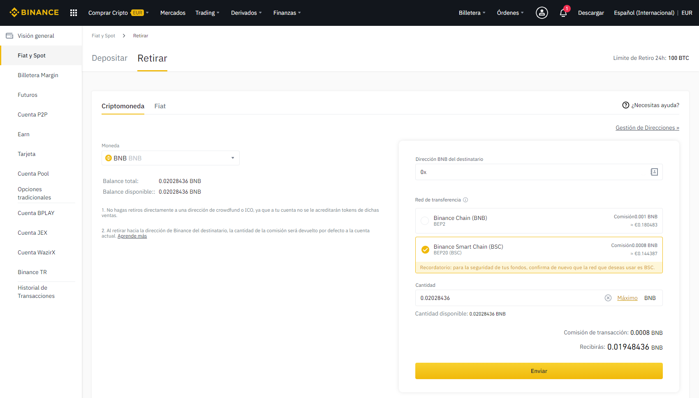

# Cómo enviar fondos de Binance a Metamask - PC

## Cómo enviar fondos de Binance a Metamask

[ballena.io](https://ballena.io/)🐋 te ayuda a transferir tus fondos desde Binance a Metamask en 5 sencillos pasos. ¡Vamos allá!

### 1. Abrir nuestra página de [Binance](https://www.binance.com/es) e ingresar con nuestra cuenta. Una vez ahí entramos en Billetera-Spot.

### 

### ​2. Selecciona “Retirar” en la línea del Token BNB.

### 

### 3. El siguiente paso será rellenar los campos del cuadro de la parte derecha del panel. Lo primero que tendremos que hacer aquí es seleccionar "Binance Smart Chain \(BSC\)".

​​

​

### 4. Ahora copiamos nuestra dirección de la red BSC en Metamask.

Hacemos click en la extensión de Metamask en nuestro navegador, y asegurándonos de tener la BSC seleccionada como red \(ver parte superior de la siguiente imagen\), hacer click en la cuenta que aparece, copiando así su dirección.

​

### 

### 5. Por último pegamos nuestra dirección en el campo "Dirección BNB del destinatario", la cantidad deseada de BNB en la parte inferior y le damos a enviar. 

No tengas prisa, en un par de minutos tus BNB aparecerán en tu Wallet de Metamask.

​​

