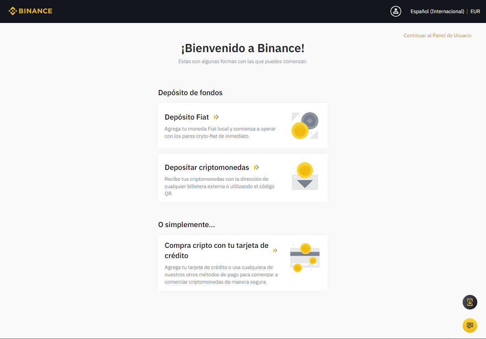

# Abrir y configurar una cuenta en Binance - PC

## Cómo dar de alta en Binance

Para poder empezar a trabajar en el mundo de las criptomonedas, es recomendable darse de alta en un Exchange. Puedes utilizar cualquier Exchange a tu elección, este tutorial se centra en [Binance](https://www.binance.com/es).

### 1. Navegar a Binance.

Para darte de alta en [Binance](https://www.binance.com/es) lo primero que tienes que hacer es ir a la dirección de su página web. Recomendamos escribir la dirección directamente y una vez dentro verificar que estas trabajando con la página correcta.

### 2. Pulsa el botón “Registrarse”.

### 

### 3. Rellena los siguientes campos.

Rellenamos los campos utilizando nuestro correo electrónico y una contraseña segura. Ten en cuenta que para los siguientes pasos tendrás que tener acceso al correo electrónico que has utilizado para darte de alta.

### 

### 3. Pulsa "Crear cuenta".

A continuación, pulsamos el botón “Crear cuenta” y completamos la verificación de seguridad deslizando la pieza del puzle al lugar correcto haciendo clic y deslizando en la pieza o en la flecha amarilla.

### 

### 4. Obtener el código de verificación.

Una vez hecho se nos pedirá en la página que introduzcamos un código de verificación que se nos ha enviado al correo electrónico que hemos utilizado para dar el alta.

Nos habrá llegado un correo electrónico de este estilo.

### 

### 5. Introducir el código de verificación.

Utiliza el código de seis dígitos enviado a tu correo para completar la verificación.

### 6. Una vez completada la verificación ya estamos dados de alta en Binance y se nos ofrecen tres opciones.

Para las opciones de depósito Fiat o compra con tarjeta de crédito deberás pasar un proceso de identificación “KYC” \(Know your customer\). Sigue los pasos marcados en la plataforma. Este proceso es un proceso de seguridad para vincular la cuenta con una empresa o persona física, para completarlo necesitarás un DNI, Carnet de Conducir o Pasaporte y tener webcam o poder hacer la verificación con el móvil.

### 

### 7. Ya estas dado de alta en Binance.

Una vez identificado en la plataforma podrás cargar saldo o comprar cripto para pasar a Binance Smart Chain. Estos pasos los podrás ver en el correspondiente tutorial.



